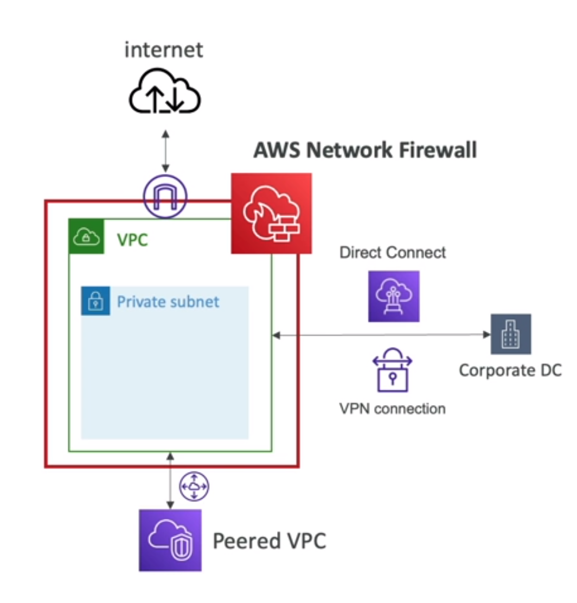
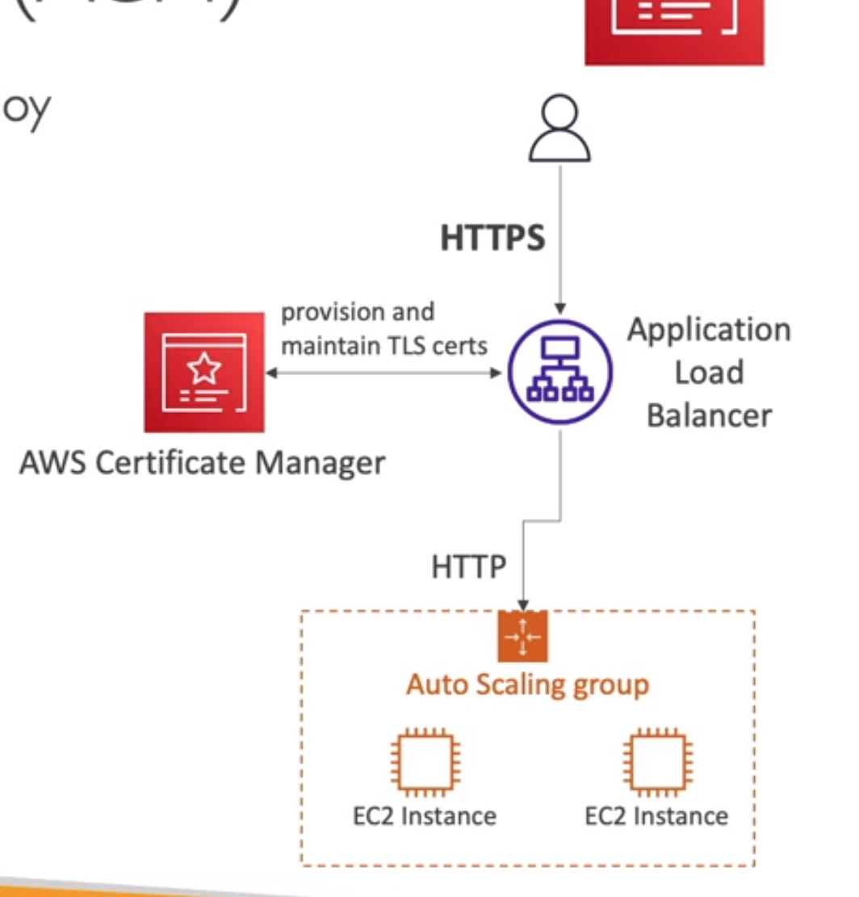
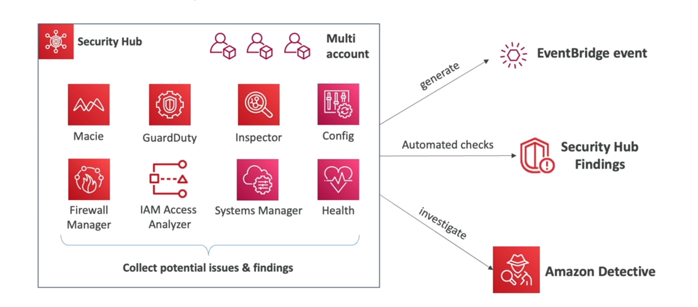

<!-- toc -->

- [AWS Security](#aws-security)
  * [AWS Shared Responsibility Model](#aws-shared-responsibility-model)
  * [What's a DDOS attack?](#whats-a-ddos-attack)
  * [AWS Shield](#aws-shield)
  * [AWS Shield Standard](#aws-shield-standard)
  * [AWS Shield Advanced](#aws-shield-advanced)
  * [AWS WAF (Web Application Firewall)](#aws-waf-web-application-firewall)
  * [AWS Network Firewall](#aws-network-firewall)
  * [Encryption](#encryption)
    + [AWS Key Management Service (KMS)](#aws-key-management-service-kms)
    + [AWS CloudHSM](#aws-cloudhsm)
    + [Types of Customer Master Keys (CMKs)](#types-of-customer-master-keys-cmks)
    + [AWS Certificate Manager (ACM)](#aws-certificate-manager-acm)
    + [AWS Secrets Manager](#aws-secrets-manager)
  * [AWS ARTIFACT](#aws-artifact)
  * [AWS GuardDuty](#aws-guardduty)
  * [AWS Inspector](#aws-inspector)
  * [AWS Config](#aws-config)
  * [AWS Macie](#aws-macie)
  * [AWS Security Hub](#aws-security-hub)
  * [Amazon Detective](#amazon-detective)
  * [AWS Abuse](#aws-abuse)
  * [Root user privileges](#root-user-privileges)
  * [IAM access analyzer](#iam-access-analyzer)
  * [Summary](#summary)

<!-- tocstop -->

## AWS Security

### AWS Shared Responsibility Model
AWS is responsible for the security of the cloud. This means that AWS is responsible for protecting the infrastructure
that runs all of the services offered in the AWS Cloud. This infrastructure is composed of the hardware, software,
networking, and facilities that run AWS Cloud services.

You are responsible for security in the cloud. This means that you are responsible for protecting the data that you put
into the cloud and for following the applicable laws and regulations that pertain to your industry.

### What's a DDOS attack?
A distributed denial-of-service (DDoS) attack is a malicious attempt to disrupt the normal traffic of a targeted server,
service or network by overwhelming the target or its surrounding infrastructure with a flood of Internet traffic. the server will not be able to respond to the request of the client.

The AWS Shield service protects against DDoS attacks, there are two tiers of AWS Shield: Standard and Advanced.
- AWS Shield Standard is available to all AWS customers at no additional cost. It protects against common, most frequently occurring network and transport layer DDoS attacks that target your web site or applications.
- AWS Shield Advanced provides additional detection and mitigation against large and sophisticated DDoS attacks, near real-time visibility into attacks, and integration with AWS WAF, a web application firewall. AWS Shield Advanced is available as an optional paid service to all AWS customers.
- AWS WAF is a web application firewall that helps protect your web applications from common web exploits that could affect application availability, compromise security, or consume excessive resources. AWS WAF gives you control over which traffic to allow or block to your web applications by defining customizable web security rules. You can use AWS WAF to create custom rules that block common attack patterns, such as SQL injection or cross-site scripting, and rules that are designed for your specific application. New rules can be deployed within minutes, letting you respond quickly to changing traffic patterns. Also, AWS WAF includes a full-featured API that you can use to automate the creation, deployment, and maintenance of web security rules.
- AWS Route 53 is a highly available and scalable cloud Domain Name System (DNS) web service. It is designed to give developers and businesses an extremely reliable and cost effective way to route end users to Internet applications by translating names like www.example.com into the numeric IP addresses like

### AWS Shield
AWS Shield is a managed Distributed Denial of Service (DDoS) protection service that safeguards applications running on

### AWS Shield Standard
AWS Shield Standard is automatically enabled on all AWS resources at no additional charge. It protects against common,
most frequently occurring network and transport layer DDoS attacks that target your web site or applications.

### AWS Shield Advanced
AWS Shield Advanced provides additional detection and mitigation against large and sophisticated DDoS attacks, near
real-time visibility into attacks, and integration with AWS WAF, a web application firewall. AWS Shield Advanced is
available as an optional paid service to all AWS customers.

### AWS WAF (Web Application Firewall)
AWS WAF is a web application firewall that helps protect your web applications from common web exploits that could
affect application availability, compromise security, or consume excessive resources. AWS WAF gives you control over
which traffic to allow or block to your web applications by defining customizable web security rules. You can use AWS
WAF to create custom rules that block common attack patterns, such as SQL injection or cross-site scripting, and rules
that are designed for your specific application. New rules can be deployed within minutes, letting you respond quickly
to changing traffic patterns. Also, AWS WAF includes a full-featured API that you can use to automate the creation,
deployment, and maintenance of web security rules.

you can define the web ACL (Access Control List) to allow or block traffic to your web application:
- Rules can include IP addresses, HTTP headers, HTTP body, or URI strings.
- Rules can be applied to all web requests or only those that match the conditions and filters that you specify.
- Protects from SQL injection, cross-site scripting, and other attacks.
-  Size constraints and geo match conditions.
- Rate-based rules to block web requests based on the rate that they arrive from a particular IP address.

### AWS Network Firewall
AWS Network Firewall is a managed service that makes it easy to deploy essential network protections for all of your
Amazon Virtual Private Clouds (Amazon VPCs). The service automatically scales with your network traffic, and offers
high availability and no maintenance or management overhead, freeing you to focus on optimizing application availability
and user experience. AWS Network Firewall provides you with visibility into your network traffic flows, and allows you
to enforce granular access control policies. The service supports both stateful and stateless traffic inspection
across Layer 4 and Layer 7, and integrates with AWS Firewall Manager to provide central management of security policies
across your accounts and Amazon VPCs.

### Encryption
Encryption is the process of encoding information. This process converts the original representation of the information,
known as plaintext, into an alternative form known as ciphertext. Only authorized parties can decipher a ciphertext
back to plaintext and access the original information.

there is two types of encryption:
- At rest: data is encrypted when it is stored on disk in the data center.
- In transit: data is encrypted when it is moving between the data center and the client.

ideally you want to encrypt your data at rest and in transit, we leverage the AWS Key Management Service (KMS) to
manage the encryption keys.

There are some services that are encrypted no matter what, such as CloudWatch Logs, CloudWatch Events, and S3 Glacier.

#### AWS Key Management Service (KMS)
AWS Key Management Service (KMS) is a managed service that makes it easy for you to create and control the encryption
keys used to encrypt your data, and uses Hardware Security Modules (HSMs) to protect the security of your keys. AWS KMS
is integrated with AWS services that encrypt your data with encryption keys that you manage. AWS KMS is also integrated
with AWS CloudTrail to provide you with logs of all key usage to help meet your regulatory and compliance needs.

AWS manages the encryption keys for us.

#### AWS CloudHSM
AWS CloudHSM is a cloud-based hardware security module (HSM) that enables you to easily generate and use your own
encryption keys on the AWS Cloud. With CloudHSM, you can manage your own encryption keys using FIPS 140-2 Level 3
validated HSMs.

Difference between AWS KMS and AWS CloudHSM:
- AWS KMS is a managed service that enables you to easily encrypt your data. AWS KMS is integrated with other AWS  services including Amazon EBS, Amazon S3, and Amazon Redshift. AWS KMS is also integrated with AWS CloudTrail to provide you with logs of all key usage to help meet your regulatory and compliance needs.
- AWS CloudHSM is a cloud-based hardware security module (HSM) that enables you to easily generate and use your own encryption keys on the AWS Cloud. With CloudHSM, you can manage your own encryption keys using FIPS 140-2 Level 3 validated HSMs.

#### Types of Customer Master Keys (CMKs)
- AWS managed CMKs: AWS owned and managed keys that are created in your account for your use. These keys are free of charge.
- Customer managed CMKs: keys in your account that you create, own, and manage. You can use these keys to encrypt and decrypt data, or you can use them to generate, encrypt, and decrypt data keys. You pay a monthly fee for each key that you manage.
- AWS owned CMKs: keys in your account that are created, owned, and managed by AWS. These keys are used only within the service that created them. You cannot use these keys in your own cryptographic operations, and you cannot manage these keys. You do not pay for AWS owned CMKs.
- CloudHSM keys: keys in your CloudHSM cluster that you create, own, and manage. You can use these keys to encrypt and decrypt data, or you can use them to generate, encrypt, and decrypt data keys. You pay a monthly fee for each key that you manage.

#### AWS Certificate Manager (ACM)
AWS Certificate Manager (ACM) is a service that lets you easily provision, manage, and deploy public and private Secure
Sockets Layer/Transport Layer Security (SSL/TLS) certificates for use with AWS services and your internal connected
resources. SSL/TLS certificates are used to secure network communications and establish the identity of websites over
the Internet as well as resources on private networks. AWS Certificate Manager removes the time-consuming manual process
of purchasing, uploading, and renewing SSL/TLS certificates. With AWS Certificate Manager, you can quickly request a
certificate, deploy it on AWS resources such as Elastic Load Balancers or Amazon CloudFront distributions, and let AWS
Certificate Manager handle certificate renewals. SSL/TLS certificates provisioned through AWS Certificate Manager are
free. You pay only for the AWS resources you create to run your application.

#### AWS Secrets Manager
AWS Secrets Manager helps you protect secrets needed to access your applications, services, and IT resources. The
service enables you to easily rotate, manage, and retrieve database credentials, API keys, and other secrets
throughout their lifecycle. Users and applications retrieve secrets with a call to Secrets Manager APIs, eliminating
the need to hardcode sensitive information in plain text. Secrets Manager offers secret rotation with built-in
integration for Amazon RDS, Amazon Redshift, and Amazon DocumentDB. Secrets Manager also integrates with Amazon
RDS for Oracle, Amazon RDS for SQL Server, Amazon Aurora, and other DBs via AWS Lambda rotation scripts. You can
configure Secrets Manager to rotate secrets automatically or on demand. Secrets Manager integrates with AWS
CloudTrail to provide a history of all API calls made on your secrets and secret rotation activity.

### AWS ARTIFACT

it is a portal that provides on-demand access to AWS compliance reports. You can download AWS security and compliance
documents, such as ISO certifications, Payment Card Industry (PCI), and Service Organization Control (SOC) reports.
You can also download AWS agreements, such as the Business Associate Addendum (BAA) or the Nondisclosure Agreement
(NDA). You can use AWS Artifact reports and agreements to help with your compliance initiatives.

they can be used to support internal audit or compliance.

### AWS GuardDuty
Amazon GuardDuty is a threat detection service that continuously monitors for malicious activity and unauthorized
behavior to protect your AWS accounts, workloads, and data stored in Amazon S3. With the cloud, the collection and
aggregation of account and network activities is simplified, but it can be time consuming for security teams to
continuously analyze event log data for potential threats. With GuardDuty, you now have an intelligent and
cost-effective option for continuous threat detection in the AWS Cloud. GuardDuty analyzes tens of billions of events
across multiple AWS data sources, such as AWS CloudTrail, Amazon VPC Flow Logs, and DNS logs. With a few clicks in the
AWS Management Console, GuardDuty can be enabled with no software or hardware to deploy or maintain. By integrating
with AWS CloudWatch Events, GuardDuty alerts are actionable, easy to aggregate across multiple accounts, and straightforward
to push into existing event management and workflow systems.

### AWS Inspector
Amazon Inspector is an automated security assessment service that helps improve the security and compliance of
applications deployed on AWS. Amazon Inspector automatically assesses applications for vulnerabilities or deviations
from best practices. After performing an assessment, Amazon Inspector produces a detailed list of security findings
prioritized by level of severity. These findings can be reviewed directly or as part of detailed assessment reports
which are available via the Amazon Inspector console or API.

for instance ec2 instnces:
- Common Vulnerabilities and Exposures (CVEs)
- Network security best practices
- Authentication and authorization best practices

also for container images push to ECR and lambda functions.

Amazon Inspector is an automated security assessment service that helps improve the security and compliance of applications deployed on AWS. It helps you test the network accessibility of your Amazon EC2 instances and the security state of your applications running on the instances.

### AWS Config
AWS Config is a service that enables you to assess, audit, and evaluate the configurations of your AWS resources.
Config continuously monitors and records your AWS resource configurations and allows you to automate the evaluation
of recorded configurations against desired configurations. With Config, you can review changes in configurations and
relationships between AWS resources, dive into detailed resource configuration histories, and determine your overall
compliance against the configurations specified in your internal guidelines. This enables you to simplify compliance
audits, security analysis, change management, and operational troubleshooting.

### AWS Macie
Amazon Macie is a fully managed data security and data privacy service that uses machine learning and pattern matching
to discover and protect your sensitive data in AWS. Macie automates the discovery of sensitive data, such as PII and
PII-like data, providing you with dashboards and alerts that give visibility into how this data is being accessed or
moved.

Macie also provides an inventory of your Amazon S3 buckets, which it continually monitors for you. If Macie
detects sensitive data or potential data access issues, it generates detailed findings for you to review and act upon
as necessary.

### AWS Security Hub
AWS Security Hub gives you a comprehensive view of your high-priority security alerts and compliance status across AWS
accounts. The service also aggregates security events—called findings—from specific AWS security services while
supporting third-party finding providers such as Check Point, Alert Logic, and Qualys. You can also continuously run
compliance checks using supported standards, such as AWS Foundational Security Best Practices, the CIS AWS Foundations
Benchmark, and the Payment Card Industry Data Security Standard. This approach provides a comprehensive view of your
security and compliance status, and enables you to check your environment against security and compliance standards
and identify areas that require attention.

### Amazon Detective
Amazon Detective makes it easy to analyze, investigate, and quickly identify the root cause of potential security
issues or suspicious activities. Amazon Detective automatically collects log data from your AWS resources and uses
machine learning, statistical analysis, and graph theory to build a linked set of data that enables you to easily
conduct faster and more efficient security investigations. Amazon Detective automatically analyzes, correlates, and
graphs billions of events from AWS CloudTrail, Amazon Virtual Private Cloud (VPC) Flow Logs, and Amazon GuardDuty
across your AWS accounts. You can use Amazon Detective to easily analyze and quickly identify the root cause of
potential security issues or suspicious activities. Amazon Detective makes it easy to conduct faster and more
efficient security investigations across your AWS workloads.

### AWS Abuse
AWS Abuse is a service that allows you to report suspected violation of AWS Acceptable Use Policy (AUP) and other
related AWS Terms and Agreements. You can report suspected AUP violations to AWS by using the AWS Abuse Report Form.
AWS investigates reported AUP violations and takes appropriate action as necessary. AWS Abuse is not a customer support
channel. If you have a support inquiry, please contact AWS Support.

### Root user privileges
The root user has full access to all resources in the AWS account. This includes billing information, access to all
resources, and the ability to change the account password. The root user should not be used for everyday tasks, even
administrative ones. Instead, create an IAM user with administrative privileges and use that user for all tasks that
require access to resources and services.

some action can only be performed by the root user:
- change account name
- close account
- change or cancel support plan
- register as a seller in the AWS Marketplace
- view certain tax invoices

### IAM access analyzer
IAM Access Analyzer helps you identify the resources in your organization and accounts, such as Amazon S3 buckets or
IAM roles, that are shared with an external entity. You can also identify which resources aren't shared with any
external entity. Access Analyzer analyzes permissions granted using policies attached to resources, and generates
findings to help you identify resources that grant access to external principals. You can review these findings to
determine if the access is intended. For example, you can use Access Analyzer to identify and remediate S3 buckets
that are shared with everyone on the internet.

### Summary
Some concepts:

- Shield: DDoS protection
- WAF: web application firewall
- Inspector: security assessment for EC2 instances
- GuardDuty: threat detection
- Macie: data protection
- Detective: security investigation
- Artifact: compliance reports
- Security Hub: security and compliance dashboard
- IAM Access Analyzer: identify resources shared with external entities
- AWS Abuse: report suspected violation of AWS Acceptable Use Policy (AUP)
- AWS Config: assess, audit, and evaluate the configurations of your AWS resources
- AWS Secrets Manager: store, rotate, and retrieve secrets
- AWS KMS: key management service
- AWS CloudHSM: hardware security module
- AWS Certificate Manager: SSL/TLS certificates
