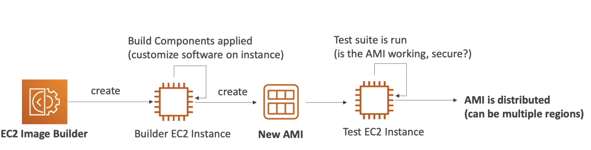
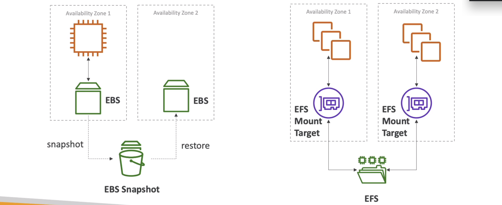
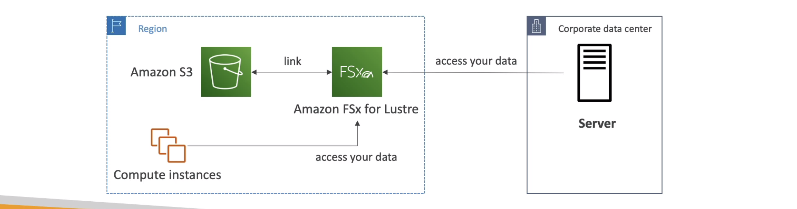
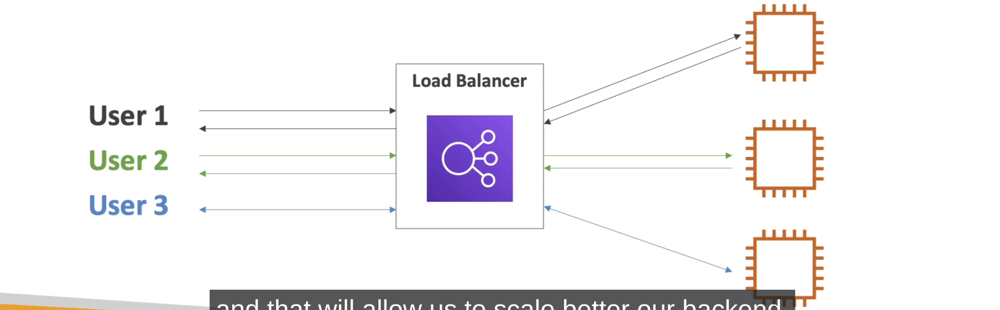
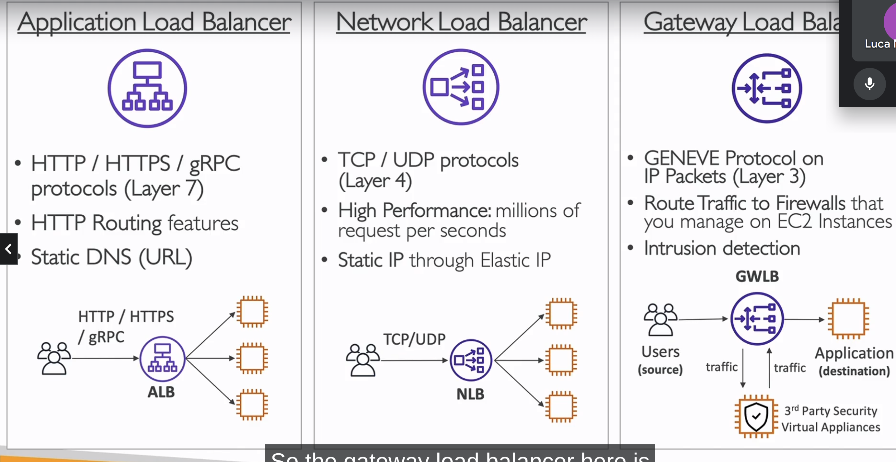
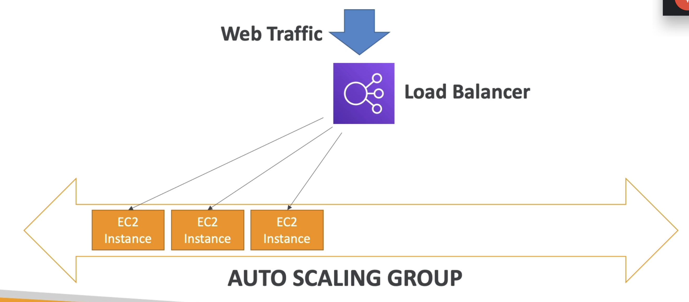

<!-- toc -->

- [Amazon Ec2 (Elastic Compute Cloud)](#amazon-ec2-elastic-compute-cloud)
  * [Ec2 User data](#ec2-user-data)
  * [Ec2 Instance Types](#ec2-instance-types)
  * [Running Ec2 Instances](#running-ec2-instances)
    + [IPv4 vs IPv6](#ipv4-vs-ipv6)
    + [Public Ipv4 DNS](#public-ipv4-dns)
  * [Instance Types (Family)](#instance-types-family)
  * [Introduction to Security Groups](#introduction-to-security-groups)
  * [Security Group Rules](#security-group-rules)
  * [Inbound vs Outbound Rules](#inbound-vs-outbound-rules)
    + [Inbound rules](#inbound-rules)
    + [Outbound rules](#outbound-rules)
    + [Security Groups - Additional Features](#security-groups---additional-features)
  * [Classic ports to know](#classic-ports-to-know)
  * [SSH - Secure Shell to connect to EC2](#ssh---secure-shell-to-connect-to-ec2)
  * [EC2 Instance Connect](#ec2-instance-connect)
  * [Ec2 Instance Roles](#ec2-instance-roles)
  * [EC2 purcashing options](#ec2-purcashing-options)
    + [Summary purchasing options](#summary-purchasing-options)
  * [Shared Responsibility Model for EC2](#shared-responsibility-model-for-ec2)
  * [EC2 Instance summary](#ec2-instance-summary)
    + [EBS - Elastic Block Store](#ebs---elastic-block-store)
    + [EBS deletion](#ebs-deletion)
    + [EBS create a volume and attach it to an instance](#ebs-create-a-volume-and-attach-it-to-an-instance)
    + [EBS Snapshots](#ebs-snapshots)
      - [EBS Snapshots - Archive](#ebs-snapshots---archive)
    + [EBS snapshots - Create a snapshot](#ebs-snapshots---create-a-snapshot)
    + [EBS Recycle Bin](#ebs-recycle-bin)
  * [AMI - Amazon Machine Image](#ami---amazon-machine-image)
    + [Ami Process](#ami-process)
    + [AMI Creation from instance](#ami-creation-from-instance)
    + [AMI Creation from snapshot](#ami-creation-from-snapshot)
    + [Ec2 Image Builder](#ec2-image-builder)
    + [AMI pricing](#ami-pricing)
  * [Ec2 Storage Instance Store](#ec2-storage-instance-store)
  * [EFS Storage (Elastic File System)](#efs-storage-elastic-file-system)
    + [EFS - Performance](#efs---performance)
    + [EFS Infrequent Access (EFS-IA)](#efs-infrequent-access-efs-ia)
      - [Ec2 Storage Shared Responsability Model](#ec2-storage-shared-responsability-model)
  * [Ec2 Storage Amazon Fsx](#ec2-storage-amazon-fsx)
  * [Ec2 Storage summary](#ec2-storage-summary)
- [Availability, Scalability, Elasticity (Load Balancing & Auto Scaling)](#availability-scalability-elasticity-load-balancing--auto-scaling)
  * [Elastic Load Balancer (ELB)](#elastic-load-balancer-elb)
    + [Application Load Balancer (ALB)](#application-load-balancer-alb)
    + [Network Load Balancer (NLB)](#network-load-balancer-nlb)
    + [Gateway Load Balancer (GWLB)](#gateway-load-balancer-gwlb)
  * [Create an Application Load Balancer (ALB) - Horizontal Scaling](#create-an-application-load-balancer-alb---horizontal-scaling)
  * [Auto Scaling Group (ASG) - Elasticity](#auto-scaling-group-asg---elasticity)
    + [Auto Scaling Group Launch Configuration](#auto-scaling-group-launch-configuration)
    + [Auto Scaling Group Scaling Policies](#auto-scaling-group-scaling-policies)
    + [ASG Scaling Strategies](#asg-scaling-strategies)

<!-- tocstop -->

## Amazon Ec2 (Elastic Compute Cloud)

Ec2 is one of the most important service of AWS. It is a virtual machine in the cloud. You can create a virtual machine
in the cloud and you can use it as a normal machine.
You can install an OS, you can install software, you can install a web server, a database, etc.

We can setup whatever operating system we want, we cal also choose:

- how much computing power we want (CPU)
- how much memory we want (RAM)
- how much storage we want (HDD or SSD)
    - Network attached storage (NAS - EBS & EFS - like shared drive)
    - Hard disk drive (HDD disk pshysically connected to the machine)
- Network card (Connector to the internet)
- Firewall (Security group)
- Bootstrap script (Script that run when the machine is created)

### Ec2 User data

it is possible to run a script when the machine is created using an EC2 User data script. So bootstrapping meaning
running a script when the machine is created as root.

### Ec2 Instance Types

There are the specifications of the instance types like the vCPU, the memory, the storage, the network performance, etc.

### Running Ec2 Instances

When you create an instance you can choose the AMI (Amazon Machine Image) that is the operating system that you want to
install on the machine.
That is a catalog of AMI with different operating systems, functionalities, pre-installed software, etc.

Needed to insert:

1. Name of instances
2. AMI (Amazon Machine Image)
3. Instance type (vCPU, memory, storage, network performance, t2.micro costs 0.0116$ per hour)
4. Key pair (to connect to the machine), you create a key pair and you download a file with the private key. You need to
   keep it safe because you need it to connect to the machine. (using `.pem` format)
   5.There is also a security group associated to the machine. The security group is a firewall that allow you to open
   ports, you can setup
   also `allows ssh traffic from` and `allow http traffic from` for let the machine reachable from the internet.
   6.the Volume is the storage of the machine. You can choose the size of the volume and the type of the volume (HDD or
   SSD)
   You need to set the size of the volume and the type of the volume. You can also set the delete on termination flag,
   so when you delete the machine the volume is deleted too.
   7.there is also the User data that is a script that is run when the machine is created. You can use it to install
   software, to install a web server, etc.
   for instance:

```bash
#!/bin/bash
yum update -y
yum install -y httpd
systemctl start httpd
systemctl enable httpd
echo "<h1>Hello World</h1>" > /var/www/html/index.html
```

```TODO

TODO given the panel of details of ec2 instance check what are te mieaning of all th

each instance has an instance ID that is a unique identifier of the instance. You can use it to identify the instance.
There is also associaed a Public IPv4 address that is the address that you can use to connect to the machine from the internet.
There is also a Public DNS (Domain Name System) that is the name of the machine. You can use it to connect to the machine from the internet.
There is also a private IP address that is the address that you can use to connect to the machine from the inside of the network.

is possible to check the security group, the network interface, the IAM role, the tags, the monitoring, the status checks, etc.
```

Then is possible to stop an instance (no cost while the machine is not running) or we can terminate the instance (the
machine is deleted and the volume is deleted too).
if you stop and instance and then you start it again the public IP address is changed. while the Private Ipv4 remains
the same.
If you want to keep the same public IP address you need to use an Elastic IP address.

#### IPv4 vs IPv6

IPv4 is the old version of the internet protocol. It is a 32 bit address that is composed by 4 numbers separated by
dots.
IPv6 is the new version of the internet protocol. It is a 128 bit address that is composed by 8 numbers separated by
colons.

#### Public Ipv4 DNS

The DNS is used to translate the name of the machine to the IP address. The public IPv4 DNS is the name of the machine.
You can use it to connect to the machine from the internet.

### Instance Types (Family)

There are different types of instances ( https://www.aws.amazon.com/ec2/instance-types/):

- General purpose: The m5 and t3 instances are well-suited for a wide range of workloads such as web servers, small to
  medium databases, development environments, and applications that require a balanced combination of compute, memory,
  and networking resources.
- Compute optimized: The c5 and c4 instances are ideal for compute-intensive applications like high-performance web
  servers, scientific modeling and simulations, batch processing, gaming servers, and applications that require
  substantial CPU power.
- Memory optimized: The r5 and r4 instances are perfect for memory-intensive applications such as in-memory databases,
  real-time big data processing, caching fleets, and applications that require high memory capacity to handle large
  datasets or workloads.
- Storage optimized: The i3 and d2 instances are designed for storage-intensive applications that demand high sequential
  read/write performance and large local storage capacity. They are well-suited for data warehousing, log processing,
  and other applications that rely heavily on local storage for large datasets.
- Accelerated computing: The p3 and p2 instances are specifically tailored for graphics-intensive applications and
  machine learning inference. They are suitable for tasks like video encoding, 3D modeling, rendering, deep learning,
  and other workloads that benefit from high-performance GPUs.
- Network optimized: The h1 and h2 instances are optimized for applications that require high network bandwidth and
  low-latency access to other instances within the same Virtual Private Cloud (VPC). They are suitable for
  high-performance databases, distributed file systems, and big data analytics workloads that heavily rely on fast
  network communication between instances.

### Introduction to Security Groups

Security groups are an essential aspect of network security within the Amazon Web Services (AWS) ecosystem. They act as
virtual firewalls that control inbound and outbound traffic for your AWS resources, such as EC2 instances, RDS
databases, and load balancers. By using security groups, you can define granular rules to allow or deny traffic based on
protocols, ports, and IP addresses, thereby strengthening the security posture of your infrastructure.

They control how traffic is allowed into or out of our EC2 instances. They act as a **firewall for our EC2 instances**.

the resources can be reference by IP or by security group. They are locked down to a region/VPC combination. They live
outside
the EC2 and they are good practice to maintain one separate security group for SSH access.

They regulate:

- Access to ports
- Authorised IP ranges - IPv4 and IPv6
- Control of inbound network (from other to the instance) and outbound network (from the instance to other)

they present the type, the protocol, the port range, the source, the description.

### Security Group Rules

They are into ec2 -> network & security -> security group. They are attached to instances.

They can be attached to multiple instances. They are locked down to a region/VPC combination, if you change the region
you need to change the security group.
They live outside the EC2 and they are good practice to maintain one separate security group for SSH access.

Typically if you get time out it means that you not raech the service while if you get connection refused it means that
you reach the service but the service is not running.


### Inbound vs Outbound Rules

#### Inbound rules

They control the traffic that is coming to the instance from the outside. Outbound rules control the traffic that is
coming from the instance to the outside.
They are specified into the security group, they have a type, a protocol, a port range, a source and a description. The
type for instance
can be SSH, HTTP, HTTPS, etc. The protocol can be TCP, UDP, ICMP, etc. The port range can be 22, 80, 443, etc. The
source can be anywhere, my IP, custom, etc.

#### Outbound rules

They control the traffic that is coming from the instance to the outside. You can specifiy like all traffic is allowed
to go out. You can specify the protocol, the port range, the destination.

#### Security Groups - Additional Features

- You can reference other security groups
- You can have multiple security groups attached to EC2 instances
- You can block specific IP addresses using security groups (for instance block a specific IP address that is trying to
  attack your machine)
- You can specify allow rules, but not deny rules (by default all is denied)

todo unstand better reference other security groups.

### Classic ports to know

- 22: SSH (Secure Shell) - log into a Linux instance
- 21: FTP (File Transfer Protocol) - upload files into a file share
- 22: SFTP (Secure File Transfer Protocol) - upload files using SSH
- 80: HTTP - access unsecured websites
- 443: HTTPS - access secured websites

you can connect to an Ec2 with SSH but also with Ec2 Instance Connect that is a browser-based SSH connection.

### SSH - Secure Shell to connect to EC2

SSH is a protocol that allows you to connect to a machine remotely. It is a secure protocol that uses encryption to
protect the connection.
Check on the security group that the SSH port is open, to do that you need to go to the security group and check the
inbound rules.

You need to have a key pair to connect to the machine. You can create a key pair into the EC2 -> network & security ->
key pairs. You can create a key pair and download it.

Next we need to change the permissions of the key pair file to 400 (chmod 400 key.pem). Then we can connect to the
machine with the command:

```bash
ssh -i key.pem ec2-user@<public_ipv4_address>
```

### EC2 Instance Connect

It is a browser-based SSH connection. You can go to the console and select the instance and then select connect. Then
you can select EC2 Instance Connect and connect to the machine.
You need still ti have the port 22 open in the security group, to do that you need to go to the security group and check
the inbound rules.

it comes with the aws cli installed. You can use the command:

### Ec2 Instance Roles

For instance you want co list the iam users:

```bash
aws iam list-users
```

but ou need credentials (never store credentials on the machine). You can use the instance roles to give permission to
the instance to do something. You can attach a role to an instance. You can create a role into the IAM -> roles.

Once we create the roles then we go to the ec2 instance, go to `Actions` and modify the IAM role to add the new role.

### EC2 purcashing options

Differnt way to buy an EC2 instance:

- On-demand: pay for what you use, has the highest cost but no upfront payment.

- Reserved: min 1 year, max 3 years, up to 75% discount compared to on-demand.

- Saving plans: commit to a consistent amount of compute usage (measured in $/hour) for a 1 or 3 year term, can save
  up to 72% compared to on-demand.

- Spot: bid for instance capacity, up to 90% discount compared to on-demand, can lose instances if the spot price goes
  above your bid price. They are great for batch jobs, big data analysis, workloads that are resilient to failure, etc.

- Dedicated hosts: physical EC2 server dedicated for your use, can help reduce costs by allowing you to use your
  existing server-bound software licenses. The use cases are regulatory requirements, licensing, compliance, etc. Access
  the physical server.

- Dedicated instances: instances running on hardware that's dedicated to you, may share hardware with other instances
  in the same account. you may share hardware with other instances in the same account. Not access the physical server.

- Capacity reservations: reserve capacity for your EC2 instances in a specific Availability Zone for any duration.

#### Summary purchasing options

On-demand: coming and stang for a short time, unpredictable workloads, dev and test.
Reserved: long workloads, predictable usage, reserved capacity.
Saving plans: flexible usage, long workloads, predictable usage, can commit to a specific amount of compute usage.
Spot: short workloads, for cheap, for workloads that are resilient to failure.

### Shared Responsibility Model for EC2

Aws:

- Infrastructure
- isolation on physical level
- replacing faulty hardware
- security of hardware
- compliance validation

Customer:

- security group
- OS patching and updates (all the software that is installed on the machine)
- IAM roles and assigned to EC2 instances
- Data security

### EC2 Instance summary

Ec3 Instance: Ami (os) -> instance -> security group -> ssh key pair -> instance roles.
Security group: inbound rules, outbound rules, reference other security groups, multiple security groups attached to
Ec2 User data: launch script, bootstrap script, configure instance, install software, etc.
EC2 instance Role. IAM role attached to an instance, temporary credentials, no need to store credentials on the
instance,
Puchasing opetions: on-demand, reserved, spot, dedicated hosts, dedicated instances, capacity reservations, saving
plans.

#@# Ec2 Storage EBS

#### EBS - Elastic Block Store

The EBS volume is a network drive you can attach to your instances while they run. It allows your instances to persist.
They can be mounted to **one instance at the time** but you can have two volumes mounted to the same Ec2 instance.

It's a network drive, it uses the network to communicate the instance, which means there is a bit of latency. It can be
detached from an EC2 instance and attached to another one quickly.

Important: It is locked to an **Availability Zone (AZ)**. To move a volume across, you first need to snapshot it.

#### EBS deletion

THe deletion of EBS volumes is by default on termination of the instance while any other attached EBS volume is not
deleted.

You can use EBS volumes as a database, you can have a database on an EBS volume and then you can detach it and attach it
to another instance. Or while proessing input data you can have the OS on the root EBS volume and the data produced
stored on another EBS volume that will be not deleted when the instance is terminated.

#### EBS create a volume and attach it to an instance

You can create a volume from the console, you need to specify the volume type, the size, the availability zone, etc.
Go the Ec2 -> Elasic Block Store -> Volumes -> Create Volume (need to specify the same availability zone of the
instance). Once create you need
to attach it to an instance. You can attach it to an instance from the console or from the instance itself.

you can then retrieve the EBS volume from the instance from the Ec2 console -> instance -> storage -> block devices.

#### EBS Snapshots

Snapsshots are a backup of the EBS volume at a point in time. They are stored in S3. They are incremental, which means
that only the blocks that have changed since your last snapshot are moved to S3. If you delete a snapshot of a volume
that has other snapshots, only the data unique to that snapshot is removed. So you never lose data.

##### EBS Snapshots - Archive

The archive tier is a new tier of storage for Amazon S3 that is designed for long-term data archival. It is designed
for data that is accessed less than once a year. It is a low cost storage tier that is optimized for infrequently
accessed data. It is a good fit for backup and archive, disaster recovery, and long-term data retention.

#### EBS snapshots - Create a snapshot

from the Elasic Block Store -> Snapshots -> Create Snapshot. You need to specify the volume, the description, etc.
You can copy the snapshot in another region, or you can recreate a volume from the snapshot.

#### EBS Recycle Bin

When you delete an EBS volume, it goes into the recycle bin. You can restore it from the recycle bin.

You can create a retention policy for the recycle bin. You can specify how many days you want to keep the deleted.

### AMI - Amazon Machine Image

They represent a customization of an EC2 instance. You can add your own software, configuration, operating system, etc.
So all the needed software is installed on the AMI resulting in easier and faster configuration when the machine is
launched.

You can launch a Public AM (i.e. Linux) I, a Private AMI (made and maintend by you) or a Marketplace AMI (you buy it).

#### Ami Process

For creating an AMI you need to:

1) Start an EC2 instance and customize it.
2) Stop the instance (not terminate).
3) Create an AMI - this will also create EBS snapshots of the volumes attached to the instance.
4) Launch instances from other AMIs.

#### AMI Creation from instance

You can start and ec2 instance (remember to specify the security group, the ssh key pair, user-data).

From the running instance from Ec2 instances., right click create image. You can specify the name, the description, etc.
You can then run them from the AMI section or when you create a new instance.

#### AMI Creation from snapshot

You can create an AMI from a snapshot. You can create a snapshot from an EBS volume. You can create a snapshot from the
Ec2 console -> Elastic Block Store -> Volumes -> select the volume -> Actions -> Create Snapshot.

You can then create an AMI from the snapshot from the Ec2 console -> Elastic Block Store -> Snapshots -> select the
snapshot -> Actions -> Create Image. You can specify the name, the description, etc.

#### Ec2 Image Builder

it used to automate the creation of AMIs. It is a fully managed AWS service that makes it easier to automate the
creation,
management, and deployment of customized, secure, and up-to-date "golden" server images that are pre-installed and
pre-configured with software and settings to meet specific IT standards.



#### AMI pricing

Ami are free. You pay for the underlying resources such as EC2 instances, EBS volumes, etc.

- You are charged for the storage of the snapshots in S3.

### Ec2 Storage Instance Store

EBS volumes are network drives with good but "limited" performance. If you need a high-performance hardware disk, use
the **EC2 Instance Store**. It is a physical disk attached to the machine. It is located on the same physical host as
the
EC2 instance. It can only be used as a root device (not as a secondary device).

It is important to know that if the instance fails, you lose your data. It is not a durable storage. It is used for:

- Better I/O performance
- Temporary storage
- Good for buffer / cache / scratch data / temporary content

### EFS Storage (Elastic File System)

It is a managed NFS (Network File System) that can be mounted on many EC2 instances (multi AZ). It is highly available,
scalable, expensive (3x EBS), pay per use, and it is a file system (not a block storage).

it works only with linux instances and also it can be mounted in a multi AZ fashion, they lock into a **region**. It
uses security groups to control
access to the EFS.

#### EFS - Performance

It is a highly available and scalable file system. It can scale up to the petabytes, it can support thousands of
concurrent NFS connections, it has a low latency file system, it is a file system, not a block storage.

Comparison



#### EFS Infrequent Access (EFS-IA)

It is a storage class that is cost-optimized for files that are not accessed every day. It is a good fit for files that
are accessed less frequently, but require fast access when they are needed. It is a good fit for data that is
infrequently  accessed, but requires millisecond access when needed.

You can change the storage class of a file system at any time. You can change the storage class of a directory or file
for instance if you have 4 docuemnts 3 of them used frequently and 1 not, you can change the storage class of the 1 not
used frequently to EFS-IA.

from the app points of view, the file system is the same, you don't need to change anything.

##### Ec2 Storage Shared Responsability Model

aws:

- infrastructure
- replication for data for EBS volumes
- replacing faulty hardware
- Ensuring their employees don't access your data

user:

- Setting up backup and recovery
- Encrypting EBS volumes
- responsibility of any data on the drive.

### Ec2 Storage Amazon Fsx

It is a fully managed file system for windows and linux. It is a file system that can be accessed via the network.
The windows version is based on windows server and supports SMB protocol. The linux version is based on Lustre and
supports NFS protocol it is used for high performance computing, machine learning, etc.



### Ec2 Storage summary

Ebs volumes:

- Network drive attached to one instance at a time
- Can be detached and attached to other instances
- Locked to an availability zone
- Can be kept when you stop the instance
- Have a provisioned capacity
- You pay for provisioned capacity
- Backed up by snapshots to S3

AMI (Amazon Machine Image):

- A customization of an EC2 instance
- Can be used to launch EC2 instances
- AMI are built for a specific region (can be copied across regions)
- AMI are built for a specific architecture (32 bit or 64 bit)

Ec2 Image builder:

- Automate the creation of AMIs
- Fully managed service

Ec2 Instnace Store:

- Physical disk attached to the machine
- Located on the same physical host as the EC2 instance
- Can only be used as a root device (not as a secondary device)
- Better I/O performance
- Temporary storage

EFS (Elastic File System):

- Managed NFS (Network File System) that can be mounted on many EC2 instances (multi AZ)
- Highly available, scalable, expensive (3x EBS), pay per use, and it is a file system (not a block storage)
- Uses security groups to control access to the EFS
- Works only with linux instances
- Can be mounted in a multi AZ fashion
- Performance:
    - Highly available and scalable file system
    - Can scale up to the petabytes
    - Can support thousands of concurrent NFS connections
    - Low latency file system
    - File system, not a block storage

EFS-IA (Elastic File System - Infrequent Access):

- Storage class that is cost-optimized for files that are not accessed every day
- Good fit for files that are accessed less frequently, but require fast access when they are needed

Fsx for windows:

- Fully managed file system for windows
- Based on windows server and supports SMB protocol
- Used for windows high performance computing, machine learning, etc.

Fsx for lustre:

- Fully managed file system for linux
- Based on Lustre and supports NFS protocol
- Used for high performance computing, machine learning, etc.
- Can be linked to S3 for cost optimization

## Availability, Scalability, Elasticity (Load Balancing & Auto Scaling)

There are two kinds of scalability:

- Vertical scalability (scale up): increase the size of the instance (ec2 instance type)
- Horizontal scalability (scale out): increase the number of instances (ec2 instances)
- High availability is ensuring your application is always up and running. It is a common architecture design. High
  availability means running your application in at least
  2 data centers (AZ) with the ability to withstand the failure of one or more servers or data centers. The goal
  is to survive a data center loss.

Some formal definitions:

- Scalability: ability of a system to handle increased load by adding resources
- Elasticity: ability of a system to handle increased load by adding resources automatically (some sort of auto-scaling)
  .
- Availability: ability of a system to recover from failure
- Agility (not really related to scalability): ability of a system to adapt to changing circumstances.

### Elastic Load Balancer (ELB)

a load balancer are server that forward internet traffic to multiple servers (ec2 instances) downstream. It is a
single point of access to your application. It spreads across multiple availability zones. It scales automatically to
meet demand. It is a fault tolerant component for your application.

It forward the traffic from internet according to free capacity. It exposes a single point of access (DNS) to your
application. It seamlessly handles failures of downstream instances. It provides SSL termination (HTTPS) for your
websites. It can do health checks to your instances. It provides stickiness to your sessions (same client goes to the
same ec2 instance).



ELB is a mananaged load balancer:

- AWS guarantees that it will be working
- AWS takes care of upgrades, maintenance, high availability
- AWS provides only a few configuration knobs
- It costs less to setup your own load balancer but it will be a lot more effort on your end.

You can have your own load balancer (software or hardware) but it will be a lot more effort on your end.

There are 4 kinds of load balancers:

- Classic Load Balancer (v1 - old generation - 2009)
- Application Load Balancer (v2 - new generation - 2016)
- Network Load Balancer (v2 - new generation - 2017)
- Gateway Load Balancer (v2 - new generation - 2020)

#### Application Load Balancer (ALB)

It is a layer 7 load balancer (http, https, websockets). It is intelligent and can create advanced request routing.

- http/https/grpc/websockets protocols
- http routing feature
- Static DNS

#### Network Load Balancer (NLB)

It is a layer 4 load balancer (tcp, udp, tls). It is capable of handling millions of requests per second, while
maintaining ultra-low latencies. It is optimized to handle sudden and volatile traffic patterns. It is used for extreme
performance, TCP or UDP traffic.

- TCP, UDP, TLS protocols
- Extreme performance
- Static IP or Elastic IP

#### Gateway Load Balancer (GWLB)

It is a layer 3 load balancer (IP). It is used for extreme performance, IP traffic. It is used for non-http use cases
such as UDP or TCP.

- GENEVE protocol on IP (L3)
- Route traffic to firewall that you manage on ec2 instances
- intrusion detection



### Create an Application Load Balancer (ALB) - Horizontal Scaling

You can create a load balancer from ec2 -> load balancers -> create load balancer. You can choose the type of load
balancer you want to create. You can choose the name of the load balancer, the scheme (internet facing or internal),
the ip address type (ipv4 or ipv6), the vpc, the availability zones, the security group, the listeners (port 80, 443,
etc.), the routing (target group), the target group (name, target type, protocol, port, health checks, etc.), the
register targets (ec2 instances), the tags, and the review.

You need to add a security group to the load balancer. You can create a new security group or use an existing one, that
will
be also used by the ec2 instances.

You need to create a target group. The target group is a set of targets (ec2 instances, ip addresses, lambda functions)
that you register with a load balancer. You can register a target with multiple target groups. You can choose the name,
the target type (instance, ip, lambda function). Choose
what you want to group together (instances, ip addresses, lambda functions). You can choose the protocol, the port, the
health checks, the advanced health check settings, the tags, and the review.

### Auto Scaling Group (ASG) - Elasticity

in real life the load on your websites and applications can change. You need to scale up or down the number of
servers (ec2 instances) that run your application. You can manually scale up or down but it is not feasible. You need
to automate this process. You can use an auto scaling group (ASG) to automatically adjust the number of ec2 instances
that are running in your application. You can use a load balancer to distribute the load across multiple ec2 instances.
You can use a launch configuration to tell the ASG what type of ec2 instances you want to launch. You can use scaling
policies to tell the ASG when to launch or terminate ec2 instances.

The goal of Auto Scaling Group (ASG) is to:

- Scale out (add ec2 instances) to match an increased load
- Scale in (remove ec2 instances) to match a decreased load
- Ensure we have a minimum and a maximum number of machines running
- Automatically register new instances to a load balancer
- Replace unhealthy instances

It integrate very well with other ABS services:



This is the integration.

#### Auto Scaling Group Launch Configuration

To create an auto scaling group you need to create a **launch template configuration**.

You can create a launch template from ec2 -> launch templates -> create launch template. You can choose the name, the
version description, the
AMI, the instance type, the key pair, the security groups, the storage, the tags, the network settings, the advanced
details, the monitoring, the instance metadata, the user data, the IAM role, the capacity reservation, the license
configuration and all the other settings.

Once you create the ASG then you can attach a load balancer to it specifying the target group.

Then you need to specify some scaling params like the desired capacity, the minimum capacity, the maximum capacity, the
scaling policies (allow to resize you ASG on demand).

from the ASG we can check the instances, the launch configuration, the scaling policies, the activity history, the
notifications, the tags, the monitoring, the capacity, the load balancing, the process, the scheduled actions and other
settings.

#### Auto Scaling Group Scaling Policies

An ASG can span multiple AZs. It is recommended to have an equal number of instances in each AZ. It is recommended to
have the same number of instances in each AZ. It is recommended to have at least 2 AZs per region. It is recommended to
have at least 1 instance per AZ.

#### ASG Scaling Strategies

The main strategies are:

- Manual Scaling: you can increase or decrease the number of instances manually. It is useful when you want to keep
  control over the instances. It is useful when you want to quickly increase or decrease the number of instances.

- Dynamic Scaling: you can define scaling policies to automatically increase or decrease the number of instances based
  on the real-time demand. It is useful when you have applications with spikes or seasonal traffic. It is useful when
  you want to scale based on predictable metrics. It is useful when you want to scale based on Amazon CloudWatch
  alarms.
    - Simple / step scaling: this is the most simple and easy to set up. It allows you to increase or decrease the
      number
      of instances in response to a metric and it scales based on a single scaling adjustment. It is useful when you
      have
      predictable load changes. It is useful when you have steady state (no spikes) applications.
    - Target Tracking Scaling: this is the most simple and easy to set up. It allows you to automatically increase or
      decrease the number of instances based on a target value for a specific metric. It is useful when you know the
      average load of your application. It is useful when you have predictable load changes. It is useful when you have
      steady state (no spikes) applications.
    - Scheduled scaling: it allows you to increase or decrease the number of instances based on a schedule. It is useful
      when you know the time when your application will scale up or down. It is useful when you have predictable load
      changes. It is useful when you have steady state (no spikes) applications.
    - Predictive scaling: it allows you to automatically schedule the scaling actions based on predictive scaling
      forecasts. It is useful when you have predictable load changes. It is useful when you have steady state (no
      spikes) applications. It is useful when you have applications with steady traffic patterns.
