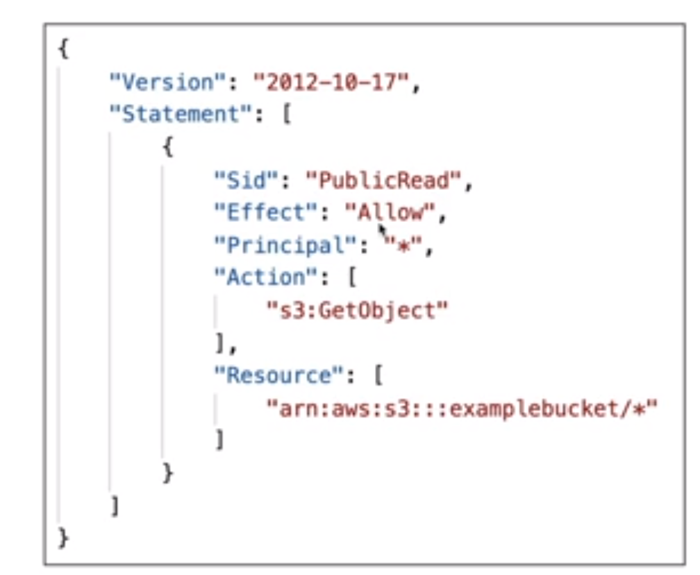

<!-- toc -->

- [S3 Buckets and Objects](#s3-buckets-and-objects)
  * [S3 Objects](#s3-objects)
  * [Amazon S3 Policies](#amazon-s3-policies)
  * [S3 Static Website](#s3-static-website)
  * [S3 CORS](#s3-cors)
  * [S3 Versioning](#s3-versioning)
  * [S3 Replication](#s3-replication)
  * [S3 Storage Classes](#s3-storage-classes)
  * [S3 Lifecycle Management](#s3-lifecycle-management)
  * [S3 Encryption](#s3-encryption)
  * [S3 Shared Responsibility Model](#s3-shared-responsibility-model)
  * [Aws Snow Family](#aws-snow-family)
  * [Hybrid Cloud Storage](#hybrid-cloud-storage)

<!-- tocstop -->

## S3 Buckets and Objects
It is an infinite storage. It is a simple key-value store. There are many S3 use cases:
- Backup and storage
- Disaster recovery
- Archive
- Hybrid cloud storage
- Application hosting
- Media hosting
- Data lakes and big data analytics
- Software delivery
- Static website hosting

S3 store files into buckets (directories). The buckets must have a globally unique name, across all regions and accounts.
The buckets are defined at the region level. You can have many buckets in a region.

**Buckets are not global, they are created in a specific region**.

### S3 Objects
The objects have a Key, the key is the full path of the object. The key is composed by a prefix which is the name of
folder inside the bucket and the name of the object.

Object values are the content of the body. The content can be anything and it is limited to 5TB. Then each Objects have some
**metadata** associated with it. The metadata is a set of name-value pairs. They Also have **tags** which are used to manage the
objects. And they could also have a **version id**. Once we create a bucket we can configure it, selecting the region and so on. Then we can upload files into the bucket, inside the Object review there are the properties of the object uploaded and
metadata and permissions.

We can create folders inside buckets and upload files, the folders are called **prefixes**. The prefixes are not real folders, they are just part of the object name.

### Amazon S3 Policies
There are different ways to secure your S3 buckets and objects:
- User-based: IAM policies (which users can perform which actions on which buckets) or Roles.
- Resource-based: bucket policies (bucket wide rules) and object access control list (ACL, finer grain)
- Encryption meaning that we can encrypt the data in transit (SSL/TLS) and at rest (Server Side Encryption or SSE)

- Note: an IAM principal can access an S3 object if:
    - The user IAM permissions allow it OR the resource policy ALLOWS it
    - There are no DENY at the bucket, object or IAM policy level that are explicit

The bucket S3 polciies are **JSON based policies** and they are bucket level. They look likes:

they specify:
1. Resources: buckets and objects
2. Effect: allow or deny
3. Actions: set of API to allow or deny
4. Principal: the account or user to apply the policy to (* to anyone)

We need to use an S3 Bucket Policy when we want to:
- Grant public access to the bucket
- Force objects to be encrypted at upload
- Grant access to another account (Cross Account)

There is also the bucket settings for block public access.

### S3 Static Website
S3 can host staic websites and have them accessible on the internet. For doing this you need to
make the s3 policy public and then you can access the website using the endpoint of the bucket.

All way down is in properties there is the static website hosting and you can enable it. You need to specify the index.html document
and the error.html document.

### S3 CORS
Cross Origin Resource Sharing. It allows to access resources from one website to another website. It is used to allow
requests to the S3 bucket from other domains. It is useful when you want to host a static website on S3 and you want to
load some resources from another domain.

### S3 Versioning
It allows to keep multiple versions of an object in one bucket.
- It is enabled at the bucket level.
- Same key overwrite will increment the version: 1, 2, 3
- It is best practice to version your buckets (protect against unintended deletes or rolling back to previous versions)

For activating the versioning you need to go to the bucket and then to the properties and then to the versioning and then
you can enable it. Once you enable it you can see the versions of the objects. You can also delete the versions of the
objects.

The objcets that were created before the versioning was enabled will have the version id of null. Also when deleting files and having versioning enabled the files will not be deleted but they will be archived (delete marker), to restore
the file you need to delete the delete marker and then the file will be restored.

### S3 Replication
It allows to replicate the objects from one bucket to another bucket in another region. It is useful for:
- Compliance
- Lower latency access
- Replication across accounts (different accounts)
- Replication across AWS accounts (same account)
- Replication can also help with the accidental deletion of objects
- You cannot replicate to multiple buckets or use daisy chaining (bucket 1 replicates to bucket 2 which replicates to bucket 3)

There are two types of replication:
- **Cross Region Replication (CRR)**: versioning must be enabled on both the source and destination buckets.  They are used for compliance, lower latency access, replication across accounts (different accounts), replication across AWS accounts (same account).
- **Same Region Replication (SRR)**: versioning must be enabled on both the source and destination buckets. They are used for log aggregation, live replication between production and test accounts, live replication between production and test accounts.
It is also possible to have buckets in a different AWS account, and the copying is asynchronous.

it works only with versioning enabled, for activating the replication you need to go to the bucket and then to management
and then to replication and then you can enable it. Then you need to select the destination bucket and the storage class
and then you can enable it.

### S3 Storage Classes
Let's define the durability and availability of the storage classes:
1. Durability: represents how many time and object is retained. It is measured in 11 9s (99.999999999%). On average you will lose 1 object every 10 million years.
2. Availability: represents how likely you are to retrieve an object when requested. It is measured in 9s (99.99%). On average you will fail 1 request every 10,000 requests.

We have different storage classes:
- S3 Standard:
  - 99.99% availability
  - Used for frequently accessed data
  - Low latency and high throughput
  - Sustain 2 concurrent facility failures
  - Use cases: big data analytics, mobile and gaming applications, content distribution
- S3 IA (Infrequently Accessed):
  - for data that is accessed less frequently, but requires rapid access when needed.
  - Lower fee than S3, but you are charged a retrieval fee.
  - 99.9% availability
  - Use cases: As a data store for disaster recovery, backups
- S3 One Zone IA:
  - for where you want a lower-cost option for infrequently accessed data, but do not require the multiple Availability Zone data resilience.
  - 99.5% availability
  - Use cases: Storing secondary backup copies of on-premises data, or storing data you can recreate
- S3 Glacier:
  - secure, durable, and low-cost storage class for data archiving.
  - You can reliably store any amount of data at costs that are competitive with or cheaper than on-premises solutions. Retrieval times configurable from minutes to hours.
  - Glacier Instant Retrieval option allows you to retrieve data within minutes.
  - Glacier Flexible Retrieval option allows you to retrieve large amounts of data within hours.
  - Glacier Deep Archive: lowest-cost storage class where a retrieval time of 12 hours is acceptable.
- S3 intelligent Tiering:
  - designed to optimize costs by automatically moving data to the most cost-effective access tier, without performance impact or operational overhead.
  - S3 Manage Access Tiers: automatically move data to the most cost-effective access tier, without performance impact or operational overhead.
  - 99.9% availability
  - Use cases: Data lakes, analytics, content distribution

### S3 Lifecycle Management
It allows to manage the lifecycle of your objects. It can be used in conjunction with versioning. It can be applied to
current and previous versions. It can be used to transition objects to another storage class (for example from standard
to IA). It can be used to expire objects at a certain time. It can be used to delete objects.

It allow to save money by moving objects to cheaper storage classes or deleting them.

### S3 Encryption
There are 4 methods of encrypting objects in S3:
1. Server-side encryption: encrypts S3 objects using keys handled and managed by AWS. There are 3 types of server-side encryption:
    1. S3 Managed Keys - SSE-S3: uses AES-256 to encrypt the object. It is handled by S3.
    2. AWS Key Management Service, Managed Keys - SSE-KMS: uses AWS Key Management Service to manage encryption keys. It is handled by KMS.
    3. Server-side encryption with customer-provided keys - SSE-C: uses keys managed by the customer. It is handled by the customer.

2. Client-side encryption: encrypts S3 objects using keys handled and managed by the customer outside of AWS. The customer manages the encryption process, the encryption keys, and related tools.

### S3 Shared Responsibility Model
AWS is responsible for:
- Protecting the infrastructure that runs all of the services offered in the AWS Cloud.
- This infrastructure is composed of the hardware, software, networking, and facilities that run AWS Cloud services.
- Interal configuration, patching, and securing of the guest operating system and associated application software.

User:
- Responsible for the security of anything you store in AWS services.
- S3 Versioning
- S3 Bucket Policies
- Logging and Monitoring
- S3 Storage Classes

### Aws Snow Family
They are highly secure, portable devices to collect and process data at the edge, and migrate data into and out of AWS. They are used for:
- Data migration
  - Snowcone: 8 TB of usable storage
  - Snowball Edge: 80 TB of usable storage
  - Snowmobile: 100 PB of usable storage

We might use snowball when we have a lot of data to transfer and we don't want to use the internet. We can use snowball
to transfer the data to the snowball and then we can send the snowball to AWS and then AWS will transfer the data to S3.

they are offline devices that are sent to AWS and then AWS will transfer the data to S3. AWS willl send psysical devices
to the customer and then the customer will transfer the data to the device and then the customer will send the device to
AWS and then AWS will transfer the data to S3.

Snow family are also used in edge computing. Meaning that we can use them to process data at the edge. For example we can
use them to process data from IoT devices (from trucks, ships, etc). We can use them to process the data and then send
the data to AWS. The use cases are:
- Preprocess data at the edge
- Collect data at the edge
- Machine learning inference

### Hybrid Cloud Storage
AWS is pushing for hybrid cloud storage. It is a combination of on-premises storage and cloud storage. This can be due to:
1. long cloud migration times
2. security concerns
3. compliance concerns
4. it strategy.

To create it upi need to use AWS Storage Gateway. It is a service that connects an on-premises software appliance with cloud-based storage to provide seamless and secure integration between an organization's on-premises IT environment and AWS's storage infrastructuue.
it allow to bridge the gap between on-premises and cloud storage.
