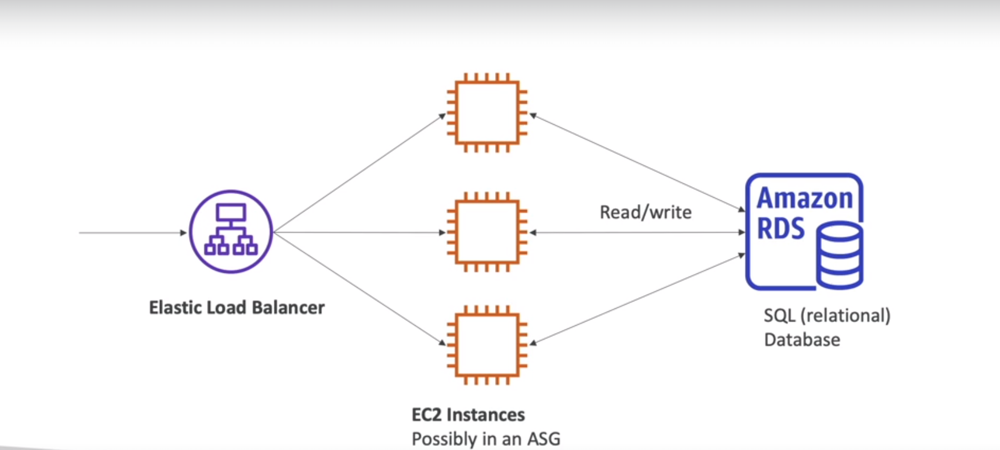
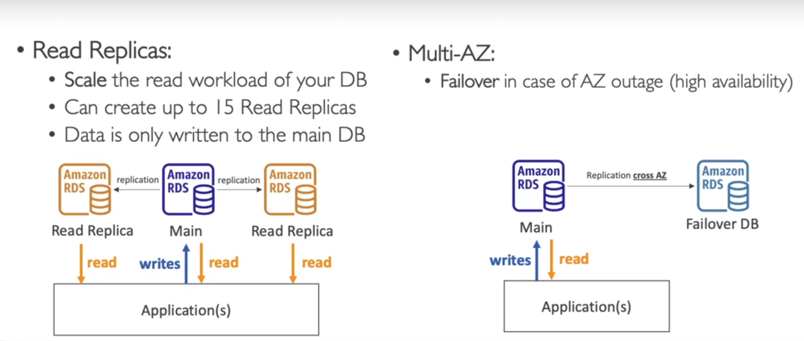
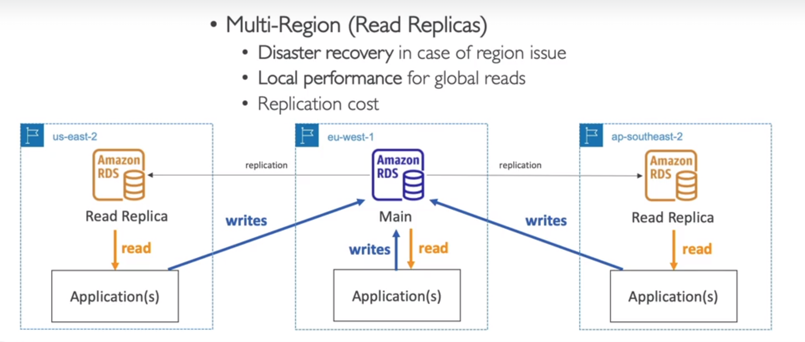
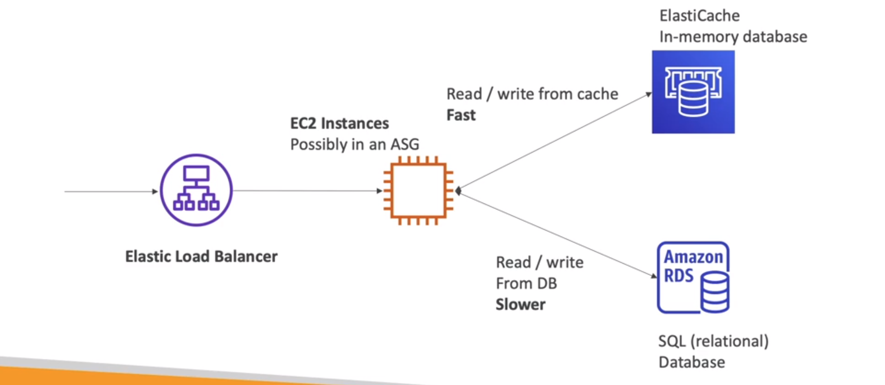
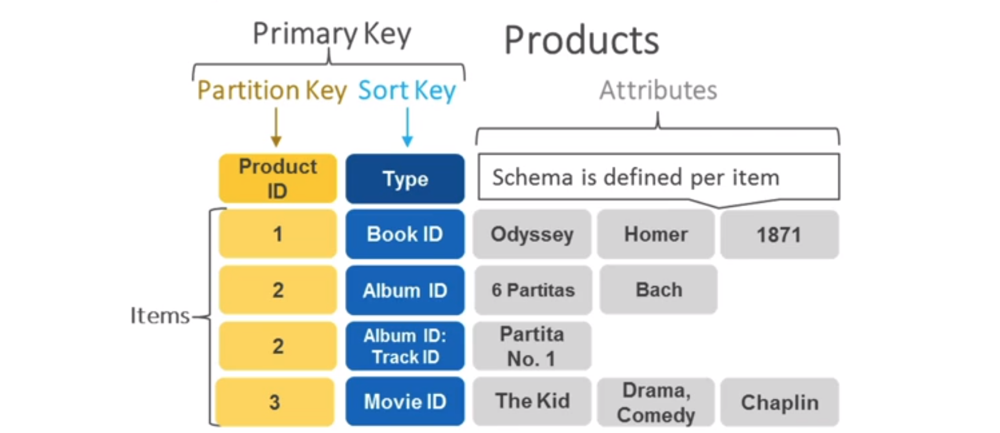
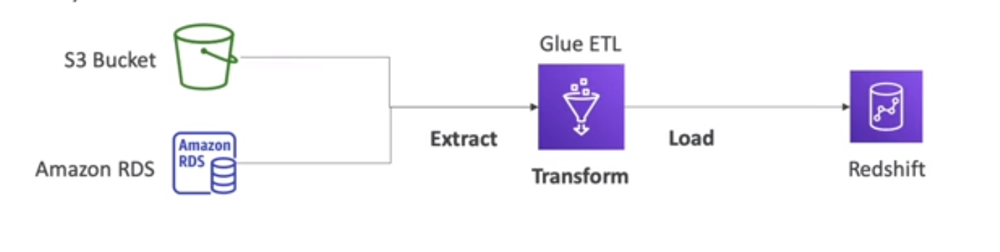

<!-- toc -->

- [Databases](#databases)
  * [RDS (Relational Database Service)](#rds-relational-database-service)
    + [Amazon Aurora](#amazon-aurora)
    + [RDS Example](#rds-example)
    + [RDS snapshots](#rds-snapshots)
    + [RDS Deployment](#rds-deployment)
      - [Read replicas:](#read-replicas)
      - [Multi AZ](#multi-az)
      - [Multi-Regions](#multi-regions)
  * [Amazon ElastiCache](#amazon-elasticache)
  * [DynamoDB](#dynamodb)
    + [DynamoDB Accelerator (DAX)](#dynamodb-accelerator-dax)
    + [DynamoDB example](#dynamodb-example)
    + [DynamoDB Global Tables](#dynamodb-global-tables)
  * [Redshift](#redshift)
  * [Amazon EMR](#amazon-emr)
  * [Amazon Athena](#amazon-athena)
  * [Amazon QuickSight](#amazon-quicksight)
  * [Document DB](#document-db)
  * [Amazon Neptune](#amazon-neptune)
  * [Amazon QLDB (Quantum Ledger Database)](#amazon-qldb-quantum-ledger-database)
  * [Amazon Managed Blockchain](#amazon-managed-blockchain)
  * [AWS Glue](#aws-glue)
  * [DMS (Database Migration Service)](#dms-database-migration-service)
  * [Summary](#summary)

<!-- tocstop -->

## Databases
### RDS (Relational Database Service)
It is a managed service that allows to set up, operate, and scale a relational database in the cloud. They can be different
types such as PostgreSQL, MySQL, MariaDB, Oracle, Microsoft SQL Server, and Amazon Aurora.

The advantage over EC2 is that it is managed by AWS. It is easy to set up, operate, and scale:
- Automated provisioning, OS patching
- Continuous backups and restore to specific timestamp (Point in Time Restore)
- Monitoring dashboards
- Read replicas for improved read performance
- Multi AZ setup for DR (Disaster Recovery)
- Maintenance windows for upgrades
- Scaling capability (vertical and horizontal)
- Storage backed by EBS (gp2 or io1)

The disadvantage is that you can't SSH into your instances. You can't customize the database software.

#### Amazon Aurora
It is a MySQL and PostgreSQL-compatible relational database built for the cloud. It is proprietary technology from AWS. It is a managed service. It is compatible with MySQL and PostgreSQL. It is not open source. It is not available for on-premises deployment.
Aurora is AWS cloud optimized and claims 5x performance improvement over MySQL on RDS, over 3x the performance of PostgreSQL on RDS. It automatically grows in increments of 10GB, up to 64TB. It can have 15 replicas while MySQL has 5 replicas. It can have 5x replication throughput of MySQL. It can have 2 copies of your data in each AZ, with minimum of 3 AZs. It can handle loss of 2 copies of data without affecting write availability and 3 copies without affecting read availability. It costs 20% more than RDS (MySQL) but is more efficient.

#### RDS Example
We can create an RDS instance using the AWS console. We can choose the database engine. We can choose the instance type.
Going to RDS -> Databases -> Create database then you need to choose the database engine (MySQL, PostgreSQL, etc). Then you
need to choose the instance type.

There are also some templates that you can use. For example you can use the free tier template (dev or test). We have to select
the storage type. We can choose the storage type (SSD or HDD). We can choose the storage size and also the auto scaling
option. Lastly you have to create a new security group or use an existing one.

#### RDS snapshots
It is a backup of the database. It is stored even if you delete the original RDS instance. It is stored in S3. It is
automatically enabled. It is taken every day during the maintenance window. It is stored even if you delete the original
RDS instance.

It will allow to recreate the database from it, you can also copy it to another region.

#### RDS Deployment
RDS Multi-AZ deployments’ main purpose is high availability, and RDS Read replicas’ main purpose is scalability. Moreover, Multi-Region deployments’ main purpose is disaster recovery and local performance.

##### Read replicas:
The read replicas are used to increase the read performance. Wha is done is that the read replicas are created and then
the data is copied from the main DB to the read replicas. The read replicas are used to read the data. The data is only
written to the main DB.

##### Multi AZ
It is for disaster recovery only. We are setting a replica in another AZ, in case the main RDS crashes then the replica
will be used. Data is only read/written from the main DB (when the main DB crashes then the replica will be used).

##### Multi-Regions
It is for disaster recovery only. We are setting a replica in another region, in case the main RDS crashes then the replica
will be used. The data will be written only into the main region.

### Amazon ElastiCache
It used to managed Redis or memchaded. Caches are **in-memory databases** with high performance, low latency. It helps reduce load off
databases for read intensive workloads.

You basically save the query in memory for a while and then you can use it again. It is used to reduce the load on the
database. It is used for read intensive workloads.

### DynamoDB
It is a NoSQL database, it scales to massive workloads with low latency and no admin overhead. It is a key-value and document database. It is serverless, meaning that you don't have to manage the
servers.

The dynamodb is a key-value database and the data looks like this:

#### DynamoDB Accelerator (DAX)
It is a fully managed in-memory cache for DynamoDB. It is a write-through cache for DynamoDB. It is used to increase
the read performance. It is used to reduce the read latency from milliseconds to microseconds. It is a good fit for
read-heavy workloads.

#### DynamoDB example
We can create a DynamoDB table using the AWS console. We can choose the table name and the primary key. We can also
set the sort key.

We do not need to provision the machine, it is serverless we just need to create the table and then we can start using
it. You do not to specify schema or index and is not possible to link tables.

#### DynamoDB Global Tables
It makes a DynamoDB table accessible from anywhere in the world. It is a multi-region, multi-master replication.
- it is an active-active replication (meaning that we can write to any region)

### Redshift
It is based on Postgres but it is not used for OLTP (Online Transaction Processing) but for OLAP (Online Analytics Processing).

For instance you load data once every hour and then you run queries on it. it is a columnar database (it is optimized to read queries).
and used for data warehousing and business intelligence. It is used for analytics and data warehousing.

### Amazon EMR
Emr Stands for Elastic Map Reduce. It is used to process vast amounts of data. It is used to run big data frameworks
such as Apache Spark, Hadoop, Hive, HBase, Presto, Flink, Zeppelin, and Sqoop. It is used for big data processing
frameworks. It is used for log analysis, web indexing, data warehousing, machine learning, financial analysis, scientific
simulation, and bioinformatics.

The clusters can be made of hundreds of EC2 instances. EMR takes care of all the provisioning and configuration (and it has auto-scaling and integrated with spot instances).

### Amazon Athena
Athena is a serverless query service to perform analytics directly on S3. Is possible to query data without having to
setup or manage any servers. It is serverless and no data warehouse needed, it supports CSV, JSON, ORC, Avro, and Parquet.

there is also AmazonQuickSight that is a business intelligence tool to visualize the data extracted with Athena.

the main use cases are:
- business intelligence
- analytics
- Log analytics

### Amazon QuickSight
It is a serveress machine learning powered business intelligence service to create interactive dashboards from various
data sources. It is serverless and no data warehouse needed. It is integrated with Athena, RDS, Redshift, S3, and EMR.

The main use cases are:
- Business intelligence
- Analytics
- Visualize data
- Create interactive dashboards

### Document DB
It is a fully managed document database service that supports MongoDB workloads, which is a no-sql database. It is
based on the MongoDB API. You have the similar deployment concepts as Aurora.

It automatically scales to workloads with millions of requests per second.

### Amazon Neptune
It is a fully managed graph database service that supports graph workloads. It is used to store relationships between
data. It is used for social networking, recommendation engines, fraud detection, knowledge graphs, life sciences, and
networks.

the main use cases are:
- Social networking
- Recommendation engines
- Fraud detection
- Knowledge graphs

### Amazon QLDB (Quantum Ledger Database)
It is a fully managed ledger database that provides a transparent, immutable, and cryptographically verifiable transaction
Is a **book recording financial transactions**. It is used to maintain a complete and verifiable history of data changes
over time. It is used for financial applications, supply chain, manufacturing, insurance, and HR.

Once a transaction is committed, it can't be changed.

### Amazon Managed Blockchain
It is services to create and manage scalable blockchain networks using the popular open source frameworks Hyperledger
Fabric and Ethereum. It is used to create a blockchain network in minutes. It is used for decentralized applications.

### AWS Glue
It is a fully managed extract, transform, and load (ETL) service that makes it easy for customers to prepare and load
their data for analytics.

The idea is that you will use Glue to prepare data and is fully serverless service. It is used to prepare data for
analytics.

### DMS (Database Migration Service)
It is a service to migrate databases to AWS quickly and securely. It is used to migrate from on-premise to AWS. It is
used to migrate from one database engine to another. The source database remains fully operational during the migration.

it supports homogenous migrations (same database engine) and heterogeneous migrations (different database engine).

### Summary
- Relational databases - OLTP (Online Transaction Processing): RDS & Aurora
- Differences between Multi-AZ and Read Replicas and Multi-Region
- In-memory databases - OLTP (Online Transaction Processing): ElastiCache
- Key-value databases - DynamoDB (serverless) & DAX (in-memory cache for DynamoDB)
- Warehouse databases - OLAP (Online Analytics Processing): Redshift
- Hadoop / Spark / Big Data - EMR (Elastic Map Reduce)
- Query data on s3 - Athena
- Dashboard and visualization - QuickSight
- Graph database - Neptune
- MongoDB - DocumentDB
- Ledger database - QLDB
- Blockchain - Managed Blockchain
- ETL - Glue
- Database migration - DMS
