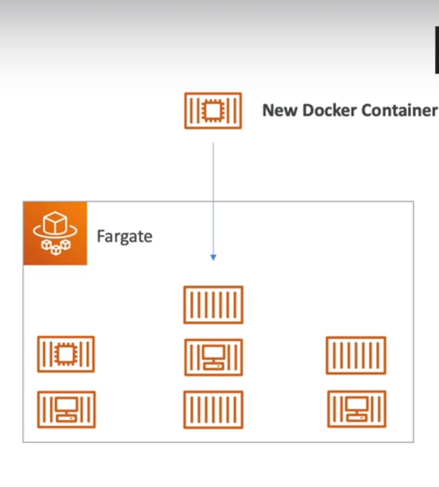

<!-- toc -->

- [Other compute services: ECS, ECR, Fargate, Lambda, Batch, Lightsail](#other-compute-services-ecs-ecr-fargate-lambda-batch-lightsail)
  * [ECS (Elastic Container Service)](#ecs-elastic-container-service)
  * [FarGate](#fargate)
  * [ECR (Elastic Container Registry)](#ecr-elastic-container-registry)
  * [Lambda](#lambda)
    + [Benefits of Lambda](#benefits-of-lambda)
    + [Lambda CRON Job (CloudWatch Events)](#lambda-cron-job-cloudwatch-events)
    + [Pricing:](#pricing)
    + [Create Lambda function](#create-lambda-function)
    + [Lambda Triggers](#lambda-triggers)
  * [Amaazon API Gateway](#amaazon-api-gateway)
  * [AWS Batch](#aws-batch)
  * [AWS Lightsail](#aws-lightsail)

<!-- tocstop -->

## Other compute services: ECS, ECR, Fargate, Lambda, Batch, Lightsail
### ECS (Elastic Container Service)
It allow to launch docker containers on AWS, you must provision the EC2 instances yourself.


### FarGate
It is a serverless compute engine for containers. It is a serverless compute engine for containers. We do not have to
provision the EC2 instances ourselves, you need to provide the CPU and RAM requirements and AWS will launch the
containers for you.



### ECR (Elastic Container Registry)
It is a fully managed Docker container registry. It is integrated with ECS and EKS. It is used to store, manage, and
deploy Docker container images.

### Lambda
Is the pioneer of serverless compute. It is a compute service where you can upload your code and create a Lambda
function. AWS Lambda takes care of provisioning and managing the servers that you use to run the code. You don't have
to worry about operating systems, patching, scaling, etc.

With Lambda differently to Ec2 we have **virtual functions** (we don't have to manage the servers), they are limited
by time (**short executions**) and **run on-demand** (no charge when the code is not running) lastly the scaling
is automated.

#### Benefits of Lambda
Lambda have many benefits:

1. Easy pricing (pay per request and compute time)
2. Integrated with other AWS services
3. Event-driven (Lambda can be triggered by events, reactive type of services)
4. Easy monitoring through AWS CloudWatch
5. Easy to get more resources per function (just increase the memory)
6. Languages supported: Node.js, Python, Java, C#, Go, PowerShell, Ruby, and Custom Runtime API (any programming language)

if it comes to run Docker images on Lambda we need Lambda Container Image Support. It is a feature that allows us to
run Lambda functions as a container image.


This example is complety full serverless, we have a Lambda function that is triggered by an API Gateway, the Lambda
function is connected to DynamoDB and S3, and the Lambda function is also connected to CloudWatch to monitor the
function.

#### Lambda CRON Job (CloudWatch Events)
Another use case is a serverless cron job (schedule), based on it run a script. We can use CloudWatch Events to trigger
Lambda functions at a specific time.

#### Pricing:
Lambda pricing is based on calls and duration and is very cheap.

- You pay per calls:
  - First 1 million requests are free
  - $0.20 per 1 million requests thereafter ($0.0000002 per request)
- Pay per duration:
  - Duration is calculated from the time your code begins executing until it returns or otherwise terminates, rounded up to the nearest 1 ms.
  - The price depends on the amount of memory you allocate to your function. You are charged $0.00001667 for every GB-second used.
  - The free tier provides 400,000 GB-seconds of compute time per month.

#### Create Lambda function
There are different type of Lambda function, we can select blueprint then we create the new role, and then we can
create the function.

In configuration we can set many important things like the timeout, memory, and the VPC.

#### Lambda Triggers
Lambda can be triggered by many AWS services, for example:
- API Gateway
- CloudFront
- S3 (Object Created, Object Removed, Object Restore)

in order to handle these events we need to create a Lambda function and then we can select the trigger, for example
if we select S3 we can select the bucket and the event type.

An example of lambda function taking a photo as input from an s3 bucket:

```python
from PIL import Image
import boto3
import uuid
import os

s3 = boto3.client('s3')

def lambda_handler(event, context):
    for record in event['Records']:
        bucket = record['s3']['bucket']['name']
        key = record['s3']['object']['key']
        download_path = '/tmp/{}{}'.format(uuid.uuid4(), key)
        upload_path = '/tmp/resized-{}'.format(key)

        s3.download_file(bucket, key, download_path)
        resize_image(download_path, upload_path)
        s3.upload_file(upload_path, '{}resized'.format(bucket), key)

def resize_image(image_path, resized_path):
    with Image.open(image_path) as image:
        image.thumbnail(tuple(x / 2 for x in image.size))
        image.save(resized_path)
```

### Amaazon API Gateway
We want to build a serverless API, we can use API Gateway to create REST APIs that can trigger Lambda functions.
The gateway API will proxy the request to the Lambda function.


### AWS Batch
It is a batch processing service that allows you to run batch jobs on AWS. It will dynamically provision the optimal
quantity and type of compute resources (EC2 instances) based on the volume and specific resource requirements of the
batch jobs submitted.

Batch jobs are defined as Docker images and run on ECS.

### AWS Lightsail
It allows to launch virtual private servers (VPS) with pre-configured options. It is a good option for beginners.
it is a simpler alternative to using EC2 instances, RDS, ELB and so on.
