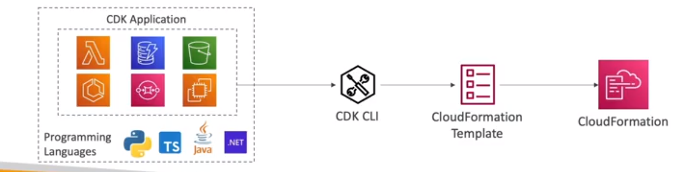
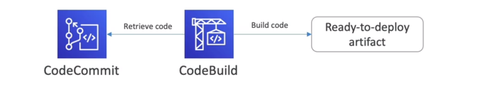
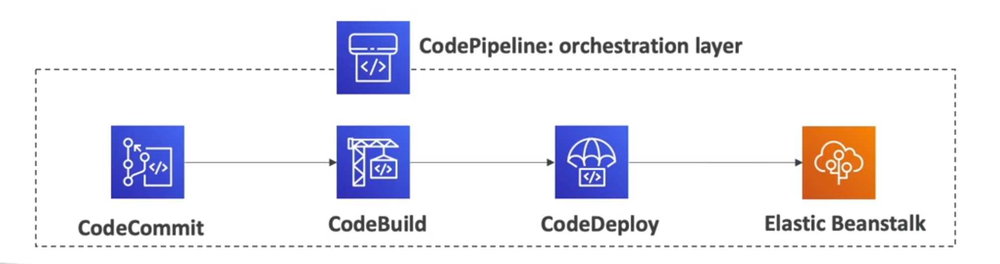

<!-- toc -->

- [Deploy and managing infrastructure at scale: CloudFormation, Elastic Beanstalk, OpsWorks, and CloudDeploy](#deploy-and-managing-infrastructure-at-scale-cloudformation-elastic-beanstalk-opsworks-and-clouddeploy)
  * [CloudFormation (IaC)](#cloudformation-iac)
    + [CloudFormation Template](#cloudformation-template)
    + [AWS Cloud Development Kit (CDK)](#aws-cloud-development-kit-cdk)
    + [Aws Beanstalk (PaaS)](#aws-beanstalk-paas)
  * [AWS CodeDeploy](#aws-codedeploy)
  * [AWS CodeCommit](#aws-codecommit)
  * [AWS CodeBuild](#aws-codebuild)
  * [AWS CodePipeline](#aws-codepipeline)
  * [AWS CodeArtifact](#aws-codeartifact)
  * [AWS CodeStar](#aws-codestar)
  * [AWS Cloud9](#aws-cloud9)
  * [AWS Systems Manager (SSM)](#aws-systems-manager-ssm)
  * [AWS OpsWorks](#aws-opsworks)
  * [AWS CloudFormation vs Elastic Beanstalk](#aws-cloudformation-vs-elastic-beanstalk)

<!-- tocstop -->

## Deploy and managing infrastructure at scale: CloudFormation, Elastic Beanstalk, OpsWorks, and CloudDeploy
### CloudFormation (IaC)
It is a declarative way of outlining your AWS Infrastructure, for any resources (most of them are supported). For
example within a CloudFormation template we can say: I want a security group, I want two EC2 instances using this
security group, I want an S3 bucket, and I want a load balancer in front of these EC2 instances.

then CloudFormation creates those for us, it will provision all the resources in the right order with the exact
configuration that we specify.

It is **infrastructure as code**. It is a very powerful tool to automate the deployment of your infrastructure.
The main benefits are:
- Automated provisioning
- Infrastructure as code
- Cost estimation
- Productivity

#### CloudFormation Template
It is a JSON/YAML file that describes your AWS infrastructure. It is declarative, we specify what we want and AWS
CloudFormation will take care of the rest.
example:
```yaml
AWSTemplateFormatVersion: "2010-09-09"
Description: "Simple CloudFormation template"
Resources:
  MyEC2Instance:
    Type: "AWS::EC2::Instance"
    Properties:
      AvailabilityZone: "us-east-1a"
      ImageId: "ami-0ff8a91507f77f867"
      InstanceType: "t2.micro"

  SecurityGroup:
    Type: "AWS::EC2::SecurityGroup"
    Properties:
      GroupDescription: "Allow SSH and HTTP access"
      SecurityGroupIngress:
        - IpProtocol: "tcp"
          FromPort: "22"
          ToPort: "22"
          CidrIp: "
```

#### AWS Cloud Development Kit (CDK)
it define your cloud infrastructure using an imperative programming language. It is a software development framework
for defining cloud infrastructure in code and provisioning it through AWS CloudFormation. Instead of writing YAML or
JSON CloudFormation templates, we can define our infrastructure using TypeScript, Python, Java, C# or JavaScript and then
compile it into CloudFormation template.



#### Aws Beanstalk (PaaS)
AWS Elastic Beanstalk is a Platform as a Service (PaaS) offered by Amazon Web Services. This service is designed to make web-scale cloud computing easier for developers. It provides an environment to easily deploy and run applications in the language of your choice.

When we deploy a web application tipically we use a ELB + ASG + EC2 + RDS. Elastic Beanstalk is a service that allows
us to deploy and scale web applications and services.

It is a developer centric view of deploying an application on AWS. It uses all the components we need to deploy and
scale our application (ELB, ASG, EC2, RDS, etc). We simply upload our application code and Elastic Beanstalk will
automatically handle the deployment, from capacity provisioning, load balancing, auto-scaling to application health
monitoring.

It is free but we pay for the underlying instances.

there are three architecture models:
- Single instance deployment: good for dev
- LB + ASG: great for production or pre-production web applications
- ASG only: great for non-web apps in production (workers, etc)

it supports many platforms (includes docker python and so on.) and it also has a full monitored dashboard and
even a CLI and IDE integration for metrics and logs.

under the hood it uses CloudFormation.

### AWS CodeDeploy

CodeDeploy is a deployment service that automates application deployments to various compute services such as Amazon EC2, AWS Fargate, AWS Lambda, and your on-premises servers. It helps you to release new features rapidly, avoid downtime during application deployment, and handle the complexity of updating your applications. 

Integration: CodeDeploy can be integrated with AWS CodePipeline to create a continuous delivery pipeline. 

Use Case: If you have a web application hosted on EC2 instances and you want to automate the deployment process whenever a new version of the application is released, you can use CodeDeploy.

It is a service that automates code deployments to any instance, it works with ec2 instances and on-premises servers (hybrid service)

### AWS CodeCommit

CodeCommit is a fully-managed source control service that hosts secure Git-based repositories. It makes it easy for teams to collaborate on code in a secure and highly scalable ecosystem. 

Integration: CodeCommit can be integrated with AWS CodeBuild, CodeDeploy, and CodePipeline for a fully managed, end-to-end, continuous integration and delivery system.

Use Case: If you are developing a software application and you need a centralized repository to store, manage, and track code, AWS CodeCommit is the service to use.

It is a managed source control service that hosts secure Git-based repositories. It is a private Git repository. It is a
fully managed service that scales automatically. It is integrated with CodePipeline and CodeDeploy.

### AWS CodeBuild
CodeBuild is a fully managed build service that compiles source code, runs tests, and produces software packages that are ready to deploy. It eliminates the need to set up, patch, and manage your own build servers.

Integration: CodeBuild can be integrated with CodeCommit, CodeDeploy, and CodePipeline. For example, you can use CodePipeline to orchestrate the entire software release process, where CodeBuild is used as one of the stages in the pipeline.

Use Case: If you have a Java application stored in a CodeCommit repository and you want to compile the code and run unit tests every time a change is made, you can use CodeBuild.

It allow to build and test code with continuous scaling. It is a fully managed build service that compiles source code,
runs tests and produces software packages that are ready to deploy. It is integrated with CodePipeline.



### AWS CodePipeline

CodePipeline is a fully managed continuous delivery service that helps you automate your release pipelines for fast and reliable application and infrastructure updates. 

Integration: CodePipeline integrates with AWS services such as CodeCommit, CodeBuild, CodeDeploy, and CodeStar, as well as third-party tools like GitHub, Jenkins, and TeamCity.

Use Case: If you want to automate the release process of your application, where the code is stored in CodeCommit, built using CodeBuild, and deployed using CodeDeploy, you can use CodePipeline to orchestrate the entire process.

It is a continuous delivery service that automates your release pipelines for fast and reliable application and
infrastructure updates. It is a CI/CD tool. It is a fully managed service that helps us automate our release pipelines
for fast and reliable application and infrastructure updates. It is a continuous delivery service that automates your
release pipelines for fast and reliable application and infrastructure updates. It is a fully managed service that
helps us automate our release pipelines for fast and reliable application and infrastructure updates.

It is integrated with many other AWS services (CodeCommit, CodeBuild, CodeDeploy, CloudFormation, Elastic Beanstalk,
ECS, etc).



### AWS CodeArtifact

CodeArtifact is a fully managed artifact repository service that makes it easy for organizations of any size to securely store, publish, and share software packages used in their software development process.

Integration: CodeArtifact can be integrated with other AWS services like CodeBuild and CodePipeline to support the creation of continuous integration and delivery (CI/CD) pipelines.

Use Case: If your development team uses a lot of open-source libraries and you want to ensure that only approved libraries are used in your projects, you can use CodeArtifact to create a central repository for these libraries. This way, you can control which libraries are used and ensure that they are free from vulnerabilities.

It is a fully managed software artifact repository service that makes it easy for organizations of any size to securely
store, publish and share packages used in their software development process.

Is a secure, scalable and cost-effective artifact management for software development.

### AWS CodeStar
AWS CodeStar is a cloud-based service for developing, building, and deploying applications on AWS. It provides a unified user interface, enabling you to manage your software development activities in one place. 

Function: CodeStar allows you to quickly develop, build, and deploy applications on AWS. It provides pre-configured project templates, setting up the continuous delivery toolchain for you, so you can start releasing code faster.

Integration: CodeStar integrates with other AWS services like AWS CodeCommit, AWS CodeBuild, AWS CodeDeploy, and AWS CodePipeline. These services provide a continuous integration and continuous delivery (CI/CD) pipeline that makes it easier to release and track new application versions.

Use Case: Suppose you're a startup that wants to quickly develop and deploy a web application. With AWS CodeStar, you can select a pre-configured project template (for example, a web application running on AWS Lambda), and CodeStar will set up the entire CI/CD pipeline for you. This allows you to focus on writing code and deploying features, rather than managing infrastructure.


### AWS Cloud9
AWS Cloud9 is a cloud-based integrated development environment (IDE) that lets you write, run, and debug your code with just a browser. 

Function: Cloud9 comes pre-packaged with essential tools for popular programming languages, including JavaScript, Python, PHP, and more, so you don't have to install files or configure your development machine to start new projects. It also provides a seamless experience for developing serverless applications.

Integration: Cloud9 integrates with AWS CodeStar, allowing you to easily share your development environment with your team. It also integrates with AWS Lambda, enabling you to step-through debug code in your Lambda functions.

Use Case: Suppose you're a developer working on a serverless application. With AWS Cloud9, you can write, run, and debug your Lambda functions in the same environment. You can also share your Cloud9 environment with your team, making collaborative coding much easier.


### AWS Systems Manager (SSM)
AWS Systems Manager (SSM) is a management service that helps you automatically collect software inventory, apply OS patches, create system images, and configure Windows and Linux operating systems. It provides a unified user interface so you can view operational data from multiple AWS services and allows you to automate operational tasks across your AWS resources.

SSM integrates with other AWS services like Amazon EC2 (Elastic Compute Cloud) and Amazon RDS (Relational Database Service). For instance, you can manage your EC2 instances and on-premises server instances through SSM. It also integrates with AWS Organizations to enable you to manage tasks on AWS resources in all accounts in your organization.

A real-world use case for SSM could be in the management of a fleet of EC2 instances. For example, a company might have hundreds of EC2 instances running their applications. With SSM, they can automate tasks such as patching, configuration, and installation of software, ensuring that all instances are consistently maintained and reducing the manual effort required.

the SSM session manager allows us to connect to our EC2 instances through a browser-based shell or CLI. It is a secure way of accessing our EC2 instances without needing to open SSH ports.

### AWS OpsWorks
It is a configuration management service that provides managed instances of Chef and Puppet. It allows us to automate operational tasks like software configurations, package installations, OS updates, etc. 

### AWS CloudFormation vs Elastic Beanstalk
- Elastic Beanstalk is the orchestration of your app
- CloudFormation is the orchestration of your infrastructure
- Elastic Beanstalk uses CloudFormation under the hood
- Elastic Beanstalk is PaaS, we don't have to worry about the underlying infrastructure
- CloudFormation is IaC, we have to write the code to define our infrastructure
- Elastic Beanstalk is great for developers who want to deploy their code with minimal fuss
- CloudFormation is great for DevOps engineers who want to have full control over their infrastructure
- Elastic Beanstalk is quicker to get started with but less customizable
- CloudFormation is slower to get started with but more customizable
- Elastic Beanstalk is free but you pay for the underlying instances
- CloudFormation is free but you pay for the underlying resources
