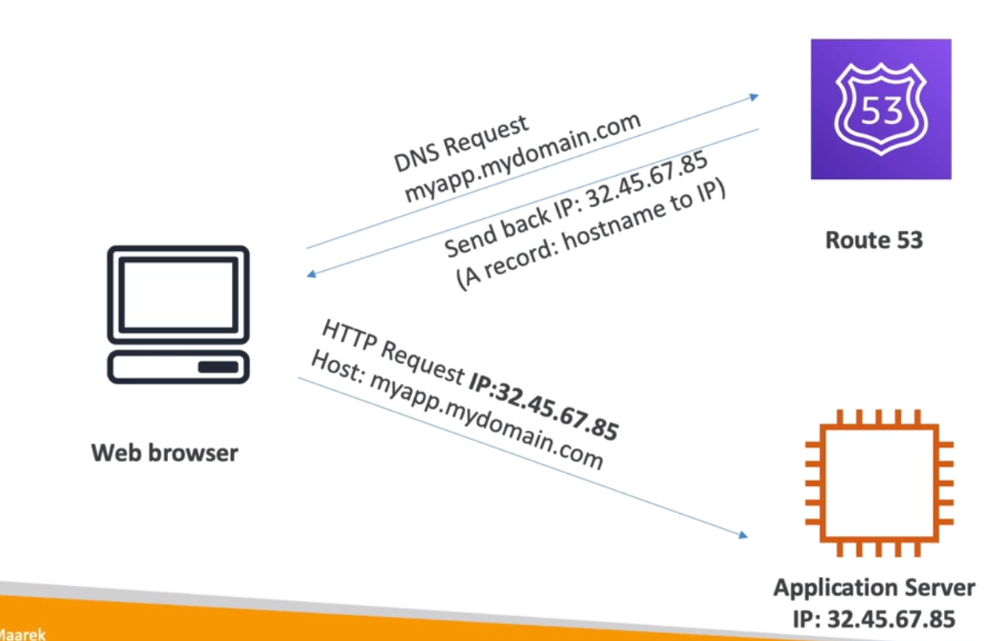
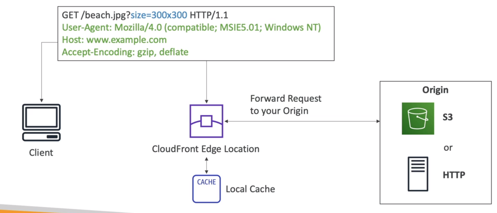
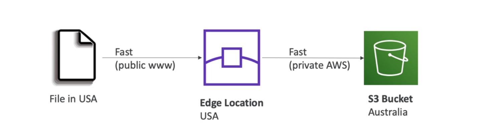
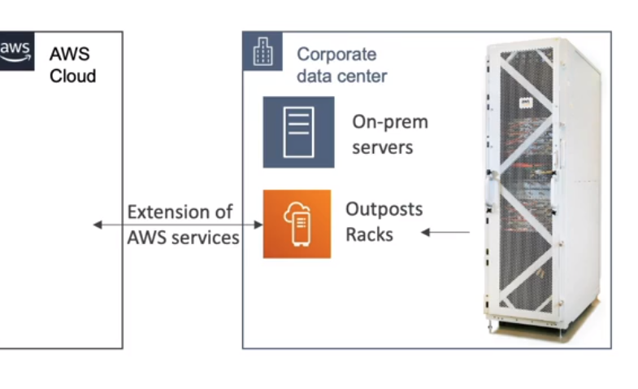
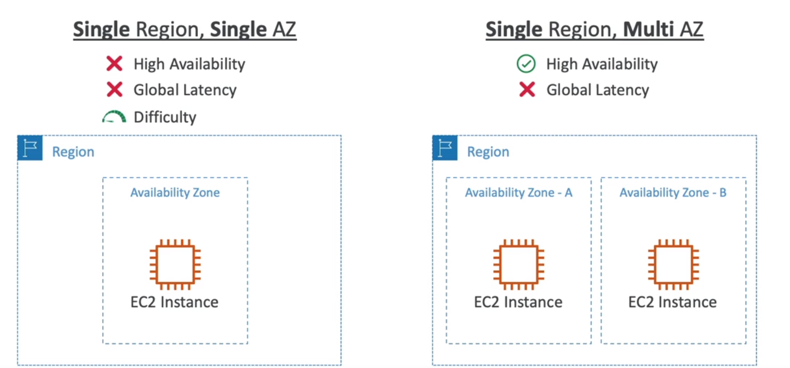
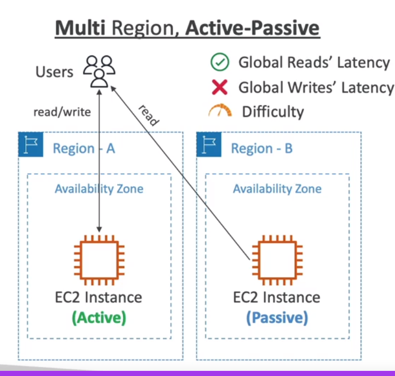
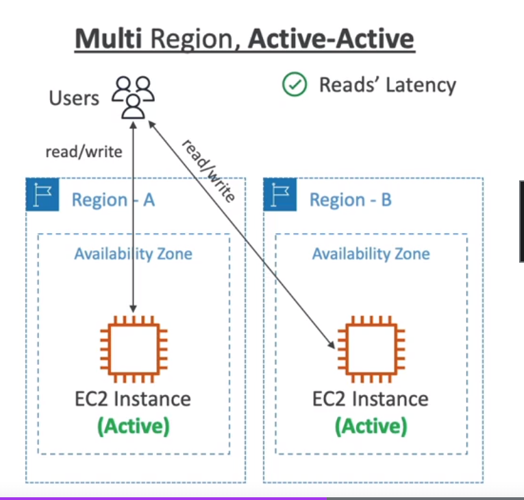

<!-- toc -->

- [Leveraging AWS Global Infrastructure](#leveraging-aws-global-infrastructure)
  * [Route53](#route53)
    + [Routing Policies](#routing-policies)
    + [Route53 example](#route53-example)
  * [CloudFront](#cloudfront)
  * [S3 Transfer Acceleration](#s3-transfer-acceleration)
  * [Global Accelerator](#global-accelerator)
    + [Global Accelerator vs CloudFront](#global-accelerator-vs-cloudfront)
    + [Global Accelerator vs S3 Transfer Acceleration](#global-accelerator-vs-s3-transfer-acceleration)
  * [AWS Outposts](#aws-outposts)
  * [Aws WaveLength](#aws-wavelength)
  * [AWS Local Zones](#aws-local-zones)
  * [Global Applications Architecture](#global-applications-architecture)
    + [Single region](#single-region)
    + [Multi region, Active-Passive](#multi-region-active-passive)
    + [Multi region, Active-Active](#multi-region-active-active)

<!-- tocstop -->

## Leveraging AWS Global Infrastructure
A global application is an application that can be accessed from anywhere in the world. It is an application that is
not bound to a specific region.

A global application is an application deployed in multiple regions around the world. It decreases latency for our end
users and increases availability & Disaster Recovery (DR).

We recall that:
1) Regions are isolated locations around the world that consist of multiple AZs
2) Availability zones (AZ) are isolated locations within a region that consist of one or more data centers
3) Edge Locations are endpoints for AWS which are used for caching content. Typically this consists of CloudFront, Amazon's Content Delivery Network (CDN)

The points of presence, or edge locations, are located in most of the major cities around the world. They are used by
CloudFront (CDN) to distribute content to our end users. They are also used by Route53 (DNS) to route end users to the
closest edge location.

### Route53

It is a managed DNS (Domain Name System) service. It is a DNS service that translates domain names into IP addresses.
it is a collection of rules and records which helps clients understand how to reach a server through URLs.

The mst common records are:
- A: hostname to IPv4
- AAAA: hostname to IPv6
- CNAME: hostname to hostname
- Alias: hostname to AWS resource

#### Routing Policies
There are different routing policies available:

1. Simple routing policy: it is used when we need to redirect to a single resource. It can't do health checks.
2. Weighted routing policy: it is used to split traffic between multiple resources. It can do health checks.
3. Latency routing policy: it is used to redirect to the server that has the least latency close to us. It can do health checks.
4. Failover routing policy: it is used to redirect to a resource when the other is down. It can do health checks.

#### Route53 example
First you will need to create a domain name in Route53. Then you will need to create a hosted zone. Then you will need
to create a record set & and ec2 instance.

### CloudFront
Is a content delivery network (CDN) that delivers content to end users with low latency and high data transfer speeds. It
improved read performance, content is cached at the edge. It is a global network of edge locations.

It provides DDoS protection and integration with Shield, AWS Web Application Firewall (WAF) and Amazon S3.  The origin can be an S3 bucket or Custom origin (HTTP):

To use it with S3, you will need to create a distribution and select the S3 bucket as the origin. Then you will need to
update the DNS of your domain name to point to the CloudFront distribution. You need the ACI (Origin Access Identity)
to restrict access to the S3 bucket only from the CloudFront distribution.

You can use AWS WAF web access control lists (web ACLs) to help minimize the effects of a distributed denial of service (DDoS) attack. For additional protection against DDoS attacks, AWS also provides AWS Shield Standard and AWS Shield Advanced.

### S3 Transfer Acceleration
Amazon S3 Transfer Acceleration enables fast, easy, and secure transfers of files over long distances between your client and an S3 bucket. Transfer Acceleration takes advantage of Amazon CloudFront’s globally distributed edge locations. As the data arrives at an edge location, data is routed to Amazon S3 over an optimized network path.

It is used to accelerate uploads to S3. It uses the CloudFront Edge Network to accelerate uploads to S3. Instead of uploading directly to S3, we can upload to an edge location which will then transfer the file to S3. It will increase transfer speed by transferring the file to the nearest edge location.

### Global Accelerator
AWS Global Accelerator is a networking service that improves the availability and performance of the applications that you offer to your global users. It provides static IP addresses that act as a fixed entry point to your application endpoints in a single or multiple AWS Regions, such as your Application Load Balancers, Network Load Balancers or Amazon EC2 instances.

Global Accelerator uses the AWS global network to optimize the path from your users to your applications, improving the performance of your TCP and UDP traffic. It also continually monitors the health of your application endpoints, and directs traffic only to healthy endpoints.

Integration: Global Accelerator is integrated with AWS Shield, AWS's managed Distributed Denial of Service (DDoS) protection service, which gives your applications built-in DDoS protection.

Use Case: A real-world use case for Global Accelerator would be for a global e-commerce company that has users all around the world. To ensure that all users have a fast and reliable experience, regardless of their location, the company could use Global Accelerator to route user requests through the AWS global network, reducing latency and improving the overall user experience.

#### Global Accelerator vs CloudFront
Thi difference with CloudFront is that CloudFront is used to cache content, while Global Accelerator is used to proxy
traffic at the edge.

#### Global Accelerator vs S3 Transfer Acceleration
In summary, while both services aim to improve the speed and performance of data transfer, they serve different purposes. Global Accelerator is more about improving the performance of your applications for global users, while S3 Transfer Acceleration is about speeding up the transfer of large amounts of data to and from your S3 bucket.

### AWS Outposts

AWS outpost are **server racks** that offers the same AWS infrastructure, services, APIs and tools to virtually any
datacenter, co-location space or on-premises facility for a truly consistent hybrid experience. It is a fully managed
service that extends AWS infrastructure, AWS services, APIs and tools to virtually any datacenter, co-location space
or on-premises facility for a truly consistent hybrid experience.

You are then responsible for the physical security of the Outpost.

AWS Outposts bring native AWS services, infrastructure, and operating models to virtually any data center, co-location space, or on-premises facility.

### Aws WaveLength

It is used to deploy applications at the edge of the 5G network. It is a service that provides developers the ability
to build applications that deliver ultra-low latency to mobile devices and end users. It is a service that provides
developers the ability to build applications that deliver ultra-low latency to mobile devices and end users.

### AWS Local Zones

It is used to place resources close to end users in a specific geographic area. It is an extension of an AWS region
that is in a different location from the region. It is a type of AWS infrastructure deployment that places compute,
storage, database, and other select services closer to large population, industry, and IT centers where no AWS region
exists today. It is an extension of an AWS region that is in a different location from the region.

You define a private local zone and associate it with a VPC in your AWS account. You can then create records in your
private hosted zone to route traffic to your resources.

### Global Applications Architecture
#### Single region

#### Multi region, Active-Passive

#### Multi region, Active-Active

