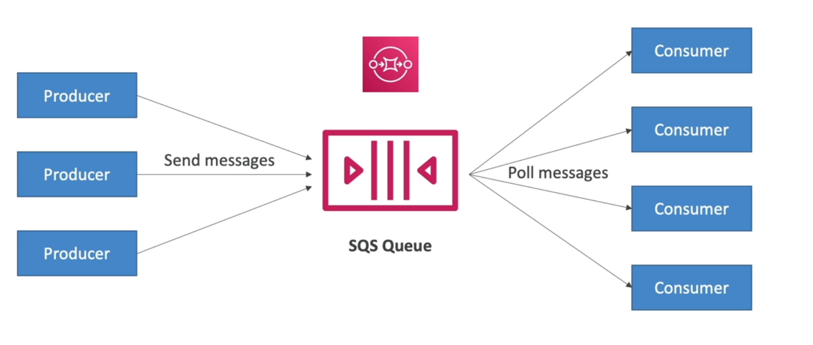
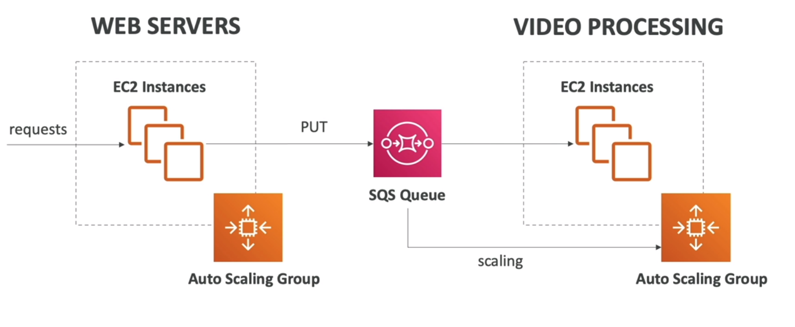

<!-- toc -->

- [Cloud Integrations](#cloud-integrations)
  * [SQS (Simple Queue Service)](#sqs-simple-queue-service)
  * [Amazon Kinesis](#amazon-kinesis)
  * [Amazon SNS (Simple Notification Service)](#amazon-sns-simple-notification-service)
  * [Amazon MQ](#amazon-mq)
- [Cloud Monitoring](#cloud-monitoring)
  * [CloudWatch Metrics](#cloudwatch-metrics)
  * [CloudWatch Alarms](#cloudwatch-alarms)
  * [CloudWatch Logs](#cloudwatch-logs)
  * [EventBridge (CloudWatch Events)](#eventbridge-cloudwatch-events)
  * [CloudTrail](#cloudtrail)
  * [AWS X-Ray](#aws-x-ray)
  * [Amazon CodeGuru](#amazon-codeguru)
- [AWS Health-Dashboard Service History](#aws-health-dashboard-service-history)
- [AWS Trusted Advisor](#aws-trusted-advisor)
- [AWS Technical Account Manager (TAM)](#aws-technical-account-manager-tam)

<!-- tocstop -->

## Cloud Integrations
When we have multiple application at some point they have to communicate with each other.  They can communicate synchronously or asynchronously (with queue or different services).

The async services once decoupled can be scaled independently from the application itself.

### SQS (Simple Queue Service)
It is a managed message queue service. It is used to decouple applications or integrate applications. It is a distributed
queue system that enables web service applications to quickly and reliably queue messages that one component in the
application generates to be consumed by another component. A queue is a temporary repository for messages that are
awaiting processing. It is a distributed queue system that enables web service applications to quickly and reliably
queue messages that one component in the application generates to be consumed by another component.

It is the oldest AWS offert, it is serverless and used to decouple applications. Once the messages are
readed byt the consumer, they are deleted from the queue. It is used to decouple applications or integrate applications as
follows:

It is also possible to create FIFO queues, which are used to guarantee the order of the messages.

### Amazon Kinesis

Amazon Kinesis is a platform to stream and analyze real-time, large-scale data. It can process hundreds of terabytes of data per hour from hundreds of thousands of sources, making it easy to collect, process, and analyze real-time, streaming data so you can get timely insights and react quickly to new information.

Kinesis integrates with other AWS services like AWS Lambda, Amazon Redshift, and Amazon S3. For instance, you can use AWS Lambda to process data and send it to other AWS services or external systems. Amazon Redshift can be used to analyze the data with SQL queries, while Amazon S3 can store the raw data for future reference.

A real-world use case for Amazon Kinesis is in ad-tech platforms, where it's crucial to process data in real-time to deliver personalized ads. For example, an ad-tech platform can use Kinesis to process clickstream data in real-time. This data can be analyzed to understand user behavior and preferences, which can then be used to serve personalized ads. The real-time nature of Kinesis ensures that the ads are relevant and timely, increasing the chances of user engagement.

### Amazon SNS (Simple Notification Service)
It is a PUB/SUB managed service that provides message delivery from publishers to
subscribers. Publishers communicate asynchronously with subscribers by sending messages to a topic, which is a logical
access point and communication channel. Subscribers (i.e., web servers, email addresses, Amazon SQS queues, AWS Lambda
functions) consume or receive the messages by subscribing to the topic.

the event publisher only sends message to one SNS topic and as many subscribers as needed consume the messages from the
SNS topic. Each subscriber to the topic will get all the messages.

### Amazon MQ
It is a managed message broker service for Apache ActiveMQ and RabbitMQ that makes it easy to set up and operate message
brokers in the cloud. It is a managed message broker service for Apache ActiveMQ and RabbitMQ that makes it easy to set
up and operate message brokers in the cloud.

it is used to migrate existing applications that use ActiveMQ or RabbitMQ to AWS.

## Cloud Monitoring
### CloudWatch Metrics
CloudWatch provides metrics for every services in AWS. It is a service that collects and tracks metrics such as CPU
utilization, latency, and request counts for your AWS resources, and applications. They have timestamps and are stored
for 15 months by default. You can create alarms based on metrics and see dashboards based on metrics.

There are many important metrics:
- EC2 instances, such as CPU utilization, network in/out, disk read/write, status check, etc.
- EBS volumes, such as disk read/write, queue length, etc.
- S3 buckets, such as bucket size, number of objects, etc.
- Lambda functions, such as number of invocations, duration, error count, etc.
- API Gateway, such as number of requests, latency, etc.
- Service limits

### CloudWatch Alarms
Alarms are used to trigger notifications for any metric. It is a type of notification that you can receive when a
particular metric reaches a threshold that you specify. You can use alarms to send email notifications or to trigger
changes in the resources that are being monitored. You can use alarms to send email notifications or to trigger changes
in the resources that are being monitored.

Trough alarms you can trigger actions such as:
- Auto scaling actions: increase/decrease EC2 instances
- EC2 actions: stop, terminate, reboot, or recover an EC2 instance
- SNS notifications: send a notification to an SNS topic
- Billing alerts: send a notification when your AWS bill exceeds a certain amount

### CloudWatch Logs
It is a service for ingesting, storing and accessing log files from EC2 instances, AWS CloudTrail, Route 53, and other
sources. It enables real-time monitoring of logs and you can adjust the log levels without redeploying your application.

Logs for Ec2, you need to install the CloudWatch Logs agent on your EC2 instance (it can be set also on premises servers).
while for instance if using aws lamba it creates automatically the log stream to CloudWatch Logs.

### EventBridge (CloudWatch Events)
It is a serverless event bus that makes it easy to connect applications together using data from your own applications,
integrated Software-as-a-Service (SaaS) applications, and AWS services. You can create rules that match incoming events and route them to one or more target functions or streams.

You can use it for:
- Scheduling: cron jobs, rate, interval
- Event pattern: event matching
- Trigger on event: EC2 state change, CodePipeline state change, etc.

you can lostin to the event bus and create rules to route events to targets but also partenrs can publish events to your
event bus and finally create custom events bus.

### CloudTrail
It is a service that enables governance, compliance, operational auditing, and risk auditing of your AWS account. It
provides event history of your AWS account activity, including actions taken through the AWS Management Console, AWS
SDKs, command line tools, and other AWS services.

It is used to track user activity and API usage, it is enabled by default and it is a global service.

Anythings that happens in your account is tracked by CloudTrail.

### AWS X-Ray
It is a service that collects data about requests that your application serves, and provides tools you can use to view,
filter, and gain insights into that data to identify issues and opportunities for optimization. It is a distributed
tracing system that helps developers analyze and debug production, distributed applications, such as those built using
a microservices architecture. With X-Ray, you can understand how your application and its underlying services are
performing to identify and troubleshoot the root cause of performance issues and errors.

It is used to debug microservices and distributed applications (tracing), it is used to analyze and debug production.

it helps doing troubleshooting and performance optimization and understand dependencies in a microservices architecture.

### Amazon CodeGuru
It is a machine learning service for automated code reviews and application performance recommendations. It helps you
find the most expensive lines of code that hurt application performance and keep you up at night troubleshooting.

It is used to improve code quality and identify expensive lines of code.

## AWS Health-Dashboard Service History
It is a service that provides you with information about AWS service disruptions and scheduled maintenance. It enables
you to get information about AWS services in the following categories: operational issues, such as an Amazon EC2
instance that becomes impaired, and availability issues, such as degradation that prevents you from provisioning an
Amazon RDS database instance.

It is used to check the health of your AWS services.

## AWS Trusted Advisor 

AWS Trusted Advisor is an online tool that provides you real-time guidance to help you provision your resources following AWS best practices. Trusted Advisor checks help optimize your AWS infrastructure, increase security and performance, reduce your overall costs, and monitor service limits. Whether establishing new workflows, developing applications, or as part of ongoing improvement, take advantage of the recommendations provided by Trusted Advisor on a regular basis to help keep your solutions provisioned optimally.

While AWS Trusted advisor checks are based on the support plan the customer has. Both Basic and Developer support plans have access to the 7 core Trusted Advisor checks. Unlike documentation-based guidance (like AWS Well-Architected Tool), this tool provides recommendations against AWS Well Architected Framework best practices and is able to track against your current AWS architecture.

## AWS Technical Account Manager (TAM) 

With AWS Enterprise Support, you get 24x7 technical support from high-quality engineers, tools, and technology to automatically manage the health of your environment, consultative architectural guidance delivered in the context of your applications and use-cases, and a designated Technical Account Manager (TAM).

A Technical Account Manager (TAM) is your designated technical point of contact who helps you onboard, provides advocacy and guidance to help plan and build solutions using best practices, coordinates access to subject matter experts, assists with case management, presents insights and recommendations on your AWS spend, workload optimization, and event management, and proactively keeps your AWS environment healthy.
