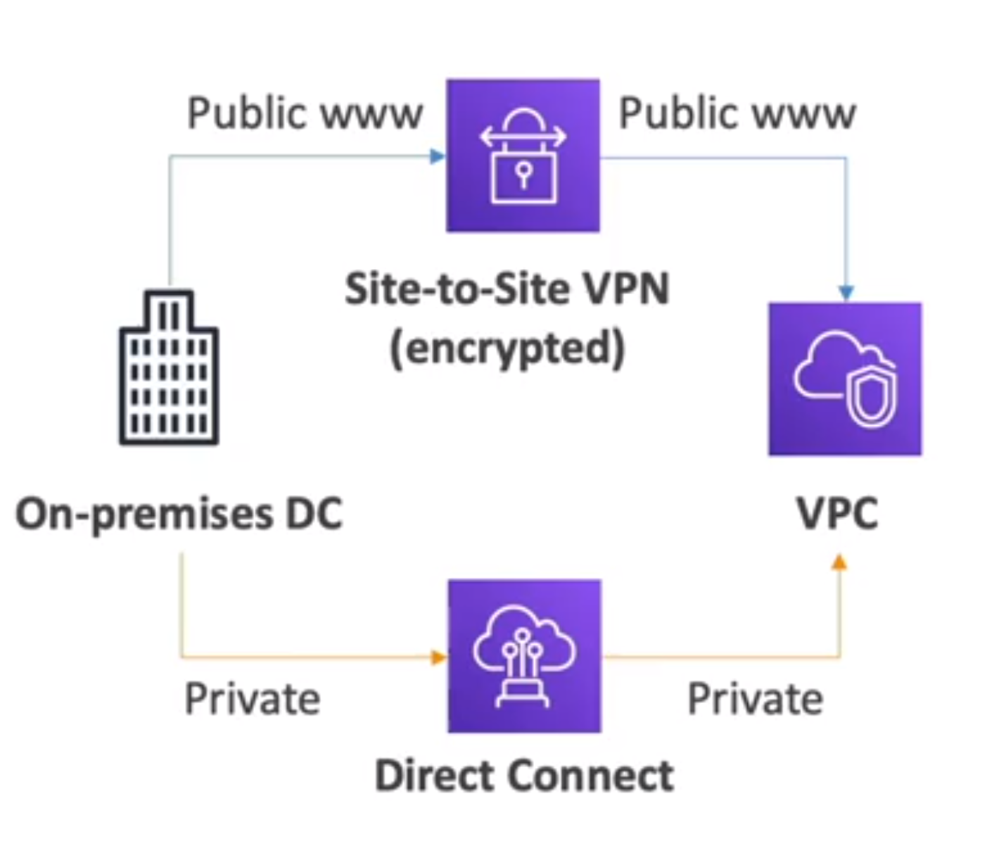

<!-- toc -->

- [VPC (Virtual Private Cloud)](#vpc-virtual-private-cloud)
  * [Subnets](#subnets)
  * [Route Tables](#route-tables)
  * [Internet Gateway](#internet-gateway)
  * [NAT Gateway](#nat-gateway)
  * [Netowrk ACL (Access control list) & Security Groups](#netowrk-acl-access-control-list--security-groups)
  * [VPC Peering](#vpc-peering)
  * [VPC Flow Logs](#vpc-flow-logs)
  * [VPC ENdpoints](#vpc-endpoints)
  * [AWS PrivateLink](#aws-privatelink)
  * [Site To site VPN & Direct Connect](#site-to-site-vpn--direct-connect)
    + [AWS Site-to-Site](#aws-site-to-site)
    + [AWS Direct Connect](#aws-direct-connect)
    + [Difference between AWS Site-to-Site VPN and AWS Direct Connect](#difference-between-aws-site-to-site-vpn-and-aws-direct-connect)
  * [AWS Client VPN](#aws-client-vpn)
  * [Transit Gateway](#transit-gateway)

<!-- tocstop -->

## VPC (Virtual Private Cloud)
It is a virtual network dedicated to your AWS account. It is logically isolated from other virtual networks in the AWS
cloud. You can launch your AWS resources, such as Amazon EC2 instances, into your VPC. You can specify an IP address
range for the VPC, add subnets, associate security groups, and configure route tables.

AWS will create a default VPC for you in each region and subnet in each availability zone. There are public
subnets and private subnets. To defnes access to the internet.

Internet gateway is used to connect the VPC to the internet. It is a horizontally scaled, redundant, and highly
available VPC component that allows communication between instances in your VPC and the internet. It therefore imposes
no availability risks or bandwidth constraints on your network traffic.

Some concepts related:

### Subnets
It is a network partition of the PC. It is a range of IP addresses in your VPC. You can launch AWS resources into a specified subnet. Use a public subnet for
resources that must be connected to the internet, and a private subnet for resources that won't be connected to the
internet. A subnet is a range of IP addresses in your VPC. It allows you to partition your network inside your VPC.

They are regional and availability zone scoped. You can have multiple subnets in each availability zone.

### Route Tables
It is a set of rules, called routes, that are used to determine where network traffic is directed. Each subnet in your
VPC must be associated with a route table; the table controls the routing for the subnet. A subnet can only be
associated with one route table at a time, but you can associate multiple subnets with the same route table.

### Internet Gateway
 An Internet Gateway is a horizontally scalable, redundant, and highly available component that provides a target in your VPC route tables for directing Internet-bound traffic. It serves as a gateway for traffic entering or leaving your VPC.
 When you associate an Internet Gateway with your VPC, instances within the VPC can communicate directly with the Internet and receive public IP addresses if needed.

### NAT Gateway
NAT Gateways allow your instances in your private subnets to access the Internet while remaining private, and are managed by AWS.

It is a highly available AWS managed service that makes it easy to connect to the internet from instances within a
private subnet in an Amazon Virtual Private Cloud (Amazon VPC). Previously, you needed to launch a NAT instance to
enable NAT for instances in a private subnet. NAT gateways are not supported for IPv6 traffic—use an egress-only
internet gateway instead.

### Netowrk ACL (Access control list) & Security Groups
the ACL is a firewall which controls traffic from and to subnet. It is an optional layer of security for your VPC that
acts as a firewall for controlling traffic in and out of one or more subnets.
A network access control list (NACL) is an optional layer of security for your VPC that acts as a firewall for controlling traffic in and out of one or more subnets. They have both ALLOW and DENY rules.

while Security Groups are a firewall that controls traffic to and from an ENI or an EC2 instance. It is a virtual
firewall for your instance to control inbound and outbound traffic. It is a first line of defense in securing your
network.

### VPC Peering
It is a networking connection between two VPCs that enables you to route traffic between them using private IPv4
addresses or IPv6 addresses. Instances in either VPC can communicate with each other as if they are within the same
network. You can create a VPC peering connection between your own VPCs, or with a VPC in another AWS account. The VPCs
can be in different regions (also called an inter-region VPC peering connection).

### VPC Flow Logs
It is a feature that enables you to capture information about the IP traffic going to and from network interfaces in
your VPC. Flow log data can be published to Amazon CloudWatch Logs or Amazon S3. After you've created a flow log, you
can retrieve and view its data in the chosen destination.

### VPC ENdpoints
endpoints allow you to connect to AWS services using a private network instead of the public internet. This means that
you can connect to AWS services without using an internet gateway, NAT device, VPN connection, or AWS Direct Connect
connection. Instances in your VPC do not require public IP addresses to communicate with resources in the service.

You can use VPC gateway endpoints to connect to AWS services that are powered by AWS PrivateLink and uses
Interface VPC Endpoints.

### AWS PrivateLink
It is a highly available, scalable technology that enables you to privately connect your VPC to supported AWS services,
services hosted by other AWS accounts (VPC endpoint services), and supported AWS Marketplace partner services.

all the connection does not go trough the internet but remains in the AWS network.

### Site To site VPN & Direct Connect
Site-to-Site VPN enables you to securely connect your on-premises network or branch office site to your Amazon Virtual
Private Cloud (Amazon VPC). Site-to-Site VPN supports Internet Protocol security (IPsec) VPN connections. Traffic
between the two networks is encrypted by one VPN gateway, then decrypted by the other VPN gateway. This protects your
data as it travels over the internet. You can create an IPsec VPN connection between your VPC and your remote network.

AWS Direct Connect is a cloud service solution that makes it easy to establish a dedicated network connection from your
premises to AWS. It is apshycial connection between your on-premises network and one of the AWS Direct Connect locations
and is not routed over the internet. With AWS Direct Connect, you can establish private connectivity between AWS and
your datacenter, office, or colocation environment, which in many cases can reduce your network costs, increase
bandwidth throughput, and provide a more consistent network experience than internet-based connections.

You must use a Customer Gateway to connect to a Site-to-Site VPN and on AWS A virtual private gateway.
AWS Direct Connect is a cloud service solution that makes it easy to establish a dedicated private network connection from your premises to AWS.

#### AWS Site-to-Site

AWS Site-to-Site VPN is a service that allows you to securely connect your on-premises network or branch office site to your Amazon Virtual Private Cloud (VPC). It provides a secure and private tunnel from an on-premises network or a remote office location to your Amazon VPC.

Function: The primary function of AWS Site-to-Site VPN is to establish secure and private sessions with IP Security (IPSec) and Transport Layer Security (TLS) tunnels. It provides two types of end-to-end VPN connections - Site-to-Site VPN connection and Client VPN connection. 

Integration: AWS Site-to-Site VPN can be integrated with other AWS services like AWS Transit Gateway, which simplifies the process of connecting multiple VPCs and on-premises networks. It can also be integrated with AWS CloudWatch for monitoring VPN connections.

Real-world use case: A company with a large on-premises data center wants to move some of its applications to the cloud for scalability and cost-effectiveness. However, they want to ensure that the connection between their on-premises data center and AWS is secure. They can use AWS Site-to-Site VPN to create a secure connection between their data center and their Amazon VPC, ensuring that their data is secure while in transit.

In summary, AWS Site-to-Site VPN is a service that provides secure, private connectivity from a user's on-premises network or a remote location to their AWS environment, ensuring that their data remains secure while in transit.

#### AWS Direct Connect
AWS Direct Connect is a network service that provides a dedicated network connection from your premises to AWS. This service bypasses the public internet, providing a more stable, reliable, and faster data transfer rate. It's ideal for transferring large amounts of data, providing a more consistent network experience than internet-based connections.

Function: AWS Direct Connect allows you to establish a private connectivity between AWS and your datacenter, office, or colocation environment. This can reduce your network costs, increase bandwidth throughput, and provide a more consistent network experience than internet-based connections.

Integration: AWS Direct Connect integrates with all AWS services, including Amazon S3, Amazon EC2, and Amazon VPC. It does this by providing private network access directly to these services, bypassing the public internet.

Real-World Use Case: A company that frequently transfers large amounts of data to AWS (like for backup or migration purposes) would benefit from AWS Direct Connect. For example, a video streaming service might use Direct Connect to transfer high-definition video files to AWS for storage and distribution. By using Direct Connect, the company can ensure a faster, more reliable transfer of these large files, improving their service's performance and reliability.

#### Difference between AWS Site-to-Site VPN and AWS Direct Connect

AWS Direct Connect and AWS Site-to-Site VPN are both methods of connecting your on-premises network to the AWS cloud, but they differ in several ways:

1. Connection Type: AWS Direct Connect provides a dedicated, private network connection between your data center and AWS, bypassing the public internet. On the other hand, AWS Site-to-Site VPN establishes a secure, encrypted tunnel over the internet between your network and AWS.

2. Performance: Direct Connect generally offers more consistent network performance and higher throughput because it doesn't rely on the public internet. Site-to-Site VPN, while secure and reliable, may be subject to the performance inconsistencies and latency of the internet.

3. Cost: Direct Connect can be more cost-effective for heavy or continuous data transfer because it doesn't incur typical internet data transfer fees. However, it requires a physical connection which can have a higher upfront cost. Site-to-Site VPN has lower upfront costs but can be more expensive for large data transfers due to internet data transfer fees.

4. Security: Both services are secure, but they offer different types of security. Direct Connect is a private, dedicated connection, so it's inherently secure. Site-to-Site VPN, on the other hand, secures your data by encrypting it as it travels over the public internet.

Real-World Use Case: If a company has strict performance requirements and transfers large amounts of data continuously, AWS Direct Connect would be the better choice. However, if a company needs a quick, easy, and secure way to connect to AWS without the need for a dedicated line, AWS Site-to-Site VPN would be more suitable.

### AWS Client VPN
It is a managed client-based VPN service that enables you to securely access your AWS resources and resources in your
on-premises network. With Client VPN, you can access your resources from any location using an OpenVPN-based VPN client.

it is used to connect from you computer to you private network in AWS.

### Transit Gateway
It is a service that enables customers to connect their Amazon Virtual Private Clouds (VPCs) and their on-premises
networks to a single gateway. This single gateway is a transit hub that acts as a network transit point for traffic
from spokes connected to the transit gateway. Customers can attach their VPCs and on-premises networks to the transit
gateway, and then create routes between them to enable them to communicate.

