<!-- toc -->
end-toc
end-toc
end-toc
end-toc
end-toc
end-toc
# Introduction
## What is cloud computing

The communication works in this way:

- client -> network -> server

This components communite via IP address, each client have an IP address and the server have also IP address, the communication are all via this IP addresses.

### Components
 - A server is composed of a CPU (computation power) and need RAM (memory) very fast memory to store information and retrieve it.
 - We need also a storage data like files or dbs.
 - We also have a networ aspect, like rouuters, switch and DNS server.

### Traditional infrastructure
That is composed by some components:

- Newtowrk: cables, router and servers connected with eact oter
- Router is a networking device that forwards data packet between computer networks.
- Switch will send the packe on the correct server

 server -> router -> switch -> pc

problem with traitional it approach (get a lot of server into the data center):
1. pay for the rent for the data center
2. pay for power supply, cooling and maintanace
3. adding an replacing hardware take times
4. scaling is limited
5. how to deal with disaters? (earthuake)

### Cloud computing

It is the **on-demand** delivery f compute power, dbs storage, app and you **pay-as-you-go** pricing. It provide exactly the right type an size of computing resources you need. you cass access rsources almost instantly.

Main characteristics:
1. on demand sel service
2. broad network access
3. multi tenancy and resource pooling (share the pshicial resources with others but keeping stuff private)
4. rapid elasticity and scalability
5. Measures service (pay for what you need)

#### Public Cloud
Aws, azure and google cloud. They are provided by owner and opereed by a third part cloud service. There are also some hybrid cloud that keep some servers on premises and extend capabilities to the cloud which allow control of sensitive information.

### Types of Cloud computing
1. Infrastructure as a service IaaS:
	- it provide buildig blocks for cloud it
	provides networking computers, data storage space
	highest level of flexibility

We can handle the os runtime data and so one while the virtualization servers and storage is managed by AWS. Some services are like EC2, GCP.

2. Platform as a Service (PaaS)
	- remoe the need for you organization to manage the underlying organization

we care only about applications and data are but not the virtualization like Elastic Beanstalk, Herokuo.

3. Sofware as a service
like gmail.


#### Prices foundamentals.
1. compute: pay for compute time
2. storage: pay for data stored in the cloud
3. data transfer: out of the cloud (the data transfer in is free)

#### Aws global infrascture:

1. AWS regions, are all around the world, they have a name and we can see them into the console of AWS. it is truly a cluster of data center. Most AWS services are region-scoped. How do you choose an AWS region?

- Compliace (GDPR data must be in the EU or something)
- Latency and proximity to customers for reduce latency.
- Available services within a region (not all services have all services)
- Pricing: it vary from region to region.

2. AWS availability zones, each region has many availability zonse (usually 3). Basically i have replica of the data center around. the're separate from each other, so that they're isolated from disasters. They are connected with high bandwidth utlra low latency networking.

3. AWS Points of presence (edge locations).
400+ points of presence, content is delivered to end user with lower latency.

### Console Home
Some services are global like IAM while other are scoped to a specific region EC2.

-> top right AWS region, choose one close to you.

### Shared responsibiity model diagram.
THe responsbility for the secirity in the cloud is mantained by the user while AWS is responsiblity for the secirity of the cloud

You also accept the AWS acceptable use policy.

## IAM  Identity and Access Managment
that is aglobal service that is used to handle users and permissions. we have a root account created by default that should no be used or shared. Than we create **users** that are people within your organization and can be grouped.

We can create **groups** within IAM that can only contains users (not othes groups). a users can belong to multiple groups.

We create group for permission and allowing operations. users of groups can be assign JSON documents called policies: **JSON policies**.

We create the **least rivilege principale**, we do not give more permissions that a user need.

### IAM Console
1. users -> add user (IAM user) -> add user to group -> admin -> add tags (optional to keep more information to the resource).
2. create group -> admin -> administratoraccess.

we can create also the alias for the root ID that will be used to login while using IAM user. We can notice a difference between a root and a IAM user looking at the top right panel

### IAM policies inheritance
image that we have a policy assigned to a group, each people assigned to that group will have that policies. We can create also inline policies assigned to a single user.


Each user can have 2 policies:
1. Inline policies (directly attached to the user)
2. Managed policies (created separately and can be attached to multiple users like group policies)

policy example:

```json
{
	"Version": "2012-10-17",
	"Statement": [
		{
			"Sid": "VisualEditor0",  // identifier
			"Effect": "Allow",  // allow or deny
			"Action": [ // list of actions
				"iam:CreateUser",
				"iam:DeleteUser",
				"iam:ListUsers",
				"iam:GetUser",
				"iam:UpdateUser"
			],
			"Pricipal": "*", // who get the benefit of the strategy
			"Resource": "*"  // resource
		}
	]
}
```

### IAM Password policy
we can set the password policy for the users. We can set the password length, the password type, the password expiration and the password reuse prevention. We can different options:
- Require at least one uppercase letter
- Require at least one lowercase letter
- what ever you want

You acn allow all IAM users to change their own password by selecting the checkbox. and you can also force the user to change the password at the first login and change the
password every N days.

### IAM MFA
Users have access to your account and poosibly change configurations. You need to protect your root account and IAM users. You can do that by enabling MFA (Multi Factor Authentication). It is a security system that requires more than one method of authentication from independent categories of credentials to verify the user's identity for a login or other transaction.
MFA is using a combination of a password and a second factor. The second factor can be a Virtual MFA device (like google authenticator) or a U2F security key (like yubikey).

### IAM Roles
Some aws service will need to perform actions on your behalf, to do so will assign IAM roles. That are permission provided to AWS services.
The roles are used to delegate access to AWS resources to third parties. It is used to give access to AWS services to other AWS services.

It is used to give access to AWS services to your on-premise users. It is used to give access to AWS services to AWS services.

An example of usage of IAM roles is to give access to an EC2 instance to S3. We can create a role and attach a policy to it. Than we can attach the role to the EC2 instance. The EC2 instance will have access to S3.
To create a role the grammar is the following:

```json
{
	"Version": "2012-10-17",
	"Statement": [
		{
			"Sid": "VisualEditor0",
			"Effect": "Allow",
			"Action": "s3:*",
			"Resource": "*"
		}
	]
}
```

From the console we can go to roles and select the entity type. Some commons roles are:
- EC2 instance roles
- Lambda function roles
- Roles for CloudFormation

We create a policy, we create a rule name and we attach the policy to the role.

### IAM Roles vs Users
1. Roles are universal, you can use them in any region
2. Roles do not have any credentials (password or access key)
3. Roles are temporary (can be set to expire)
4. Roles can be assumed by users, services or even AWS services
5. IAM roles are free
6. You can attach policies to roles to control what the role can and cannot do

### AWS cli configure
First we need to create and Access Key ID and a Secret Access Key. We can do that by going to the IAM console and than to the users section.
From the console go to IAM, than to users, than to add user. We can choose the username and the access type. We can choose programmatic access and than we can attach a policy to the user. We can choose the policy that we have created before (EC2FullAccess).

we can configure the AWS cli by using the following command:

```bash
aws configure
```

than we can insert the access key and the secret access key. We can also set the default region and the default output format.


### AWS cloudshell
It is a shell that is available from the AWS console already with the credentials configured. It is a browser based shell that is pre-authenticated with your console credentials.
It is a linux shell with 1GB of persistent storage. It is free to use, you pay for the underlying resources.

### IAM security tools
- IAM credentials report (account-level): a report that lists all your account's users and the status of their various credentials.
- IAM access advisor (user-level): show service permission granted to a user and were last accessed.

### IAM best practices
- Don't use the root account except for AWS account setup
- One physical user = one AWS user
- Assign users to groups and assign permissions to groups
- Create a strong password policy
- Use and enforce the use of MFA
- Create and use roles for giving permissions to AWS services
- Use access keys for programmatic access (CLI/SDK)
- Audit permissions of your account with the IAM credentials report
- Never share IAM users and access keys

#### Shared responsibility model for IAM
AWS is responsible for:
- The IAM service itself
- Managing the physical security of the underlying infrastructure.
- Compliance validation

You are responsible for:
- Users, groups, roles, policies
- enabling MFA to the users
- Rotate credentials regularly
- Monitor activity in your account review logs and use IAM credentials report.


### AWS Budget Setup

You need a root account to setup budget. For change it from the console go to My Account -> Edit Billing Preferences.
Then from billing -> biils is possible to see the costs of each service and the total cost. You can also see the cost of
each tag.

IAM user and Role access to billing information to let your users to see the costs and the billing.

In the same panel you cal also check the Free tier usage.

### Aws Budget

You can create a budget for each service. You can create a budget for each service and you can also create a budget for
each tag.

This budget allow you to set a limit and to receive an email when the limit is reached.

You can also set a forecasted budget, so you can set a limit for the next month.

## Amazon Ec2 (Elastic Compute Cloud)

Ec2 is one of the most important service of AWS. It is a virtual machine in the cloud. You can create a virtual machine
in the cloud and you can use it as a normal machine.
You can install an OS, you can install software, you can install a web server, a database, etc.

We can setup whatever operating system we want, we cal also choose:

- how much computing power we want (CPU)
- how much memory we want (RAM)
- how much storage we want (HDD or SSD)
    - Network attached storage (NAS - EBS & EFS - like shared drive)
    - Hard disk drive (HDD disk pshysically connected to the machine)
- Network card (Connector to the internet)
- Firewall (Security group)
- Bootstrap script (Script that run when the machine is created)

### Ec2 User data

it is possible to run a script when the machine is created using an EC2 User data script. So bootstrapping meaning
running a script when the machine is created as root.

### Ec2 Instance Types

There are the specifications of the instance types like the vCPU, the memory, the storage, the network performance, etc.

### Running Ec2 Instances

When you create an instance you can choose the AMI (Amazon Machine Image) that is the operating system that you want to
install on the machine.
That is a catalog of AMI with different operating systems, functionalities, pre-installed software, etc.

Needed to insert:

1. Name of instances
2. AMI (Amazon Machine Image)
3. Instance type (vCPU, memory, storage, network performance, t2.micro costs 0.0116$ per hour)
4. Key pair (to connect to the machine), you create a key pair and you download a file with the private key. You need to
   keep it safe because you need it to connect to the machine. (using `.pem` format)
   5.There is also a security group associated to the machine. The security group is a firewall that allow you to open
   ports, you can setup
   also `allows ssh traffic from` and `allow http traffic from` for let the machine reachable from the internet.
   6.the Volume is the storage of the machine. You can choose the size of the volume and the type of the volume (HDD or
   SSD)
   You need to set the size of the volume and the type of the volume. You can also set the delete on termination flag,
   so when you delete the machine the volume is deleted too.
   7.there is also the User data that is a script that is run when the machine is created. You can use it to install
   software, to install a web server, etc.
   for instance:

```bash
#!/bin/bash
yum update -y
yum install -y httpd
systemctl start httpd
systemctl enable httpd
echo "<h1>Hello World</h1>" > /var/www/html/index.html
```

```TODO

TODO given the panel of details of ec2 instance check what are te mieaning of all th

each instance has an instance ID that is a unique identifier of the instance. You can use it to identify the instance.
There is also associaed a Public IPv4 address that is the address that you can use to connect to the machine from the internet.
There is also a Public DNS (Domain Name System) that is the name of the machine. You can use it to connect to the machine from the internet.
There is also a private IP address that is the address that you can use to connect to the machine from the inside of the network.

is possible to check the security group, the network interface, the IAM role, the tags, the monitoring, the status checks, etc.
```

Then is possible to stop an instance (no cost while the machine is not running) or we can terminate the instance (the
machine is deleted and the volume is deleted too).
if you stop and instance and then you start it again the public IP address is changed. while the Private Ipv4 remains
the same.
If you want to keep the same public IP address you need to use an Elastic IP address.

#### IPv4 vs IPv6

IPv4 is the old version of the internet protocol. It is a 32 bit address that is composed by 4 numbers separated by
dots.
IPv6 is the new version of the internet protocol. It is a 128 bit address that is composed by 8 numbers separated by
colons.

#### Public Ipv4 DNS

The DNS is used to translate the name of the machine to the IP address. The public IPv4 DNS is the name of the machine.
You can use it to connect to the machine from the internet.

### Instance Types (Family)

There are different types of instances ( https://www.aws.amazon.com/ec2/instance-types/):

- General purpose: The m5 and t3 instances are well-suited for a wide range of workloads such as web servers, small to
  medium databases, development environments, and applications that require a balanced combination of compute, memory,
  and networking resources.
- Compute optimized: The c5 and c4 instances are ideal for compute-intensive applications like high-performance web
  servers, scientific modeling and simulations, batch processing, gaming servers, and applications that require
  substantial CPU power.
- Memory optimized: The r5 and r4 instances are perfect for memory-intensive applications such as in-memory databases,
  real-time big data processing, caching fleets, and applications that require high memory capacity to handle large
  datasets or workloads.
- Storage optimized: The i3 and d2 instances are designed for storage-intensive applications that demand high sequential
  read/write performance and large local storage capacity. They are well-suited for data warehousing, log processing,
  and other applications that rely heavily on local storage for large datasets.
- Accelerated computing: The p3 and p2 instances are specifically tailored for graphics-intensive applications and
  machine learning inference. They are suitable for tasks like video encoding, 3D modeling, rendering, deep learning,
  and other workloads that benefit from high-performance GPUs.
- Network optimized: The h1 and h2 instances are optimized for applications that require high network bandwidth and
  low-latency access to other instances within the same Virtual Private Cloud (VPC). They are suitable for
  high-performance databases, distributed file systems, and big data analytics workloads that heavily rely on fast
  network communication between instances.

### Introduction to Security Groups

Security groups are an essential aspect of network security within the Amazon Web Services (AWS) ecosystem. They act as
virtual firewalls that control inbound and outbound traffic for your AWS resources, such as EC2 instances, RDS
databases, and load balancers. By using security groups, you can define granular rules to allow or deny traffic based on
protocols, ports, and IP addresses, thereby strengthening the security posture of your infrastructure.

They control how traffic is allowed into or out of our EC2 instances. They act as a **firewall for our EC2 instances**.

the resources can be reference by IP or by security group. They are locked down to a region/VPC combination. They live
outside
the EC2 and they are good practice to maintain one separate security group for SSH access.

They regulate:

- Access to ports
- Authorised IP ranges - IPv4 and IPv6
- Control of inbound network (from other to the instance) and outbound network (from the instance to other)

they present the type, the protocol, the port range, the source, the description.

### Security Group Rules

They are into ec2 -> network & security -> security group. They are attached to instances.

They can be attached to multiple instances. They are locked down to a region/VPC combination, if you change the region
you need to change the security group.
They live outside the EC2 and they are good practice to maintain one separate security group for SSH access.

Typically if you get time out it means that you not raech the service while if you get connection refused it means that
you reach the service but the service is not running.


### Inbound vs Outbound Rules

#### Inbound rules

They control the traffic that is coming to the instance from the outside. Outbound rules control the traffic that is
coming from the instance to the outside.
They are specified into the security group, they have a type, a protocol, a port range, a source and a description. The
type for instance
can be SSH, HTTP, HTTPS, etc. The protocol can be TCP, UDP, ICMP, etc. The port range can be 22, 80, 443, etc. The
source can be anywhere, my IP, custom, etc.

#### Outbound rules

They control the traffic that is coming from the instance to the outside. You can specifiy like all traffic is allowed
to go out. You can specify the protocol, the port range, the destination.

#### Security Groups - Additional Features

- You can reference other security groups
- You can have multiple security groups attached to EC2 instances
- You can block specific IP addresses using security groups (for instance block a specific IP address that is trying to
  attack your machine)
- You can specify allow rules, but not deny rules (by default all is denied)

todo unstand better reference other security groups.

### Classic ports to know

- 22: SSH (Secure Shell) - log into a Linux instance
- 21: FTP (File Transfer Protocol) - upload files into a file share
- 22: SFTP (Secure File Transfer Protocol) - upload files using SSH
- 80: HTTP - access unsecured websites
- 443: HTTPS - access secured websites

you can connect to an Ec2 with SSH but also with Ec2 Instance Connect that is a browser-based SSH connection.

### SSH - Secure Shell to connect to EC2

SSH is a protocol that allows you to connect to a machine remotely. It is a secure protocol that uses encryption to
protect the connection.
Check on the security group that the SSH port is open, to do that you need to go to the security group and check the
inbound rules.

You need to have a key pair to connect to the machine. You can create a key pair into the EC2 -> network & security ->
key pairs. You can create a key pair and download it.

Next we need to change the permissions of the key pair file to 400 (chmod 400 key.pem). Then we can connect to the
machine with the command:

```bash
ssh -i key.pem ec2-user@<public_ipv4_address>
```

### EC2 Instance Connect

It is a browser-based SSH connection. You can go to the console and select the instance and then select connect. Then
you can select EC2 Instance Connect and connect to the machine.
You need still ti have the port 22 open in the security group, to do that you need to go to the security group and check
the inbound rules.

it comes with the aws cli installed. You can use the command:

### Ec2 Instance Roles

For instance you want co list the iam users:

```bash
aws iam list-users
```

but ou need credentials (never store credentials on the machine). You can use the instance roles to give permission to
the instance to do something. You can attach a role to an instance. You can create a role into the IAM -> roles.

Once we create the roles then we go to the ec2 instance, go to `Actions` and modify the IAM role to add the new role.

### EC2 purcashing options

Differnt way to buy an EC2 instance:

- On-demand: pay for what you use, has the highest cost but no upfront payment.

- Reserved: min 1 year, max 3 years, up to 75% discount compared to on-demand.

- Saving plans: commit to a consistent amount of compute usage (measured in $/hour) for a 1 or 3 year term, can save
  up to 72% compared to on-demand.

- Spot: bid for instance capacity, up to 90% discount compared to on-demand, can lose instances if the spot price goes
  above your bid price. They are great for batch jobs, big data analysis, workloads that are resilient to failure, etc.

- Dedicated hosts: physical EC2 server dedicated for your use, can help reduce costs by allowing you to use your
  existing server-bound software licenses. The use cases are regulatory requirements, licensing, compliance, etc. Access
  the physical server.

- Dedicated instances: instances running on hardware that's dedicated to you, may share hardware with other instances
  in the same account. you may share hardware with other instances in the same account. Not access the physical server.

- Capacity reservations: reserve capacity for your EC2 instances in a specific Availability Zone for any duration.

#### Summary purchasing options

On-demand: coming and stang for a short time, unpredictable workloads, dev and test.
Reserved: long workloads, predictable usage, reserved capacity.
Saving plans: flexible usage, long workloads, predictable usage, can commit to a specific amount of compute usage.
Spot: short workloads, for cheap, for workloads that are resilient to failure.

### Shared Responsibility Model for EC2

Aws:

- Infrastructure
- isolation on physical level
- replacing faulty hardware
- security of hardware
- compliance validation

Customer:

- security group
- OS patching and updates (all the software that is installed on the machine)
- IAM roles and assigned to EC2 instances
- Data security

### EC2 Instance summary

Ec3 Instance: Ami (os) -> instance -> security group -> ssh key pair -> instance roles.
Security group: inbound rules, outbound rules, reference other security groups, multiple security groups attached to
Ec2 User data: launch script, bootstrap script, configure instance, install software, etc.
EC2 instance Role. IAM role attached to an instance, temporary credentials, no need to store credentials on the
instance,
Puchasing opetions: on-demand, reserved, spot, dedicated hosts, dedicated instances, capacity reservations, saving
plans.

#@# Ec2 Storage EBS

#### EBS - Elastic Block Store

The EBS volume is a network drive you can attach to your instances while they run. It allows your instances to persist.
They can be mounted to **one instance at the time** but you can have two volumes mounted to the same Ec2 instance.

It's a network drive, it uses the network to communicate the instance, which means there is a bit of latency. It can be
detached from an EC2 instance and attached to another one quickly.

Important: It is locked to an **Availability Zone (AZ)**. To move a volume across, you first need to snapshot it.

#### EBS deletion

THe deletion of EBS volumes is by default on termination of the instance while any other attached EBS volume is not
deleted.

You can use EBS volumes as a database, you can have a database on an EBS volume and then you can detach it and attach it
to another instance. Or while proessing input data you can have the OS on the root EBS volume and the data produced
stored on another EBS volume that will be not deleted when the instance is terminated.

#### EBS create a volume and attach it to an instance

You can create a volume from the console, you need to specify the volume type, the size, the availability zone, etc.
Go the Ec2 -> Elasic Block Store -> Volumes -> Create Volume (need to specify the same availability zone of the
instance). Once create you need
to attach it to an instance. You can attach it to an instance from the console or from the instance itself.

you can then retrieve the EBS volume from the instance from the Ec2 console -> instance -> storage -> block devices.

#### EBS Snapshots

Snapsshots are a backup of the EBS volume at a point in time. They are stored in S3. They are incremental, which means
that only the blocks that have changed since your last snapshot are moved to S3. If you delete a snapshot of a volume
that has other snapshots, only the data unique to that snapshot is removed. So you never lose data.

##### EBS Snapshots - Archive

The archive tier is a new tier of storage for Amazon S3 that is designed for long-term data archival. It is designed
for data that is accessed less than once a year. It is a low cost storage tier that is optimized for infrequently
accessed data. It is a good fit for backup and archive, disaster recovery, and long-term data retention.

#### EBS snapshots - Create a snapshot

from the Elasic Block Store -> Snapshots -> Create Snapshot. You need to specify the volume, the description, etc.
You can copy the snapshot in another region, or you can recreate a volume from the snapshot.

#### EBS Recycle Bin

When you delete an EBS volume, it goes into the recycle bin. You can restore it from the recycle bin.

You can create a retention policy for the recycle bin. You can specify how many days you want to keep the deleted.

### AMI - Amazon Machine Image

They represent a customization of an EC2 instance. You can add your own software, configuration, operating system, etc.
So all the needed software is installed on the AMI resulting in easier and faster configuration when the machine is
launched.

You can launch a Public AM (i.e. Linux) I, a Private AMI (made and maintend by you) or a Marketplace AMI (you buy it).

#### Ami Process

For creating an AMI you need to:

1) Start an EC2 instance and customize it.
2) Stop the instance (not terminate).
3) Create an AMI - this will also create EBS snapshots of the volumes attached to the instance.
4) Launch instances from other AMIs.

#### AMI Creation from instance

You can start and ec2 instance (remember to specify the security group, the ssh key pair, user-data).

From the running instance from Ec2 instances., right click create image. You can specify the name, the description, etc.
You can then run them from the AMI section or when you create a new instance.

#### AMI Creation from snapshot

You can create an AMI from a snapshot. You can create a snapshot from an EBS volume. You can create a snapshot from the
Ec2 console -> Elastic Block Store -> Volumes -> select the volume -> Actions -> Create Snapshot.

You can then create an AMI from the snapshot from the Ec2 console -> Elastic Block Store -> Snapshots -> select the
snapshot -> Actions -> Create Image. You can specify the name, the description, etc.

#### Ec2 Image Builder

it used to automate the creation of AMIs. It is a fully managed AWS service that makes it easier to automate the
creation,
management, and deployment of customized, secure, and up-to-date "golden" server images that are pre-installed and
pre-configured with software and settings to meet specific IT standards.

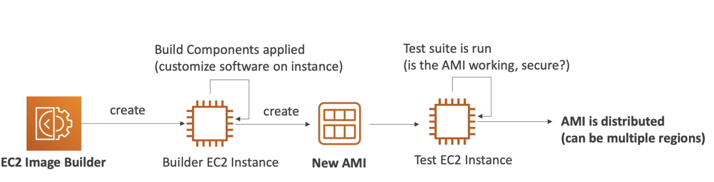

#### AMI pricing

Ami are free. You pay for the underlying resources such as EC2 instances, EBS volumes, etc.

- You are charged for the storage of the snapshots in S3.

### Ec2 Storage Instance Store

EBS volumes are network drives with good but "limited" performance. If you need a high-performance hardware disk, use
the **EC2 Instance Store**. It is a physical disk attached to the machine. It is located on the same physical host as
the
EC2 instance. It can only be used as a root device (not as a secondary device).

It is important to know that if the instance fails, you lose your data. It is not a durable storage. It is used for:

- Better I/O performance
- Temporary storage
- Good for buffer / cache / scratch data / temporary content

### EFS Storage (Elastic File System)

It is a managed NFS (Network File System) that can be mounted on many EC2 instances (multi AZ). It is highly available,
scalable, expensive (3x EBS), pay per use, and it is a file system (not a block storage).

it works only with linux instances and also it can be mounted in a multi AZ fashion, they lock into a **region**. It
uses security groups to control
access to the EFS.

#### EFS - Performance

It is a highly available and scalable file system. It can scale up to the petabytes, it can support thousands of
concurrent NFS connections, it has a low latency file system, it is a file system, not a block storage.

Comparison

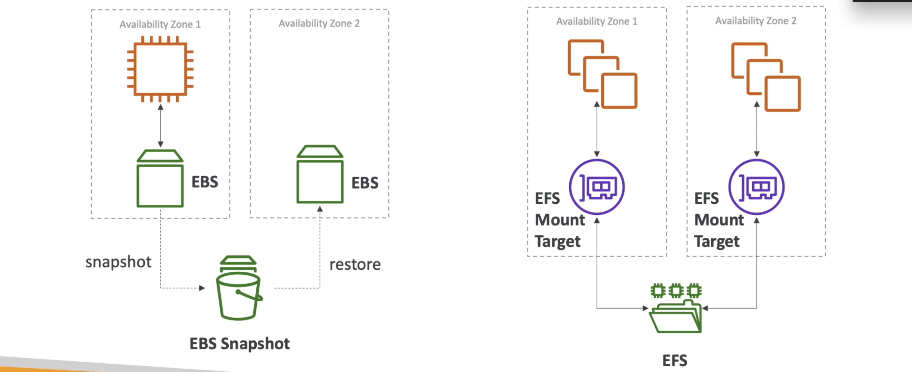

#### EFS Infrequent Access (EFS-IA)

It is a storage class that is cost-optimized for files that are not accessed every day. It is a good fit for files that
are accessed less frequently, but require fast access when they are needed. It is a good fit for data that is
infrequently
accessed, but requires millisecond access when needed.

You can change the storage class of a file system at any time. You can change the storage class of a directory or file
for instance if you have 4 docuemnts 3 of them used frequently and 1 not, you can change the storage class of the 1 not
used frequently to EFS-IA.

from the app points of view, the file system is the same, you don't need to change anything.

##### Ec2 Storage Shared Responsability Model

aws:

- infrastructure
- replication for data for EBS volumes
- replacing faulty hardware
- Ensuring their employees don't access your data

user:

- Setting up backup and recovery
- Encrypting EBS volumes
- responsibility of any data on the drive.

### Ec2 Storage Amazon Fsx

It is a fully managed file system for windows and linux. It is a file system that can be accessed via the network.
The windows version is based on windows server and supports SMB protocol. The linux version is based on Lustre and
supports NFS protocol it is used for high performance computing, machine learning, etc.

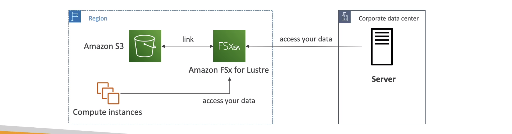

### Ec2 Storage summary

Ebs volumes:

- Network drive attached to one instance at a time
- Can be detached and attached to other instances
- Locked to an availability zone
- Can be kept when you stop the instance
- Have a provisioned capacity
- You pay for provisioned capacity
- Backed up by snapshots to S3

AMI (Amazon Machine Image):

- A customization of an EC2 instance
- Can be used to launch EC2 instances
- AMI are built for a specific region (can be copied across regions)
- AMI are built for a specific architecture (32 bit or 64 bit)

Ec2 Image builder:

- Automate the creation of AMIs
- Fully managed service

Ec2 Instnace Store:

- Physical disk attached to the machine
- Located on the same physical host as the EC2 instance
- Can only be used as a root device (not as a secondary device)
- Better I/O performance
- Temporary storage

EFS (Elastic File System):

- Managed NFS (Network File System) that can be mounted on many EC2 instances (multi AZ)
- Highly available, scalable, expensive (3x EBS), pay per use, and it is a file system (not a block storage)
- Uses security groups to control access to the EFS
- Works only with linux instances
- Can be mounted in a multi AZ fashion
- Performance:
    - Highly available and scalable file system
    - Can scale up to the petabytes
    - Can support thousands of concurrent NFS connections
    - Low latency file system
    - File system, not a block storage

EFS-IA (Elastic File System - Infrequent Access):

- Storage class that is cost-optimized for files that are not accessed every day
- Good fit for files that are accessed less frequently, but require fast access when they are needed

Fsx for windows:

- Fully managed file system for windows
- Based on windows server and supports SMB protocol
- Used for windows high performance computing, machine learning, etc.

Fsx for lustre:

- Fully managed file system for linux
- Based on Lustre and supports NFS protocol
- Used for high performance computing, machine learning, etc.
- Can be linked to S3 for cost optimization

## Availability, Scalability, Elasticity (Load Balancing & Auto Scaling)

There are two kinds of scalability:

- Vertical scalability (scale up): increase the size of the instance (ec2 instance type)
- Horizontal scalability (scale out): increase the number of instances (ec2 instances)
- High availability is ensuring your application is always up and running. It is a common architecture design. High
  availability means running your application in at least
  2 data centers (AZ) with the ability to withstand the failure of one or more servers or data centers. The goal
  is to survive a data center loss.

Some formal definitions:

- Scalability: ability of a system to handle increased load by adding resources
- Elasticity: ability of a system to handle increased load by adding resources automatically (some sort of auto-scaling)
  .
- Availability: ability of a system to recover from failure
- Agility (not really related to scalability): ability of a system to adapt to changing circumstances.

### Elastic Load Balancer (ELB)

a load balancer are server that forward internet traffic to multiple servers (ec2 instances) downstream. It is a
single point of access to your application. It spreads across multiple availability zones. It scales automatically to
meet demand. It is a fault tolerant component for your application.

It forward the traffic from internet according to free capacity. It exposes a single point of access (DNS) to your
application. It seamlessly handles failures of downstream instances. It provides SSL termination (HTTPS) for your
websites. It can do health checks to your instances. It provides stickiness to your sessions (same client goes to the
same ec2 instance).


ELB is a mananaged load balancer:

- AWS guarantees that it will be working
- AWS takes care of upgrades, maintenance, high availability
- AWS provides only a few configuration knobs
- It costs less to setup your own load balancer but it will be a lot more effort on your end.

You can have your own load balancer (software or hardware) but it will be a lot more effort on your end.

There are 4 kinds of load balancers:

- Classic Load Balancer (v1 - old generation - 2009)
- Application Load Balancer (v2 - new generation - 2016)
- Network Load Balancer (v2 - new generation - 2017)
- Gateway Load Balancer (v2 - new generation - 2020)

#### Application Load Balancer (ALB)

It is a layer 7 load balancer (http, https, websockets). It is intelligent and can create advanced request routing.

- http/https/grpc/websockets protocols
- http routing feature
- Static DNS

#### Network Load Balancer (NLB)

It is a layer 4 load balancer (tcp, udp, tls). It is capable of handling millions of requests per second, while
maintaining ultra-low latencies. It is optimized to handle sudden and volatile traffic patterns. It is used for extreme
performance, TCP or UDP traffic.

- TCP, UDP, TLS protocols
- Extreme performance
- Static IP or Elastic IP

#### Gateway Load Balancer (GWLB)

It is a layer 3 load balancer (IP). It is used for extreme performance, IP traffic. It is used for non-http use cases
such as UDP or TCP.

- GENEVE protocol on IP (L3)
- Route traffic to firewall that you manage on ec2 instances
- intrusion detection


### Create an Application Load Balancer (ALB) - Horizontal Scaling

You can create a load balancer from ec2 -> load balancers -> create load balancer. You can choose the type of load
balancer you want to create. You can choose the name of the load balancer, the scheme (internet facing or internal),
the ip address type (ipv4 or ipv6), the vpc, the availability zones, the security group, the listeners (port 80, 443,
etc.), the routing (target group), the target group (name, target type, protocol, port, health checks, etc.), the
register targets (ec2 instances), the tags, and the review.

You need to add a security group to the load balancer. You can create a new security group or use an existing one, that
will
be also used by the ec2 instances.

You need to create a target group. The target group is a set of targets (ec2 instances, ip addresses, lambda functions)
that you register with a load balancer. You can register a target with multiple target groups. You can choose the name,
the target type (instance, ip, lambda function). Choose
what you want to group together (instances, ip addresses, lambda functions). You can choose the protocol, the port, the
health checks, the advanced health check settings, the tags, and the review.

### Auto Scaling Group (ASG) - Elasticity

in real life the load on your websites and applications can change. You need to scale up or down the number of
servers (ec2 instances) that run your application. You can manually scale up or down but it is not feasible. You need
to automate this process. You can use an auto scaling group (ASG) to automatically adjust the number of ec2 instances
that are running in your application. You can use a load balancer to distribute the load across multiple ec2 instances.
You can use a launch configuration to tell the ASG what type of ec2 instances you want to launch. You can use scaling
policies to tell the ASG when to launch or terminate ec2 instances.

The goal of Auto Scaling Group (ASG) is to:

- Scale out (add ec2 instances) to match an increased load
- Scale in (remove ec2 instances) to match a decreased load
- Ensure we have a minimum and a maximum number of machines running
- Automatically register new instances to a load balancer
- Replace unhealthy instances

It integrate very well with other ABS services:

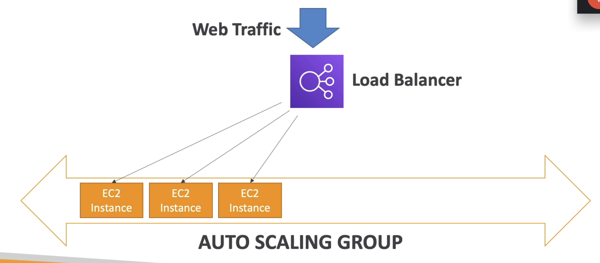

This is the integration.

#### Auto Scaling Group Launch Configuration

To create an auto scaling group you need to create a **launch template configuration**.

You can create a launch template from ec2 -> launch templates -> create launch template. You can choose the name, the
version description, the
AMI, the instance type, the key pair, the security groups, the storage, the tags, the network settings, the advanced
details, the monitoring, the instance metadata, the user data, the IAM role, the capacity reservation, the license
configuration and all the other settings.

Once you create the ASG then you can attach a load balancer to it specifying the target group.

Then you need to specify some scaling params like the desired capacity, the minimum capacity, the maximum capacity, the
scaling policies (allow to resize you ASG on demand).

from the ASG we can check the instances, the launch configuration, the scaling policies, the activity history, the
notifications, the tags, the monitoring, the capacity, the load balancing, the process, the scheduled actions and other
settings.

#### Auto Scaling Group Scaling Policies

An ASG can span multiple AZs. It is recommended to have an equal number of instances in each AZ. It is recommended to
have the same number of instances in each AZ. It is recommended to have at least 2 AZs per region. It is recommended to
have at least 1 instance per AZ.

#### ASG Scaling Strategies

The main strategies are:

- Manual Scaling: you can increase or decrease the number of instances manually. It is useful when you want to keep
  control over the instances. It is useful when you want to quickly increase or decrease the number of instances.

- Dynamic Scaling: you can define scaling policies to automatically increase or decrease the number of instances based
  on the real-time demand. It is useful when you have applications with spikes or seasonal traffic. It is useful when
  you want to scale based on predictable metrics. It is useful when you want to scale based on Amazon CloudWatch
  alarms.
    - Simple / step scaling: this is the most simple and easy to set up. It allows you to increase or decrease the
      number
      of instances in response to a metric and it scales based on a single scaling adjustment. It is useful when you
      have
      predictable load changes. It is useful when you have steady state (no spikes) applications.
    - Target Tracking Scaling: this is the most simple and easy to set up. It allows you to automatically increase or
      decrease the number of instances based on a target value for a specific metric. It is useful when you know the
      average load of your application. It is useful when you have predictable load changes. It is useful when you have
      steady state (no spikes) applications.
    - Scheduled scaling: it allows you to increase or decrease the number of instances based on a schedule. It is useful
      when you know the time when your application will scale up or down. It is useful when you have predictable load
      changes. It is useful when you have steady state (no spikes) applications.
    - Predictive scaling: it allows you to automatically schedule the scaling actions based on predictive scaling
      forecasts. It is useful when you have predictable load changes. It is useful when you have steady state (no
      spikes) applications. It is useful when you have applications with steady traffic patterns.

## S3 Buckets and Objects
It is an infinite storage. It is a simple key-value store. There are many S3 use cases:
- Backup and storage
- Disaster recovery
- Archive
- Hybrid cloud storage
- Application hosting
- Media hosting
- Data lakes and big data analytics
- Software delivery
- Static website hosting

S3 store files into buckets (directories). The buckets must have a globally unique name, across all regions and accounts.
The buckets are defined at the region level. You can have many buckets in a region.

**Buckets are not global, they are created in a specific region**.

### S3 Objects
The objects have a Key, the key is the full path of the object. The key is composed by a prefix which is the name of
folder inside the bucket and the name of the object.


Object values are the content of the body. The content can be anything and it is limited to 5TB. Then each Objects have some
**metadata** associated with it. The metadata is a set of name-value pairs. They Also have **tags** which are used to manage the
objects. And they could also have a **version id**. Once we create a bucket we can configure it, selecting the region and so on. Then we can upload files into the bucket, inside the Object review there are the properties of the object uploaded and
metadata and permissions.

We can create folders inside buckets and upload files, the folders are called **prefixes**. The prefixes are not real folders, they are just part of the object name.

### Amazon S3 Policies
There are different ways to secure your S3 buckets and objects:
- User-based: IAM policies (which users can perform which actions on which buckets) or Roles.
- Resource-based: bucket policies (bucket wide rules) and object access control list (ACL, finer grain)
- Encryption meaning that we can encrypt the data in transit (SSL/TLS) and at rest (Server Side Encryption or SSE)

- Note: an IAM principal can access an S3 object if:
    - The user IAM permissions allow it OR the resource policy ALLOWS it
    - There are no DENY at the bucket, object or IAM policy level that are explicit

The bucket S3 polciies are **JSON based policies** and they are bucket level. They look likes:

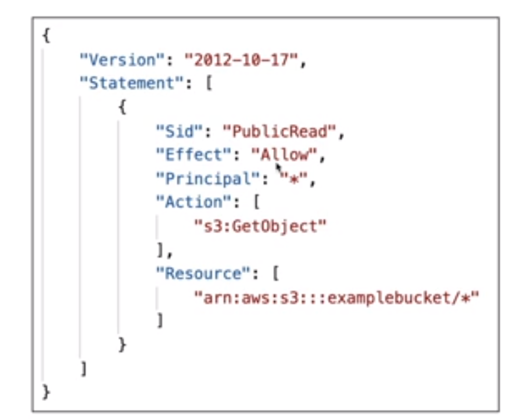

they specify:
1. Resources: buckets and objects
2. Effect: allow or deny
3. Actions: set of API to allow or deny
4. Principal: the account or user to apply the policy to (* to anyone)

We need to use an S3 Bucket Policy when we want to:
- Grant public access to the bucket
- Force objects to be encrypted at upload
- Grant access to another account (Cross Account)

There is also the bucket settings for block public access.

### S3 Static Website
S3 can host staic websites and have them accessible on the internet. For doing this you need to
make the s3 policy public and then you can access the website using the endpoint of the bucket.

All way down is in properties there is the static website hosting and you can enable it. You need to specify the index.html document
and the error.html document.

### S3 CORS
Cross Origin Resource Sharing. It allows to access resources from one website to another website. It is used to allow
requests to the S3 bucket from other domains. It is useful when you want to host a static website on S3 and you want to
load some resources from another domain.

### S3 Versioning
It allows to keep multiple versions of an object in one bucket.
- It is enabled at the bucket level.
- Same key overwrite will increment the version: 1, 2, 3
- It is best practice to version your buckets (protect against unintended deletes or rolling back to previous versions)

For activating the versioning you need to go to the bucket and then to the properties and then to the versioning and then
you can enable it. Once you enable it you can see the versions of the objects. You can also delete the versions of the
objects.

The objcets that were created before the versioning was enabled will have the version id of null. Also when deleting files and having versioning enabled the files will not be deleted but they will be archived (delete marker), to restore
the file you need to delete the delete marker and then the file will be restored.

### S3 Replication
It allows to replicate the objects from one bucket to another bucket in another region. It is useful for:
- Compliance
- Lower latency access
- Replication across accounts (different accounts)
- Replication across AWS accounts (same account)
- Replication can also help with the accidental deletion of objects
- You cannot replicate to multiple buckets or use daisy chaining (bucket 1 replicates to bucket 2 which replicates to bucket 3)

There are two types of replication:
- **Cross Region Replication (CRR)**: versioning must be enabled on both the source and destination buckets.  They are used for compliance, lower latency access, replication across accounts (different accounts), replication across AWS accounts (same account).
- **Same Region Replication (SRR)**: versioning must be enabled on both the source and destination buckets. They are used for log aggregation, live replication between production and test accounts, live replication between production and test accounts.
It is also possible to have buckets in a different AWS account, and the copying is asynchronous.

it works only with versioning enabled, for activating the replication you need to go to the bucket and then to management
and then to replication and then you can enable it. Then you need to select the destination bucket and the storage class
and then you can enable it.

### S3 Storage Classes
Let's define the durability and availability of the storage classes:
1. Durability: represents how many time and object is retained. It is measured in 11 9s (99.999999999%). On average you will lose 1 object every 10 million years.
2. Availability: represents how likely you are to retrieve an object when requested. It is measured in 9s (99.99%). On average you will fail 1 request every 10,000 requests.


We have different storage classes:
- S3 Standard:
  - 99.99% availability
  - Used for frequently accessed data
  - Low latency and high throughput
  - Sustain 2 concurrent facility failures
  - Use cases: big data analytics, mobile and gaming applications, content distribution
- S3 IA (Infrequently Accessed):
  - for data that is accessed less frequently, but requires rapid access when needed.
  - Lower fee than S3, but you are charged a retrieval fee.
  - 99.9% availability
  - Use cases: As a data store for disaster recovery, backups
- S3 One Zone IA:
  - for where you want a lower-cost option for infrequently accessed data, but do not require the multiple Availability Zone data resilience.
  - 99.5% availability
  - Use cases: Storing secondary backup copies of on-premises data, or storing data you can recreate
- S3 Glacier:
  - secure, durable, and low-cost storage class for data archiving.
  - You can reliably store any amount of data at costs that are competitive with or cheaper than on-premises solutions. Retrieval times configurable from minutes to hours.
  - Glacier Instant Retrieval option allows you to retrieve data within minutes.
  - Glacier Flexible Retrieval option allows you to retrieve large amounts of data within hours.
  - Glacier Deep Archive: lowest-cost storage class where a retrieval time of 12 hours is acceptable.
- S3 intelligent Tiering:
  - designed to optimize costs by automatically moving data to the most cost-effective access tier, without performance impact or operational overhead.
  - S3 Manage Access Tiers: automatically move data to the most cost-effective access tier, without performance impact or operational overhead.
  - 99.9% availability
  - Use cases: Data lakes, analytics, content distribution


### S3 Lifecycle Management
It allows to manage the lifecycle of your objects. It can be used in conjunction with versioning. It can be applied to
current and previous versions. It can be used to transition objects to another storage class (for example from standard
to IA). It can be used to expire objects at a certain time. It can be used to delete objects.

It allow to save money by moving objects to cheaper storage classes or deleting them.

### S3 Encryption
There are 4 methods of encrypting objects in S3:
1. Server-side encryption: encrypts S3 objects using keys handled and managed by AWS. There are 3 types of server-side encryption:
    1. S3 Managed Keys - SSE-S3: uses AES-256 to encrypt the object. It is handled by S3.
    2. AWS Key Management Service, Managed Keys - SSE-KMS: uses AWS Key Management Service to manage encryption keys. It is handled by KMS.
    3. Server-side encryption with customer-provided keys - SSE-C: uses keys managed by the customer. It is handled by the customer.

2. Client-side encryption: encrypts S3 objects using keys handled and managed by the customer outside of AWS. The customer manages the encryption process, the encryption keys, and related tools.

### S3 Shared Responsibility Model
AWS is responsible for:
- Protecting the infrastructure that runs all of the services offered in the AWS Cloud.
- This infrastructure is composed of the hardware, software, networking, and facilities that run AWS Cloud services.
- Interal configuration, patching, and securing of the guest operating system and associated application software.

User:
- Responsible for the security of anything you store in AWS services.
- S3 Versioning
- S3 Bucket Policies
- Logging and Monitoring
- S3 Storage Classes

### Aws Snow Family
They are highly secure, portable devices to collect and process data at the edge, and migrate data into and out of AWS. They are used for:
- Data migration
  - Snowcone: 8 TB of usable storage
  - Snowball Edge: 80 TB of usable storage
  - Snowmobile: 100 PB of usable storage

We might use snowball when we have a lot of data to transfer and we don't want to use the internet. We can use snowball
to transfer the data to the snowball and then we can send the snowball to AWS and then AWS will transfer the data to S3.

they are offline devices that are sent to AWS and then AWS will transfer the data to S3. AWS willl send psysical devices
to the customer and then the customer will transfer the data to the device and then the customer will send the device to
AWS and then AWS will transfer the data to S3.

Snow family are also used in edge computing. Meaning that we can use them to process data at the edge. For example we can
use them to process data from IoT devices (from trucks, ships, etc). We can use them to process the data and then send
the data to AWS. The use cases are:
- Preprocess data at the edge
- Collect data at the edge
- Machine learning inference

### Hybrid Cloud Storage
AWS is pushing for hybrid cloud storage. It is a combination of on-premises storage and cloud storage. This can be due to:
1. long cloud migration times
2. security concerns
3. compliance concerns
4. it strategy.

To create it upi need to use AWS Storage Gateway. It is a service that connects an on-premises software appliance with cloud-based storage to provide seamless and secure integration between an organization's on-premises IT environment and AWS's storage infrastructuue.
it allow to bridge the gap between on-premises and cloud storage.

## Databases
### RDS (Relational Database Service)
It is a managed service that allows to set up, operate, and scale a relational database in the cloud. They can be different
types such as PostgreSQL, MySQL, MariaDB, Oracle, Microsoft SQL Server, and Amazon Aurora.

The advantage over EC2 is that it is managed by AWS. It is easy to set up, operate, and scale:
- Automated provisioning, OS patching
- Continuous backups and restore to specific timestamp (Point in Time Restore)
- Monitoring dashboards
- Read replicas for improved read performance
- Multi AZ setup for DR (Disaster Recovery)
- Maintenance windows for upgrades
- Scaling capability (vertical and horizontal)
- Storage backed by EBS (gp2 or io1)

The disadvantage is that you can't SSH into your instances. You can't customize the database software.


#### Amazon Aurora
It is a MySQL and PostgreSQL-compatible relational database built for the cloud. It is proprietary technology from AWS. It is a managed service. It is compatible with MySQL and PostgreSQL. It is not open source. It is not available for on-premises deployment.
Aurora is AWS cloud optimized and claims 5x performance improvement over MySQL on RDS, over 3x the performance of PostgreSQL on RDS. It automatically grows in increments of 10GB, up to 64TB. It can have 15 replicas while MySQL has 5 replicas. It can have 5x replication throughput of MySQL. It can have 2 copies of your data in each AZ, with minimum of 3 AZs. It can handle loss of 2 copies of data without affecting write availability and 3 copies without affecting read availability. It costs 20% more than RDS (MySQL) but is more efficient.

#### RDS Example
We can create an RDS instance using the AWS console. We can choose the database engine. We can choose the instance type.
Going to RDS -> Databases -> Create database then you need to choose the database engine (MySQL, PostgreSQL, etc). Then you
need to choose the instance type.

There are also some templates that you can use. For example you can use the free tier template (dev or test). We have to select
the storage type. We can choose the storage type (SSD or HDD). We can choose the storage size and also the auto scaling
option. Lastly you have to create a new security group or use an existing one.

#### RDS snapshots
It is a backup of the database. It is stored even if you delete the original RDS instance. It is stored in S3. It is
automatically enabled. It is taken every day during the maintenance window. It is stored even if you delete the original
RDS instance.

It will allow to recreate the database from it, you can also copy it to another region.

#### RDS Deployment
RDS Multi-AZ deployments main purpose is high availability, and RDS Read replicas main purpose is scalability. Moreover, Multi-Region deployments main purpose is disaster recovery and local performance.

##### Read replicas:
The read replicas are used to increase the read performance. Wha is done is that the read replicas are created and then
the data is copied from the main DB to the read replicas. The read replicas are used to read the data. The data is only
written to the main DB.

##### Multi AZ
It is for disaster recovery only. We are setting a replica in another AZ, in case the main RDS crashes then the replica
will be used. Data is only read/written from the main DB (when the main DB crashes then the replica will be used).


##### Multi-Regions
It is for disaster recovery only. We are setting a replica in another region, in case the main RDS crashes then the replica
will be used. The data will be written only into the main region.


### Amazon ElastiCache
It used to managed Redis or memchaded. Caches are **in-memory databases** with high performance, low latency. It helps reduce load off
databases for read intensive workloads.

You basically save the query in memory for a while and then you can use it again. It is used to reduce the load on the
database. It is used for read intensive workloads.


### DynamoDB
It is a NoSQL database, it scales to massive workloads with low latency and no admin overhead. It is a key-value and document database. It is serverless, meaning that you don't have to manage the
servers.

The dynamodb is a key-value database and the data looks like this:

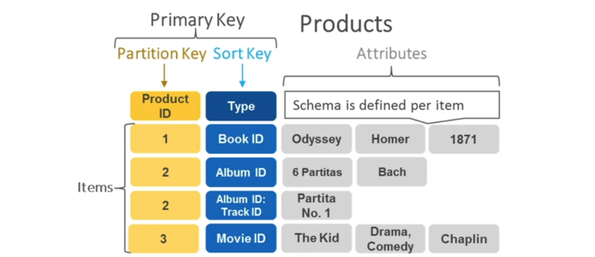

#### DynamoDB Accelerator (DAX)
It is a fully managed in-memory cache for DynamoDB. It is a write-through cache for DynamoDB. It is used to increase
the read performance. It is used to reduce the read latency from milliseconds to microseconds. It is a good fit for
read-heavy workloads.

#### DynamoDB example
We can create a DynamoDB table using the AWS console. We can choose the table name and the primary key. We can also
set the sort key.

We do not need to provision the machine, it is serverless we just need to create the table and then we can start using
it. You do not to specify schema or index and is not possible to link tables.

#### DynamoDB Global Tables
It makes a DynamoDB table accessible from anywhere in the world. It is a multi-region, multi-master replication.
- it is an active-active replication (meaning that we can write to any region)

### Redshift
It is based on Postgres but it is not used for OLTP (Online Transaction Processing) but for OLAP (Online Analytics Processing).

For instance you load data once every hour and then you run queries on it. it is a columnar database (it is optimized to read queries).
and used for data warehousing and business intelligence. It is used for analytics and data warehousing.

### Amazon EMR
Emr Stands for Elastic Map Reduce. It is used to process vast amounts of data. It is used to run big data frameworks
such as Apache Spark, Hadoop, Hive, HBase, Presto, Flink, Zeppelin, and Sqoop. It is used for big data processing
frameworks. It is used for log analysis, web indexing, data warehousing, machine learning, financial analysis, scientific
simulation, and bioinformatics.

The clusters can be made of hundreds of EC2 instances. EMR takes care of all the provisioning and configuration (and it has auto-scaling and integrated with spot instances).

### Amazon Athena
Athena is a serverless query service to perform analytics directly on S3. Is possible to query data without having to
setup or manage any servers. It is serverless and no data warehouse needed, it supports CSV, JSON, ORC, Avro, and Parquet.

there is also AmazonQuickSight that is a business intelligence tool to visualize the data extracted with Athena.

the main use cases are:
- business intelligence
- analytics
- Log analytics

### Amazon QuickSight
It is a serveress machine learning powered business intelligence service to create interactive dashboards from various
data sources. It is serverless and no data warehouse needed. It is integrated with Athena, RDS, Redshift, S3, and EMR.

The main use cases are:
- Business intelligence
- Analytics
- Visualize data
- Create interactive dashboards

### Document DB
It is a fully managed document database service that supports MongoDB workloads, which is a no-sql database. It is
based on the MongoDB API. You have the similar deployment concepts as Aurora.

It automatically scales to workloads with millions of requests per second.

### Amazon Neptune
It is a fully managed graph database service that supports graph workloads. It is used to store relationships between
data. It is used for social networking, recommendation engines, fraud detection, knowledge graphs, life sciences, and
networks.

the main use cases are:
- Social networking
- Recommendation engines
- Fraud detection
- Knowledge graphs

### Amazon QLDB (Quantum Ledger Database)
It is a fully managed ledger database that provides a transparent, immutable, and cryptographically verifiable transaction
Is a **book recording financial transactions**. It is used to maintain a complete and verifiable history of data changes
over time. It is used for financial applications, supply chain, manufacturing, insurance, and HR.

Once a transaction is committed, it can't be changed.

### Amazon Managed Blockchain
It is services to create and manage scalable blockchain networks using the popular open source frameworks Hyperledger
Fabric and Ethereum. It is used to create a blockchain network in minutes. It is used for decentralized applications.

### AWS Glue
It is a fully managed extract, transform, and load (ETL) service that makes it easy for customers to prepare and load
their data for analytics.

The idea is that you will use Glue to prepare data and is fully serverless service. It is used to prepare data for
analytics.


### DMS (Database Migration Service)
It is a service to migrate databases to AWS quickly and securely. It is used to migrate from on-premise to AWS. It is
used to migrate from one database engine to another. The source database remains fully operational during the migration.

it supports homogenous migrations (same database engine) and heterogeneous migrations (different database engine).

### Summary
- Relational databases - OLTP (Online Transaction Processing): RDS & Aurora
- Differences between Multi-AZ and Read Replicas and Multi-Region
- In-memory databases - OLTP (Online Transaction Processing): ElastiCache
- Key-value databases - DynamoDB (serverless) & DAX (in-memory cache for DynamoDB)
- Warehouse databases - OLAP (Online Analytics Processing): Redshift
- Hadoop / Spark / Big Data - EMR (Elastic Map Reduce)
- Query data on s3 - Athena
- Dashboard and visualization - QuickSight
- Graph database - Neptune
- MongoDB - DocumentDB
- Ledger database - QLDB
- Blockchain - Managed Blockchain
- ETL - Glue
- Database migration - DMS

## Other compute services: ECS, ECR, Fargate, Lambda, Batch, Lightsail
### ECS (Elastic Container Service)
It allow to launch docker containers on AWS, you must provision the EC2 instances yourself.


### FarGate
It is a serverless compute engine for containers. It is a serverless compute engine for containers. We do not have to
provision the EC2 instances ourselves, you need to provide the CPU and RAM requirements and AWS will launch the
containers for you.


### ECR (Elastic Container Registry)
It is a fully managed Docker container registry. It is integrated with ECS and EKS. It is used to store, manage, and
deploy Docker container images.

### Lambda
Is the pioneer of serverless compute. It is a compute service where you can upload your code and create a Lambda
function. AWS Lambda takes care of provisioning and managing the servers that you use to run the code. You don't have
to worry about operating systems, patching, scaling, etc.

With Lambda differently to Ec2 we have **virtual functions** (we don't have to manage the servers), they are limited
by time (**short executions**) and **run on-demand** (no charge when the code is not running) lastly the scaling
is automated.

#### Benefits of Lambda
Lambda have many benefits:

1. Easy pricing (pay per request and compute time)
2. Integrated with other AWS services
3. Event-driven (Lambda can be triggered by events, reactive type of services)
4. Easy monitoring through AWS CloudWatch
5. Easy to get more resources per function (just increase the memory)
6. Languages supported: Node.js, Python, Java, C#, Go, PowerShell, Ruby, and Custom Runtime API (any programming language)

if it comes to run Docker images on Lambda we need Lambda Container Image Support. It is a feature that allows us to
run Lambda functions as a container image.


This example is complety full serverless, we have a Lambda function that is triggered by an API Gateway, the Lambda
function is connected to DynamoDB and S3, and the Lambda function is also connected to CloudWatch to monitor the
function.

#### Lambda CRON Job (CloudWatch Events)
Another use case is a serverless cron job (schedule), based on it run a script. We can use CloudWatch Events to trigger
Lambda functions at a specific time.

#### Pricing:
Lambda pricing is based on calls and duration and is very cheap.

- You pay per calls:
  - First 1 million requests are free
  - $0.20 per 1 million requests thereafter ($0.0000002 per request)
- Pay per duration:
  - Duration is calculated from the time your code begins executing until it returns or otherwise terminates, rounded up to the nearest 1 ms.
  - The price depends on the amount of memory you allocate to your function. You are charged $0.00001667 for every GB-second used.
  - The free tier provides 400,000 GB-seconds of compute time per month.

#### Create Lambda function
There are different type of Lambda function, we can select blueprint then we create the new role, and then we can
create the function.

In configuration we can set many important things like the timeout, memory, and the VPC.

#### Lambda Triggers
Lambda can be triggered by many AWS services, for example:
- API Gateway
- CloudFront
- S3 (Object Created, Object Removed, Object Restore)

in order to handle these events we need to create a Lambda function and then we can select the trigger, for example
if we select S3 we can select the bucket and the event type.

An example of lambda function taking a photo as input from an s3 bucket:

```python
from PIL import Image
import boto3
import uuid
import os

s3 = boto3.client('s3')

def lambda_handler(event, context):
    for record in event['Records']:
        bucket = record['s3']['bucket']['name']
        key = record['s3']['object']['key']
        download_path = '/tmp/{}{}'.format(uuid.uuid4(), key)
        upload_path = '/tmp/resized-{}'.format(key)

        s3.download_file(bucket, key, download_path)
        resize_image(download_path, upload_path)
        s3.upload_file(upload_path, '{}resized'.format(bucket), key)

def resize_image(image_path, resized_path):
    with Image.open(image_path) as image:
        image.thumbnail(tuple(x / 2 for x in image.size))
        image.save(resized_path)
```

### Amaazon API Gateway
We want to build a serverless API, we can use API Gateway to create REST APIs that can trigger Lambda functions.
The gateway API will proxy the request to the Lambda function.


### AWS Batch
It is a batch processing service that allows you to run batch jobs on AWS. It will dynamically provision the optimal
quantity and type of compute resources (EC2 instances) based on the volume and specific resource requirements of the
batch jobs submitted.

Batch jobs are defined as Docker images and run on ECS.

### AWS Lightsail
It allows to launch virtual private servers (VPS) with pre-configured options. It is a good option for beginners.
it is a simpler alternative to using EC2 instances, RDS, ELB and so on.

## Deploy and managing infrastructure at scale: CloudFormation, Elastic Beanstalk, OpsWorks, and CloudDeploy
### CloudFormation (IaC)
It is a declarative way of outlining your AWS Infrastructure, for any resources (most of them are supported). For
example within a CloudFormation template we can say: I want a security group, I want two EC2 instances using this
security group, I want an S3 bucket, and I want a load balancer in front of these EC2 instances.

then CloudFormation creates those for us, it will provision all the resources in the right order with the exact
configuration that we specify.

It is **infrastructure as code**. It is a very powerful tool to automate the deployment of your infrastructure.
The main benefits are:
- Automated provisioning
- Infrastructure as code
- Cost estimation
- Productivity

#### CloudFormation Template
It is a JSON/YAML file that describes your AWS infrastructure. It is declarative, we specify what we want and AWS
CloudFormation will take care of the rest.
example:
```yaml
AWSTemplateFormatVersion: "2010-09-09"
Description: "Simple CloudFormation template"
Resources:
  MyEC2Instance:
    Type: "AWS::EC2::Instance"
    Properties:
      AvailabilityZone: "us-east-1a"
      ImageId: "ami-0ff8a91507f77f867"
      InstanceType: "t2.micro"

  SecurityGroup:
    Type: "AWS::EC2::SecurityGroup"
    Properties:
      GroupDescription: "Allow SSH and HTTP access"
      SecurityGroupIngress:
        - IpProtocol: "tcp"
          FromPort: "22"
          ToPort: "22"
          CidrIp: "
```

#### AWS Cloud Development Kit (CDK)
it define your cloud infrastructure using an imperative programming language. It is a software development framework
for defining cloud infrastructure in code and provisioning it through AWS CloudFormation. Instead of writing YAML or
JSON CloudFormation templates, we can define our infrastructure using TypeScript, Python, Java, C# or JavaScript and then
compile it into CloudFormation template.


#### Aws Beanstalk (PaaS)
When we deploy a web application tipically we use a ELB + ASG + EC2 + RDS. Elastic Beanstalk is a service that allows
us to deploy and scale web applications and services.

It is a developer centric view of deploying an application on AWS. It uses all the components we need to deploy and
scale our application (ELB, ASG, EC2, RDS, etc). We simply upload our application code and Elastic Beanstalk will
automatically handle the deployment, from capacity provisioning, load balancing, auto-scaling to application health
monitoring.

It is free but we pay for the underlying instances.

there are three architecture models:
- Single instance deployment: good for dev
- LB + ASG: great for production or pre-production web applications
- ASG only: great for non-web apps in production (workers, etc)

it supports many platforms (includes docker python and so on.) and it also has a full monitored dashboard and
even a CLI and IDE integration for metrics and logs.

under the hood it uses CloudFormation.

### AWS CodeDeploy
It is a service that automates code deployments to any instance, it works with ec2 instances and on-premises servers (hybrid service)

### AWS CodeCommit
It is a managed source control service that hosts secure Git-based repositories. It is a private Git repository. It is a
fully managed service that scales automatically. It is integrated with CodePipeline and CodeDeploy.

### AWS CodeBuild
It allow to build and test code with continuous scaling. It is a fully managed build service that compiles source code,
runs tests and produces software packages that are ready to deploy. It is integrated with CodePipeline.


### AWS CodePipeline

It is a continuous delivery service that automates your release pipelines for fast and reliable application and
infrastructure updates. It is a CI/CD tool. It is a fully managed service that helps us automate our release pipelines
for fast and reliable application and infrastructure updates. It is a continuous delivery service that automates your
release pipelines for fast and reliable application and infrastructure updates. It is a fully managed service that
helps us automate our release pipelines for fast and reliable application and infrastructure updates.

It is integrated with many other AWS services (CodeCommit, CodeBuild, CodeDeploy, CloudFormation, Elastic Beanstalk,
ECS, etc).

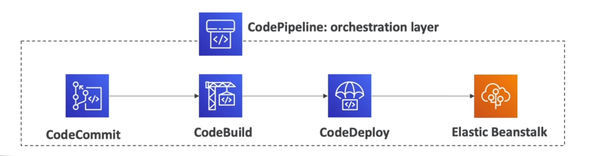

### AWS CodeArtifact

It is a fully managed software artifact repository service that makes it easy for organizations of any size to securely
store, publish and share packages used in their software development process.

Is a secure, scalable and cost-effective artifact management for software development.

### AWS CodeStar
It is a Unified UI to easily manage software development activities in one place. It is a web application that helps
you develop, build, deploy and manage your AWS applications. It is an integrated solution for software development
projects. It is integrated with many other AWS services (CodeCommit, CodeBuild, CodeDeploy, CloudFormation, Elastic
Beanstalk, ECS, etc).

### AWS Cloud9
It is a cloud-based IDE (integrated development environment) that lets you write, run and debug your code with just a
browser. It includes a code editor, debugger and terminal. It is a cloud-based IDE that lets you write, run and debug
your code with just a browser. It includes a code editor, debugger and terminal. It is integrated with many other AWS
services (CodeCommit, CodeBuild, CodeDeploy, CloudFormation, Elastic Beanstalk, ECS, etc).

### AWS Systems Manager (SSM)
it helps us manage our EC2 and on-premises systems at scale. It provides a unified user interface so we can view
operational data from multiple AWS services and allows us to automate operational tasks across our AWS resources.
It is a system manager, state of infrastructure management tool.

the SSM session manager allows us to connect to our EC2 instances through a browser-based shell or CLI. It is a
secure way of accessing our EC2 instances without needing to open SSH ports.

### AWS OpsWorks
It is a configuration management service that provides managed instances of Chef and Puppet. It allows us to automate
operational tasks like software configurations, package installations, OS updates, etc. It is a configuration

### AWS CloudFormation vs Elastic Beanstalk
- Elastic Beanstalk is the orchestration of your app
- CloudFormation is the orchestration of your infrastructure
- Elastic Beanstalk uses CloudFormation under the hood
- Elastic Beanstalk is PaaS, we don't have to worry about the underlying infrastructure
- CloudFormation is IaC, we have to write the code to define our infrastructure
- Elastic Beanstalk is great for developers who want to deploy their code with minimal fuss
- CloudFormation is great for DevOps engineers who want to have full control over their infrastructure
- Elastic Beanstalk is quicker to get started with but less customizable
- CloudFormation is slower to get started with but more customizable
- Elastic Beanstalk is free but you pay for the underlying instances
- CloudFormation is free but you pay for the underlying resources


## Leveraging AWS Global Infrastructure
A global application is an application that can be accessed from anywhere in the world. It is an application that is
not bound to a specific region.

A global application is an application deployed in multiple regions around the world. It decreases latency for our end
users and increases availability & Disaster Recovery (DR).

We recall that:
1) Regions are isolated locations around the world that consist of multiple AZs
2) Availability zones (AZ) are isolated locations within a region that consist of one or more data centers
3) Edge Locations are endpoints for AWS which are used for caching content. Typically this consists of CloudFront, Amazon's Content Delivery Network (CDN)

The points of presence, or edge locations, are located in most of the major cities around the world. They are used by
CloudFront (CDN) to distribute content to our end users. They are also used by Route53 (DNS) to route end users to the
closest edge location.

### Route53

It is a managed DNS (Domain Name System) service. It is a DNS service that translates domain names into IP addresses.
it is a collection of rules and records which helps clients understand how to reach a server through URLs.

The mst common records are:
- A: hostname to IPv4
- AAAA: hostname to IPv6
- CNAME: hostname to hostname
- Alias: hostname to AWS resource

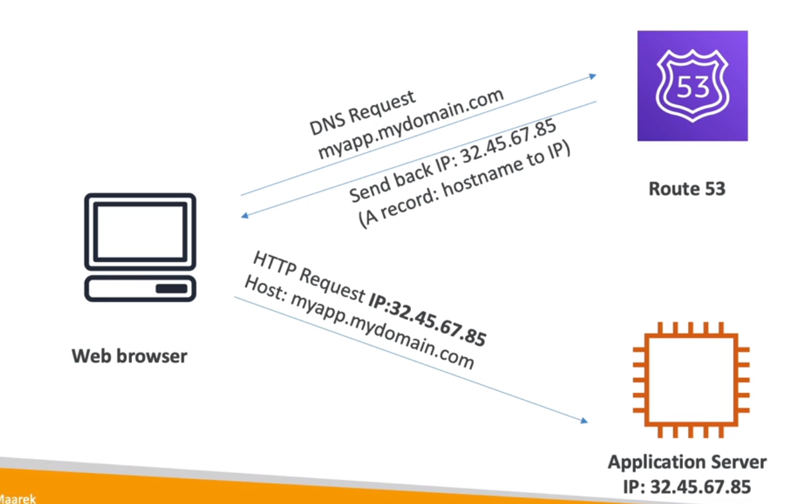


#### Routing Policies
There are different routing policies available:

1. Simple routing policy: it is used when we need to redirect to a single resource. It can't do health checks.
2. Weighted routing policy: it is used to split traffic between multiple resources. It can do health checks.
3. Latency routing policy: it is used to redirect to the server that has the least latency close to us. It can do health checks.
4. Failover routing policy: it is used to redirect to a resource when the other is down. It can do health checks.

#### Route53 example
First you will need to create a domain name in Route53. Then you will need to create a hosted zone. Then you will need
to create a record set & and ec2 instance.

### CloudFront
Is a content delivery network (CDN) that delivers content to end users with low latency and high data transfer speeds. It
improved read performance, content is cached at the edge. It is a global network of edge locations.

It provides DDoS protection and integration with Shield, AWS Web Application Firewall (WAF) and Amazon S3.  The origin can be an S3 bucket or Custom origin (HTTP):

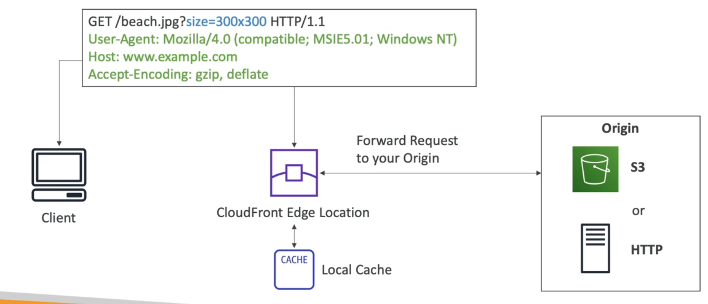

To use it with S3, you will need to create a distribution and select the S3 bucket as the origin. Then you will need to
update the DNS of your domain name to point to the CloudFront distribution. You need the ACI (Origin Access Identity)
to restrict access to the S3 bucket only from the CloudFront distribution.

You can use AWS WAF web access control lists (web ACLs) to help minimize the effects of a distributed denial of service (DDoS) attack. For additional protection against DDoS attacks, AWS also provides AWS Shield Standard and AWS Shield Advanced.

### S3 Transfer Acceleration
Amazon S3 Transfer Acceleration enables fast, easy, and secure transfers of files over long distances between your client and an S3 bucket. Transfer Acceleration takes advantage of Amazon CloudFronts globally distributed edge locations. As the data arrives at an edge location, data is routed to Amazon S3 over an optimized network path.

It is used to accelerate uploads to S3. It uses the CloudFront Edge Network to accelerate uploads to S3. Instead of
uploading directly to S3, we can upload to an edge location which will then transfer the file to S3. It will increase
transfer speed by transferring the file to the nearest edge location.


### Global Accelerator

It is used to improve the availability and performance of our applications. It uses the AWS global network to direct
traffic to the optimal endpoint. It uses the AWS global network to optimize the path from our users to our applications,
improving the performance of our TCP and UDP traffic. It provides static IP addresses that act as a fixed entry point
to our application endpoints in a single or multiple AWS regions. It is a static IP that acts as a fixed entry point
to our application endpoints in a single or multiple AWS regions.

#### Global Accelerator vs CloudFront
Thi difference with CloudFront is that CloudFront is used to cache content, while Global Accelerator is used to proxy
traffic at the edge.

### AWS Outposts

AWS outpost are **server racks** that offers the same AWS infrastructure, services, APIs and tools to virtually any
datacenter, co-location space or on-premises facility for a truly consistent hybrid experience. It is a fully managed
service that extends AWS infrastructure, AWS services, APIs and tools to virtually any datacenter, co-location space
or on-premises facility for a truly consistent hybrid experience.

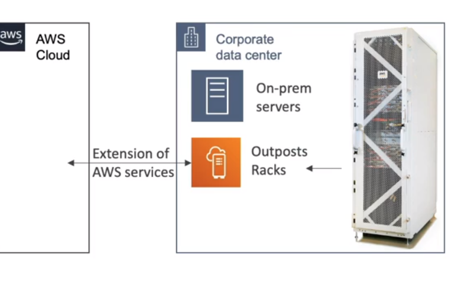

You are then responsible for the physical security of the Outpost.

AWS Outposts bring native AWS services, infrastructure, and operating models to virtually any data center, co-location space, or on-premises facility.

### Aws WaveLength

It is used to deploy applications at the edge of the 5G network. It is a service that provides developers the ability
to build applications that deliver ultra-low latency to mobile devices and end users. It is a service that provides
developers the ability to build applications that deliver ultra-low latency to mobile devices and end users.


### AWS Local Zones

It is used to place resources close to end users in a specific geographic area. It is an extension of an AWS region
that is in a different location from the region. It is a type of AWS infrastructure deployment that places compute,
storage, database, and other select services closer to large population, industry, and IT centers where no AWS region
exists today. It is an extension of an AWS region that is in a different location from the region.

You define a private local zone and associate it with a VPC in your AWS account. You can then create records in your
private hosted zone to route traffic to your resources.

### Global Applications Architecture
#### Single region


#### Multi region, Active-Passive

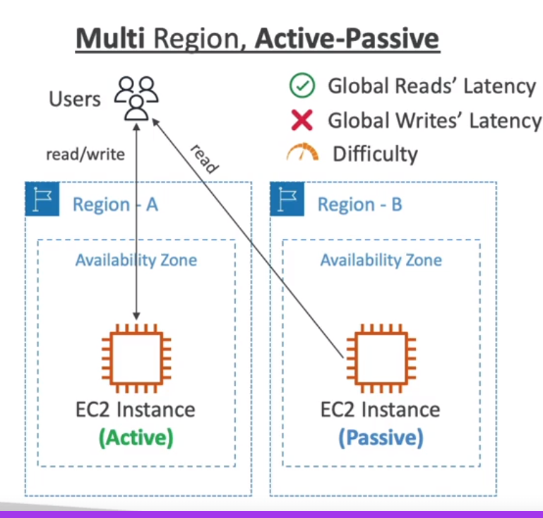

#### Multi region, Active-Active


## Cloud Integrations
When we have multiple application at some point they have to communicate with each other.  They can communicate synchronously or asynchronously (with queue or different services).

The async services once decoupled can be scaled independently from the application itself.

### SQS (Simple Queue Service)
It is a managed message queue service. It is used to decouple applications or integrate applications. It is a distributed
queue system that enables web service applications to quickly and reliably queue messages that one component in the
application generates to be consumed by another component. A queue is a temporary repository for messages that are
awaiting processing. It is a distributed queue system that enables web service applications to quickly and reliably
queue messages that one component in the application generates to be consumed by another component.


It is the oldest AWS offert, it is serverless and used to decouple applications. Once the messages are
readed byt the consumer, they are deleted from the queue. It is used to decouple applications or integrate applications as
follows:

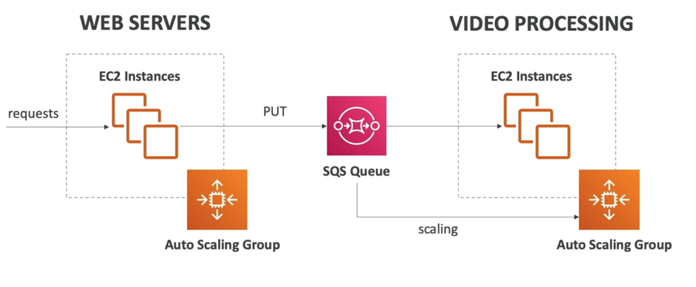

It is also possible to create FIFO queues, which are used to guarantee the order of the messages.

### Amazon Kinesis

It is a real-time big data streaming, it is a managed service to collect, process and analyze real-time streaming data
at any scale.

### Amazon SNS (Simple Notification Service)
It is a PUB/SUB managed service that provides message delivery from publishers to
subscribers. Publishers communicate asynchronously with subscribers by sending messages to a topic, which is a logical
access point and communication channel. Subscribers (i.e., web servers, email addresses, Amazon SQS queues, AWS Lambda
functions) consume or receive the messages by subscribing to the topic.

the event publisher only sends message to one SNS topic and as many subscribers as needed consume the messages from the
SNS topic. Each subscriber to the topic will get all the messages.

### Amazon MQ
It is a managed message broker service for Apache ActiveMQ and RabbitMQ that makes it easy to set up and operate message
brokers in the cloud. It is a managed message broker service for Apache ActiveMQ and RabbitMQ that makes it easy to set
up and operate message brokers in the cloud.

it is used to migrate existing applications that use ActiveMQ or RabbitMQ to AWS.

## Cloud Monitoring
### CloudWatch Metrics
CloudWatch provides metrics for every services in AWS. It is a service that collects and tracks metrics such as CPU
utilization, latency, and request counts for your AWS resources, and applications. They have timestamps and are stored
for 15 months by default. You can create alarms based on metrics and see dashboards based on metrics.

There are many important metrics:
- EC2 instances, such as CPU utilization, network in/out, disk read/write, status check, etc.
- EBS volumes, such as disk read/write, queue length, etc.
- S3 buckets, such as bucket size, number of objects, etc.
- Lambda functions, such as number of invocations, duration, error count, etc.
- API Gateway, such as number of requests, latency, etc.
- Service limits

### CloudWatch Alarms
Alarms are used to trigger notifications for any metric. It is a type of notification that you can receive when a
particular metric reaches a threshold that you specify. You can use alarms to send email notifications or to trigger
changes in the resources that are being monitored. You can use alarms to send email notifications or to trigger changes
in the resources that are being monitored.

Trough alarms you can trigger actions such as:
- Auto scaling actions: increase/decrease EC2 instances
- EC2 actions: stop, terminate, reboot, or recover an EC2 instance
- SNS notifications: send a notification to an SNS topic
- Billing alerts: send a notification when your AWS bill exceeds a certain amount

### CloudWatch Logs
It is a service for ingesting, storing and accessing log files from EC2 instances, AWS CloudTrail, Route 53, and other
sources. It enables real-time monitoring of logs and you can adjust the log levels without redeploying your application.

Logs for Ec2, you need to install the CloudWatch Logs agent on your EC2 instance (it can be set also on premises servers).
while for instance if using aws lamba it creates automatically the log stream to CloudWatch Logs.

### EventBridge (CloudWatch Events)
It is a serverless event bus that makes it easy to connect applications together using data from your own applications,
integrated Software-as-a-Service (SaaS) applications, and AWS services. You can create rules that match incoming events and route them to one or more target functions or streams.

You can use it for:
- Scheduling: cron jobs, rate, interval
- Event pattern: event matching
- Trigger on event: EC2 state change, CodePipeline state change, etc.

you can lostin to the event bus and create rules to route events to targets but also partenrs can publish events to your
event bus and finally create custom events bus.

### CloudTrail
It is a service that enables governance, compliance, operational auditing, and risk auditing of your AWS account. It
provides event history of your AWS account activity, including actions taken through the AWS Management Console, AWS
SDKs, command line tools, and other AWS services.

It is used to track user activity and API usage, it is enabled by default and it is a global service.

Anythings that happens in your account is tracked by CloudTrail.

### AWS X-Ray
It is a service that collects data about requests that your application serves, and provides tools you can use to view,
filter, and gain insights into that data to identify issues and opportunities for optimization. It is a distributed
tracing system that helps developers analyze and debug production, distributed applications, such as those built using
a microservices architecture. With X-Ray, you can understand how your application and its underlying services are
performing to identify and troubleshoot the root cause of performance issues and errors.

It is used to debug microservices and distributed applications (tracing), it is used to analyze and debug production.

it helps doing troubleshooting and performance optimization and understand dependencies in a microservices architecture.

### Amazon CodeGuru
It is a machine learning service for automated code reviews and application performance recommendations. It helps you
find the most expensive lines of code that hurt application performance and keep you up at night troubleshooting.

It is used to improve code quality and identify expensive lines of code.

### AWS Health-Dashboard Service History
It is a service that provides you with information about AWS service disruptions and scheduled maintenance. It enables
you to get information about AWS services in the following categories: operational issues, such as an Amazon EC2
instance that becomes impaired, and availability issues, such as degradation that prevents you from provisioning an
Amazon RDS database instance.

It is used to check the health of your AWS services.

## VPC (Virtual Private Cloud)
It is a virtual network dedicated to your AWS account. It is logically isolated from other virtual networks in the AWS
cloud. You can launch your AWS resources, such as Amazon EC2 instances, into your VPC. You can specify an IP address
range for the VPC, add subnets, associate security groups, and configure route tables.

AWS will create a default VPC for you in each region and subnet in each availability zone. There are public
subnets and private subnets. To defnes access to the internet.

Internet gateway is used to connect the VPC to the internet. It is a horizontally scaled, redundant, and highly
available VPC component that allows communication between instances in your VPC and the internet. It therefore imposes
no availability risks or bandwidth constraints on your network traffic.


Some concepts related:


### Subnets
It is a network partition of the PC. It is a range of IP addresses in your VPC. You can launch AWS resources into a specified subnet. Use a public subnet for
resources that must be connected to the internet, and a private subnet for resources that won't be connected to the
internet. A subnet is a range of IP addresses in your VPC. It allows you to partition your network inside your VPC.

They are regional and availability zone scoped. You can have multiple subnets in each availability zone.

### Route Tables
It is a set of rules, called routes, that are used to determine where network traffic is directed. Each subnet in your
VPC must be associated with a route table; the table controls the routing for the subnet. A subnet can only be
associated with one route table at a time, but you can associate multiple subnets with the same route table.

### Internet Gateway
 An Internet Gateway is a horizontally scalable, redundant, and highly available component that provides a target in your VPC route tables for directing Internet-bound traffic. It serves as a gateway for traffic entering or leaving your VPC.
 When you associate an Internet Gateway with your VPC, instances within the VPC can communicate directly with the Internet and receive public IP addresses if needed.


### NAT Gateway
NAT Gateways allow your instances in your private subnets to access the Internet while remaining private, and are managed by AWS.

It is a highly available AWS managed service that makes it easy to connect to the internet from instances within a
private subnet in an Amazon Virtual Private Cloud (Amazon VPC). Previously, you needed to launch a NAT instance to
enable NAT for instances in a private subnet. NAT gateways are not supported for IPv6 trafficuse an egress-only
internet gateway instead.

### Netowrk ACL (Access control list) & Security Groups
the ACL is a firewall which controls traffic from and to subnet. It is an optional layer of security for your VPC that
acts as a firewall for controlling traffic in and out of one or more subnets.
A network access control list (NACL) is an optional layer of security for your VPC that acts as a firewall for controlling traffic in and out of one or more subnets. They have both ALLOW and DENY rules.


while Security Groups are a firewall that controls traffic to and from an ENI or an EC2 instance. It is a virtual
firewall for your instance to control inbound and outbound traffic. It is a first line of defense in securing your
network.

### VPC Peering
It is a networking connection between two VPCs that enables you to route traffic between them using private IPv4
addresses or IPv6 addresses. Instances in either VPC can communicate with each other as if they are within the same
network. You can create a VPC peering connection between your own VPCs, or with a VPC in another AWS account. The VPCs
can be in different regions (also called an inter-region VPC peering connection).

### VPC Flow Logs
It is a feature that enables you to capture information about the IP traffic going to and from network interfaces in
your VPC. Flow log data can be published to Amazon CloudWatch Logs or Amazon S3. After you've created a flow log, you
can retrieve and view its data in the chosen destination.

### VPC ENdpoints
endpoints allow you to connect to AWS services using a private network instead of the public internet. This means that
you can connect to AWS services without using an internet gateway, NAT device, VPN connection, or AWS Direct Connect
connection. Instances in your VPC do not require public IP addresses to communicate with resources in the service.


You can use VPC gateway endpoints to connect to AWS services that are powered by AWS PrivateLink and uses
Interface VPC Endpoints.

### AWS PrivateLink
It is a highly available, scalable technology that enables you to privately connect your VPC to supported AWS services,
services hosted by other AWS accounts (VPC endpoint services), and supported AWS Marketplace partner services.


all the connection does not go trough the internet but remains in the AWS network.

### Site To site VPN & Direct Connect
Site-to-Site VPN enables you to securely connect your on-premises network or branch office site to your Amazon Virtual
Private Cloud (Amazon VPC). Site-to-Site VPN supports Internet Protocol security (IPsec) VPN connections. Traffic
between the two networks is encrypted by one VPN gateway, then decrypted by the other VPN gateway. This protects your
data as it travels over the internet. You can create an IPsec VPN connection between your VPC and your remote network.

AWS Direct Connect is a cloud service solution that makes it easy to establish a dedicated network connection from your
premises to AWS. It is apshycial connection between your on-premises network and one of the AWS Direct Connect locations
and is not routed over the internet. With AWS Direct Connect, you can establish private connectivity between AWS and
your datacenter, office, or colocation environment, which in many cases can reduce your network costs, increase
bandwidth throughput, and provide a more consistent network experience than internet-based connections.


You must use a Customer Gateway to connect to a Site-to-Site VPN and on AWS A virtual private gateway.
AWS Direct Connect is a cloud service solution that makes it easy to establish a dedicated private network connection from your premises to AWS.

### AWS Client VPN
It is a managed client-based VPN service that enables you to securely access your AWS resources and resources in your
on-premises network. With Client VPN, you can access your resources from any location using an OpenVPN-based VPN client.

it is used to connect from you computer to you private network in AWS.

### Transit Gateway
It is a service that enables customers to connect their Amazon Virtual Private Clouds (VPCs) and their on-premises
networks to a single gateway. This single gateway is a transit hub that acts as a network transit point for traffic
from spokes connected to the transit gateway. Customers can attach their VPCs and on-premises networks to the transit
gateway, and then create routes between them to enable them to communicate.


## AWS Security

### AWS Shared Responsibility Model
AWS is responsible for the security of the cloud. This means that AWS is responsible for protecting the infrastructure
that runs all of the services offered in the AWS Cloud. This infrastructure is composed of the hardware, software,
networking, and facilities that run AWS Cloud services.

You are responsible for security in the cloud. This means that you are responsible for protecting the data that you put
into the cloud and for following the applicable laws and regulations that pertain to your industry.

### What's a DDOS attack?
A distributed denial-of-service (DDoS) attack is a malicious attempt to disrupt the normal traffic of a targeted server,
service or network by overwhelming the target or its surrounding infrastructure with a flood of Internet traffic. the server will not be able to respond to the request of the client.

The AWS Shield service protects against DDoS attacks, there are two tiers of AWS Shield: Standard and Advanced.
- AWS Shield Standard is available to all AWS customers at no additional cost. It protects against common, most frequently occurring network and transport layer DDoS attacks that target your web site or applications.
- AWS Shield Advanced provides additional detection and mitigation against large and sophisticated DDoS attacks, near real-time visibility into attacks, and integration with AWS WAF, a web application firewall. AWS Shield Advanced is available as an optional paid service to all AWS customers.
- AWS WAF is a web application firewall that helps protect your web applications from common web exploits that could affect application availability, compromise security, or consume excessive resources. AWS WAF gives you control over which traffic to allow or block to your web applications by defining customizable web security rules. You can use AWS WAF to create custom rules that block common attack patterns, such as SQL injection or cross-site scripting, and rules that are designed for your specific application. New rules can be deployed within minutes, letting you respond quickly to changing traffic patterns. Also, AWS WAF includes a full-featured API that you can use to automate the creation, deployment, and maintenance of web security rules.
- AWS Route 53 is a highly available and scalable cloud Domain Name System (DNS) web service. It is designed to give developers and businesses an extremely reliable and cost effective way to route end users to Internet applications by translating names like www.example.com into the numeric IP addresses like

### AWS Shield
AWS Shield is a managed Distributed Denial of Service (DDoS) protection service that safeguards applications running on

### AWS Shield Standard
AWS Shield Standard is automatically enabled on all AWS resources at no additional charge. It protects against common,
most frequently occurring network and transport layer DDoS attacks that target your web site or applications.

### AWS Shield Advanced
AWS Shield Advanced provides additional detection and mitigation against large and sophisticated DDoS attacks, near
real-time visibility into attacks, and integration with AWS WAF, a web application firewall. AWS Shield Advanced is
available as an optional paid service to all AWS customers.

### AWS WAF (Web Application Firewall)
AWS WAF is a web application firewall that helps protect your web applications from common web exploits that could
affect application availability, compromise security, or consume excessive resources. AWS WAF gives you control over
which traffic to allow or block to your web applications by defining customizable web security rules. You can use AWS
WAF to create custom rules that block common attack patterns, such as SQL injection or cross-site scripting, and rules
that are designed for your specific application. New rules can be deployed within minutes, letting you respond quickly
to changing traffic patterns. Also, AWS WAF includes a full-featured API that you can use to automate the creation,
deployment, and maintenance of web security rules.

you can define the web ACL (Access Control List) to allow or block traffic to your web application:
- Rules can include IP addresses, HTTP headers, HTTP body, or URI strings.
- Rules can be applied to all web requests or only those that match the conditions and filters that you specify.
- Protects from SQL injection, cross-site scripting, and other attacks.
-  Size constraints and geo match conditions.
- Rate-based rules to block web requests based on the rate that they arrive from a particular IP address.

### AWS Network Firewall
AWS Network Firewall is a managed service that makes it easy to deploy essential network protections for all of your
Amazon Virtual Private Clouds (Amazon VPCs). The service automatically scales with your network traffic, and offers
high availability and no maintenance or management overhead, freeing you to focus on optimizing application availability
and user experience. AWS Network Firewall provides you with visibility into your network traffic flows, and allows you
to enforce granular access control policies. The service supports both stateful and stateless traffic inspection
across Layer 4 and Layer 7, and integrates with AWS Firewall Manager to provide central management of security policies
across your accounts and Amazon VPCs.

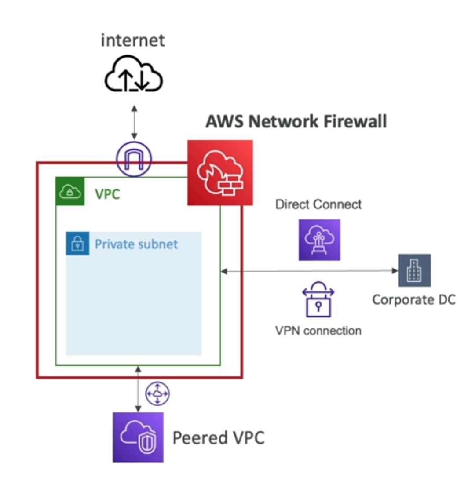

### Encryption
Encryption is the process of encoding information. This process converts the original representation of the information,
known as plaintext, into an alternative form known as ciphertext. Only authorized parties can decipher a ciphertext
back to plaintext and access the original information.

there is two types of encryption:
- At rest: data is encrypted when it is stored on disk in the data center.
- In transit: data is encrypted when it is moving between the data center and the client.

ideally you want to encrypt your data at rest and in transit, we leverage the AWS Key Management Service (KMS) to
manage the encryption keys.

There are some services that are encrypted no matter what, such as CloudWatch Logs, CloudWatch Events, and S3 Glacier.

#### AWS Key Management Service (KMS)
AWS Key Management Service (KMS) is a managed service that makes it easy for you to create and control the encryption
keys used to encrypt your data, and uses Hardware Security Modules (HSMs) to protect the security of your keys. AWS KMS
is integrated with AWS services that encrypt your data with encryption keys that you manage. AWS KMS is also integrated
with AWS CloudTrail to provide you with logs of all key usage to help meet your regulatory and compliance needs.

AWS manages the encryption keys for us.

#### AWS CloudHSM
AWS CloudHSM is a cloud-based hardware security module (HSM) that enables you to easily generate and use your own
encryption keys on the AWS Cloud. With CloudHSM, you can manage your own encryption keys using FIPS 140-2 Level 3
validated HSMs.

Difference between AWS KMS and AWS CloudHSM:
- AWS KMS is a managed service that enables you to easily encrypt your data. AWS KMS is integrated with other AWS  services including Amazon EBS, Amazon S3, and Amazon Redshift. AWS KMS is also integrated with AWS CloudTrail to provide you with logs of all key usage to help meet your regulatory and compliance needs.
- AWS CloudHSM is a cloud-based hardware security module (HSM) that enables you to easily generate and use your own encryption keys on the AWS Cloud. With CloudHSM, you can manage your own encryption keys using FIPS 140-2 Level 3 validated HSMs.

#### Types of Customer Master Keys (CMKs)
- AWS managed CMKs: AWS owned and managed keys that are created in your account for your use. These keys are free of charge.
- Customer managed CMKs: keys in your account that you create, own, and manage. You can use these keys to encrypt and decrypt data, or you can use them to generate, encrypt, and decrypt data keys. You pay a monthly fee for each key that you manage.
- AWS owned CMKs: keys in your account that are created, owned, and managed by AWS. These keys are used only within the service that created them. You cannot use these keys in your own cryptographic operations, and you cannot manage these keys. You do not pay for AWS owned CMKs.
- CloudHSM keys: keys in your CloudHSM cluster that you create, own, and manage. You can use these keys to encrypt and decrypt data, or you can use them to generate, encrypt, and decrypt data keys. You pay a monthly fee for each key that you manage.

#### AWS Certificate Manager (ACM)
AWS Certificate Manager (ACM) is a service that lets you easily provision, manage, and deploy public and private Secure
Sockets Layer/Transport Layer Security (SSL/TLS) certificates for use with AWS services and your internal connected
resources. SSL/TLS certificates are used to secure network communications and establish the identity of websites over
the Internet as well as resources on private networks. AWS Certificate Manager removes the time-consuming manual process
of purchasing, uploading, and renewing SSL/TLS certificates. With AWS Certificate Manager, you can quickly request a
certificate, deploy it on AWS resources such as Elastic Load Balancers or Amazon CloudFront distributions, and let AWS
Certificate Manager handle certificate renewals. SSL/TLS certificates provisioned through AWS Certificate Manager are
free. You pay only for the AWS resources you create to run your application.

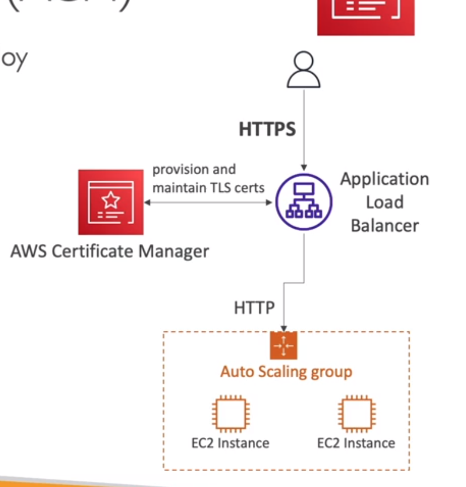

#### AWS Secrets Manager
AWS Secrets Manager helps you protect secrets needed to access your applications, services, and IT resources. The
service enables you to easily rotate, manage, and retrieve database credentials, API keys, and other secrets
throughout their lifecycle. Users and applications retrieve secrets with a call to Secrets Manager APIs, eliminating
the need to hardcode sensitive information in plain text. Secrets Manager offers secret rotation with built-in
integration for Amazon RDS, Amazon Redshift, and Amazon DocumentDB. Secrets Manager also integrates with Amazon
RDS for Oracle, Amazon RDS for SQL Server, Amazon Aurora, and other DBs via AWS Lambda rotation scripts. You can
configure Secrets Manager to rotate secrets automatically or on demand. Secrets Manager integrates with AWS
CloudTrail to provide a history of all API calls made on your secrets and secret rotation activity.

### AWS ARTIFACT

it is a portal that provides on-demand access to AWS compliance reports. You can download AWS security and compliance
documents, such as ISO certifications, Payment Card Industry (PCI), and Service Organization Control (SOC) reports.
You can also download AWS agreements, such as the Business Associate Addendum (BAA) or the Nondisclosure Agreement
(NDA). You can use AWS Artifact reports and agreements to help with your compliance initiatives.

they can be used to support internal audit or compliance.

### AWS GuardDuty
Amazon GuardDuty is a threat detection service that continuously monitors for malicious activity and unauthorized
behavior to protect your AWS accounts, workloads, and data stored in Amazon S3. With the cloud, the collection and
aggregation of account and network activities is simplified, but it can be time consuming for security teams to
continuously analyze event log data for potential threats. With GuardDuty, you now have an intelligent and
cost-effective option for continuous threat detection in the AWS Cloud. GuardDuty analyzes tens of billions of events
across multiple AWS data sources, such as AWS CloudTrail, Amazon VPC Flow Logs, and DNS logs. With a few clicks in the
AWS Management Console, GuardDuty can be enabled with no software or hardware to deploy or maintain. By integrating
with AWS CloudWatch Events, GuardDuty alerts are actionable, easy to aggregate across multiple accounts, and straightforward
to push into existing event management and workflow systems.

### AWS Inspector
Amazon Inspector is an automated security assessment service that helps improve the security and compliance of
applications deployed on AWS. Amazon Inspector automatically assesses applications for vulnerabilities or deviations
from best practices. After performing an assessment, Amazon Inspector produces a detailed list of security findings
prioritized by level of severity. These findings can be reviewed directly or as part of detailed assessment reports
which are available via the Amazon Inspector console or API.

for instance ec2 instnces:
- Common Vulnerabilities and Exposures (CVEs)
- Network security best practices
- Authentication and authorization best practices

also for container images push to ECR and lambda functions.

Amazon Inspector is an automated security assessment service that helps improve the security and compliance of applications deployed on AWS. It helps you test the network accessibility of your Amazon EC2 instances and the security state of your applications running on the instances.

### AWS Config
AWS Config is a service that enables you to assess, audit, and evaluate the configurations of your AWS resources.
Config continuously monitors and records your AWS resource configurations and allows you to automate the evaluation
of recorded configurations against desired configurations. With Config, you can review changes in configurations and
relationships between AWS resources, dive into detailed resource configuration histories, and determine your overall
compliance against the configurations specified in your internal guidelines. This enables you to simplify compliance
audits, security analysis, change management, and operational troubleshooting.

### AWS Macie
Amazon Macie is a fully managed data security and data privacy service that uses machine learning and pattern matching
to discover and protect your sensitive data in AWS. Macie automates the discovery of sensitive data, such as PII and
PII-like data, providing you with dashboards and alerts that give visibility into how this data is being accessed or
moved.

Macie also provides an inventory of your Amazon S3 buckets, which it continually monitors for you. If Macie
detects sensitive data or potential data access issues, it generates detailed findings for you to review and act upon
as necessary.

### AWS Security Hub
AWS Security Hub gives you a comprehensive view of your high-priority security alerts and compliance status across AWS
accounts. The service also aggregates security eventscalled findingsfrom specific AWS security services while
supporting third-party finding providers such as Check Point, Alert Logic, and Qualys. You can also continuously run
compliance checks using supported standards, such as AWS Foundational Security Best Practices, the CIS AWS Foundations
Benchmark, and the Payment Card Industry Data Security Standard. This approach provides a comprehensive view of your
security and compliance status, and enables you to check your environment against security and compliance standards
and identify areas that require attention.

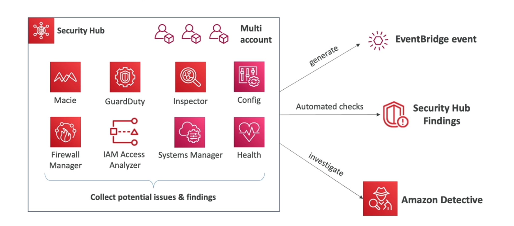

### Amazon Detective
Amazon Detective makes it easy to analyze, investigate, and quickly identify the root cause of potential security
issues or suspicious activities. Amazon Detective automatically collects log data from your AWS resources and uses
machine learning, statistical analysis, and graph theory to build a linked set of data that enables you to easily
conduct faster and more efficient security investigations. Amazon Detective automatically analyzes, correlates, and
graphs billions of events from AWS CloudTrail, Amazon Virtual Private Cloud (VPC) Flow Logs, and Amazon GuardDuty
across your AWS accounts. You can use Amazon Detective to easily analyze and quickly identify the root cause of
potential security issues or suspicious activities. Amazon Detective makes it easy to conduct faster and more
efficient security investigations across your AWS workloads.

### AWS Abuse
AWS Abuse is a service that allows you to report suspected violation of AWS Acceptable Use Policy (AUP) and other
related AWS Terms and Agreements. You can report suspected AUP violations to AWS by using the AWS Abuse Report Form.
AWS investigates reported AUP violations and takes appropriate action as necessary. AWS Abuse is not a customer support
channel. If you have a support inquiry, please contact AWS Support.

### Root user privileges
The root user has full access to all resources in the AWS account. This includes billing information, access to all
resources, and the ability to change the account password. The root user should not be used for everyday tasks, even
administrative ones. Instead, create an IAM user with administrative privileges and use that user for all tasks that
require access to resources and services.

some action can only be performed by the root user:
- change account name
- close account
- change or cancel support plan
- register as a seller in the AWS Marketplace
- view certain tax invoices

### IAM access analyzer
IAM Access Analyzer helps you identify the resources in your organization and accounts, such as Amazon S3 buckets or
IAM roles, that are shared with an external entity. You can also identify which resources aren't shared with any
external entity. Access Analyzer analyzes permissions granted using policies attached to resources, and generates
findings to help you identify resources that grant access to external principals. You can review these findings to
determine if the access is intended. For example, you can use Access Analyzer to identify and remediate S3 buckets
that are shared with everyone on the internet.


### Summary
Some concepts:

- Shield: DDoS protection
- WAF: web application firewall
- Inspector: security assessment for EC2 instances
- GuardDuty: threat detection
- Macie: data protection
- Detective: security investigation
- Artifact: compliance reports
- Security Hub: security and compliance dashboard
- IAM Access Analyzer: identify resources shared with external entities
- AWS Abuse: report suspected violation of AWS Acceptable Use Policy (AUP)
- AWS Config: assess, audit, and evaluate the configurations of your AWS resources
- AWS Secrets Manager: store, rotate, and retrieve secrets
- AWS KMS: key management service
- AWS CloudHSM: hardware security module
- AWS Certificate Manager: SSL/TLS certificates

## AWS ML login 2
skipped

## Other services
### Amazon WorkSpaces
Amazon WorkSpaces is a managed, secure Desktop-as-a-Service (DaaS) solution. You can use Amazon WorkSpaces to provision
either Windows or Linux desktops in just a few minutes and quickly scale to provide thousands of desktops to workers
across the globe. You can pay either monthly or hourly, just for the WorkSpaces you launch, which helps you save money
when compared to traditional desktops and on-premises VDI solutions. Amazon WorkSpaces helps you eliminate the complexity

### Amazon AppStream 2.0
Amazon AppStream 2.0 is a fully managed desktop application streaming service. You centrally manage your desktop applications
on AppStream 2.0 and securely deliver them to any computer. You can easily scale to any number of users across the globe
without acquiring, provisioning, and operating hardware or infrastructure.

it is application focues and delivered from withing a web browser.

### AWS IoT Core
AWS IoT Core is a managed cloud service that lets connected devices easily and securely interact with cloud applications
and other devices. AWS IoT Core can support billions of devices and trillions of messages, and can process and route
those messages to AWS endpoints and to other devices reliably and securely. With AWS IoT Core, your applications can
keep track of and communicate with all your devices, all the time, even when they arent connected.

You can connect it to s3 services.

### Amazon Elastic Transcoder
Amazon Elastic Transcoder is media transcoding in the cloud. It is designed to be a highly scalable, easy to use and a
cost effective way for developers and businesses to convert (or transcode) media files from their source format into
versions that will playback on devices like smartphones, tablets and PCs.

### AWS AppSync
AWS AppSync is a fully managed service that makes it easy to develop GraphQL APIs by handling the heavy lifting of
deploying, scaling, maintaining, and securing GraphQL APIs. AppSync automatically updates the data in web and mobile
applications in real time, and updates data for offline users as soon as they reconnect. AppSync makes it easy to build
data driven web and mobile applications by handling securely all the application data management tasks like online and
offline data access, data synchronization, and data manipulation across multiple data sources.

### AWS Amplify
AWS Amplify is a set of tools and services that enables mobile and front-end web developers to build secure, scalable
full stack applications, powered by AWS. With Amplify, you can configure app backends and connect your app in minutes,
deploy static web apps in a few clicks, and easily manage app content outside the AWS console.

Is a wrapper around to create mobile application backend.

### AWS Device Farm
AWS Device Farm is an application testing service that lets you improve the quality of your web and mobile apps by
testing them across an extensive range of desktop browsers and real mobile devices; without having to provision and
manage any testing infrastructure. The service enables you to run your tests concurrently on multiple desktop browsers
or real devices to speed up the execution of your test suite, and generates videos and logs to help you quickly
diagnose issues with your app. You can also use AWS Device Farms built-in integration with AWS CodePipeline to
automatically run tests every time you change your apps code. Device Farm is built for testing your apps, whether you
are a developer, QA manager, or release manager. Device Farm makes it easier than ever for you to test your app so you
can iterate faster and deliver high quality apps to your customers.

### AWS Backup


### Disaster recovery trategies
- Backup and restore: backup your data and restore it in case of failure
- Pilot light: a minimal version of your application is always running in the cloud. When a disaster occurs, a scaled
  version of the application can be quickly provisioned to replace the affected primary site.
- Warm standby: a scaled-down version of a fully functional environment that is always running in the cloud. In the
  event of a disaster, the environment can be scaled up to full capacity.
- Multi-site: all sites are active and they are used for non-production traffic. In the event of a disaster, all
  production traffic is routed to the disaster recovery site.

### AWS Elastic Disaster Recovery (AWS CloudEndure Disaster Recovery)
AWS Elastic Disaster Recovery (AWS CloudEndure Disaster Recovery) is a highly automated disaster recovery solution that
uses block-level continuous replication, application stack orchestration, and automated machine conversion to ensure
near-zero RPO and RTO for all applications, while reducing traditional disaster recovery expenses by 80% or more. AWS
Elastic Disaster Recovery continuously replicates your machines into a low-cost staging area in your target AWS
account, which serves as a pilot light environment. In the event of a disaster, you can launch your applications
natively on AWS, or on AWS VMware Cloud on AWS, with the click of a button and continue normal operations from the
latest recovery point.

### AWS Application Migration Service (AWS MGN)
AWS Application Migration Service (AWS MGN) is a service that helps you migrate your applications to AWS at scale,
reducing the risk of data loss and minimizing application downtime. AWS MGN continuously replicates your source
machines into AWS, creating a replica of your applications ready to run in the cloud. AWS MGN provides a highly
automated lift-and-shift migration experience, reducing the need for specialized migration skills, thereby minimizing
the effort and complexity involved in your migration effort.

### AWS Server Migration Service (AWS SMS)
AWS Server Migration Service (AWS SMS) is an agentless service that makes it easier and faster for you to migrate
thousands of on-premises workloads to AWS. AWS SMS allows you to automate, schedule, and track incremental replications
of live server volumes, making it easier for you to coordinate large-scale server migrations.

### AWS Migration Evaluator
AWS Migration Evaluator (formerly TSO Logic) is a migration assessment tool that helps you plan and optimize your
migration to AWS. AWS Migration Evaluator provides insights that help you understand your current IT infrastructure,
model your future IT state on AWS, and generate a detailed report plan for migrating to AWS.

### AWS Fault injection simulator (AWS FIS)
AWS Fault Injection Simulator (AWS FIS) is a fully managed service that enables you to perform fault injection
experiments on AWS workloads. AWS FIS supports built-in templates that make it easier to perform experiments on your
infrastructure, services, and applications. You can also create your own templates to perform custom experiments.

    
