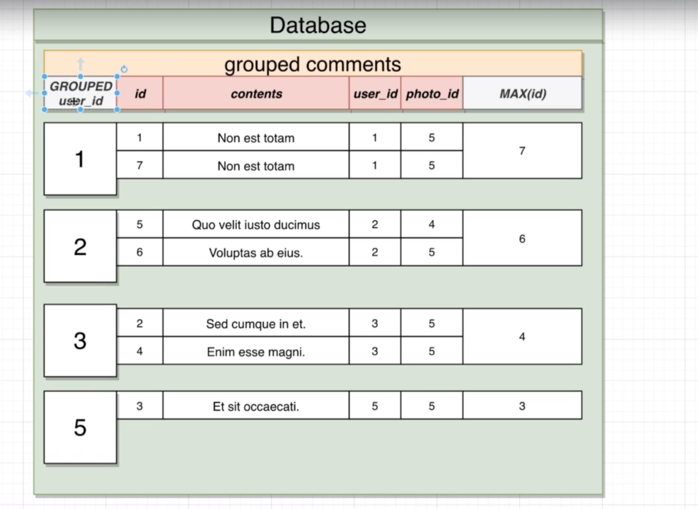
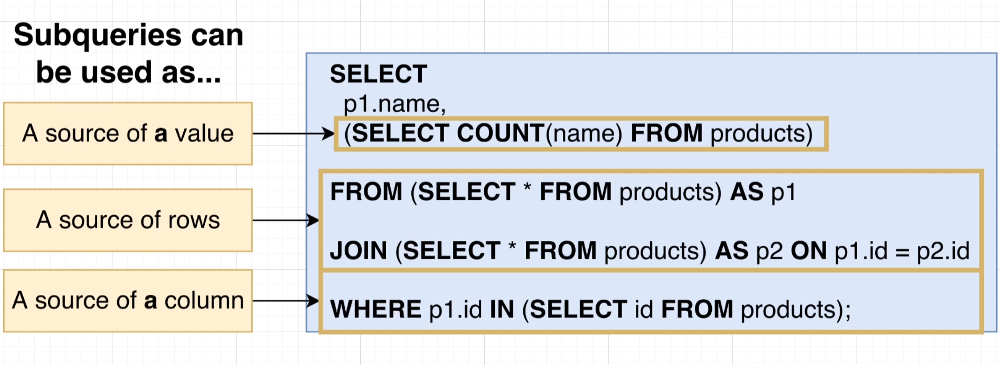
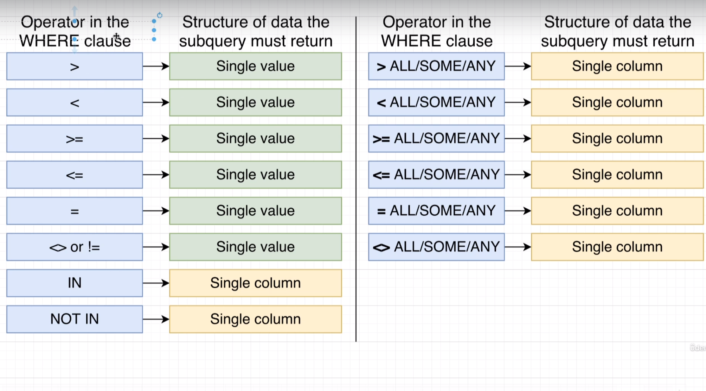

<!-- toc -->

- [Querying Data](#querying-data)
  * [Calculated columns](#calculated-columns)
  * [String operators](#string-operators)
  * [`WHERE` clause](#where-clause)
    + [Select basic operators](#select-basic-operators)
    + [Boolean operators](#boolean-operators)
    + [Calculated columns inside `WHERE` clause](#calculated-columns-inside-where-clause)
  * [`UPDATE` and `DELETE` statements](#update-and-delete-statements)
  * [Joins and Aggregations](#joins-and-aggregations)
    + [Basic `JOIN` types](#basic-join-types)
    + [Alternate Forms of syntax](#alternate-forms-of-syntax)
    + [Different kind of `JOIN` types](#different-kind-of-join-types)
    + [`WHERE` with `JOIN`](#where-with-join)
    + [Multiple `JOIN` statements](#multiple-join-statements)
  * [Aggregation of records](#aggregation-of-records)
    + [`GROUP BY` clause](#group-by-clause)
    + [Aggregate functions](#aggregate-functions)
    + [Aggregations with `GROUP BY` clause](#aggregations-with-group-by-clause)
      - [`COUNT` tricks](#count-tricks)
    + [Filtering Groups with `Having`](#filtering-groups-with-having)
    + [`HAVING` and `WHERE` clauses](#having-and-where-clauses)
  * [Sorting records](#sorting-records)
    + [`OFFSET` and `LIMIT` clauses](#offset-and-limit-clauses)
  * [`UNION` and `UNION ALL` clauses](#union-and-union-all-clauses)
  * [`INTERSECT` and `INTERSECT ALL` clauses](#intersect-and-intersect-all-clauses)
  * [`EXCEPT` and `EXCEPT ALL` clauses](#except-and-except-all-clauses)
  * [Subqueries](#subqueries)
    + [Subquery data shaping](#subquery-data-shaping)
    + [Subqueries shaping in action](#subqueries-shaping-in-action)
    + [Subqueries in `FROM` clause](#subqueries-in-from-clause)
  * [Subquery in `JOIN` clause](#subquery-in-join-clause)
    + [Subquery in `WHERE` clause](#subquery-in-where-clause)
    + [Correlated subqueries](#correlated-subqueries)
      - [Correlated subqueries in `WHERE` clause](#correlated-subqueries-in-where-clause)
      - [Subqueries in `SELECT` clause](#subqueries-in-select-clause)
  * [`DISTINCT` clause](#distinct-clause)
  * [Utility Operators, keywords and functions](#utility-operators-keywords-and-functions)
    + [`GREATEST` and `LEAST` functions](#greatest-and-least-functions)
  * [`CASE` expression](#case-expression)

<!-- tocstop -->

## Querying Data
### Calculated columns

A calculated column is a column that you add to an existing table, then fill with a value that you calculate from an expression or function. The value can be based on other columns in the same table.

Let's consider a simple example. Suppose we have a table named "orders" with the following columns: "quantity" and "price_per_item". We want to add a new column "total_price" which is a calculated column.

Here's how you can do it:

1. First, let's create the "orders" table:

```sql
CREATE TABLE orders (
    order_id serial PRIMARY KEY,
    quantity integer,
    price_per_item decimal
);
```

2. Now, let's insert some data into the table:

```sql
INSERT INTO orders (quantity, price_per_item) 
VALUES (5, 20.0), (3, 15.0), (10, 8.0);
```

3. Now, let's say we want to calculate the total price for each order. We can do this using a SELECT statement with a calculated column:

```sql
SELECT order_id, 
       quantity, 
       price_per_item, 
       quantity * price_per_item AS total_price 
FROM orders;
```

In this query, `quantity * price_per_item AS total_price` is the calculated column. The `AS` keyword is used to rename the calculated column to "total_price". The result of this query will be a table that includes a "total_price" column, with each row's value calculated as the product of that row's "quantity" and "price_per_item".

Please note that this calculated column is not stored in the database. It's calculated on the fly when you run the query. If you want to store the result in the database, you would need to add a new column to the table and update it with the calculated values.

### String operators

String operators are used to manipulate strings in SQL. They can be used to concatenate strings, extract substrings, and perform other operations on strings.
First, let's create a simple table named "employees" for our examples:

```sql
CREATE TABLE employees (
    id SERIAL PRIMARY KEY,
    first_name VARCHAR(100),
    last_name VARCHAR(100),
    email VARCHAR(100)
);

INSERT INTO employees (first_name, last_name, email)
VALUES ('John', 'Doe', 'john.doe@example.com'),
       ('Jane', 'Doe', 'jane.doe@example.com'),
       ('Jim', 'Brown', 'jim.brown@example.com');
```

Now, we have a table with three employees.

1. String Operators:

The `||` operator in PostgreSQL is used to concatenate strings. Here's an example:

```sql
SELECT first_name || ' ' || last_name AS full_name
FROM employees;
```

This will return a new column "full_name" that includes the first name and last name of each employee separated by a space.

2. String Functions:

PostgreSQL provides several functions to work with strings. Here are a few examples:

- `LENGTH(string)`: This function returns the number of characters in the string.

```sql
SELECT first_name, LENGTH(first_name) AS name_length
FROM employees;
```

This will return a column "name_length" that shows the length of each employee's first name.

- `UPPER(string)` and `LOWER(string)`: These functions convert a string to upper-case or lower-case respectively.

```sql
SELECT UPPER(first_name) AS upper_name, LOWER(last_name) AS lower_name
FROM employees;
```

This will return two columns "upper_name" and "lower_name" that show the first name in upper-case and the last name in lower-case respectively.

- `SUBSTRING(string FROM pattern)`: This function extracts a substring that matches a regular expression pattern.

```sql
SELECT email, SUBSTRING(email FROM '@[^.]*') AS domain
FROM employees;
```

This will return a column "domain" that shows the domain of each employee's email address.

- `TRIM([leading|trailing|both] [characters] FROM string)`: This function removes the longest string containing only the characters (a space by default) from the start, end, or both ends of the string.

```sql
SELECT TRIM(BOTH 'n' FROM first_name) AS trimmed_name
FROM employees;
```

This will return a column "trimmed_name" that shows the first name of each employee with 'n' trimmed from both ends.

Remember, PostgreSQL is case-sensitive, so ensure you're using the correct case when referencing column names and string values.

### `WHERE` clause

The WHERE clause in SQL is a powerful tool, and it's used in PostgreSQL as well. It allows you to filter the results of your query, returning only those rows that meet certain criteria. This is essential when you're dealing with large databases, as it allows you to narrow down your results to only the data you're interested in.

Here's the basic syntax of a SELECT statement with a WHERE clause:

```sql
SELECT column1, column2, ...
FROM table_name
WHERE condition;
```

In this syntax, `column1, column2, ...` are the fields that you want to retrieve, `table_name` is the name of the table from which you want to retrieve data, and `condition` is the condition that the rows must meet to be included in the result set.

For example, let's say we have a table named `employees` with the following data:

| id | name  | job_title  | salary |
|----|-------|------------|--------|
| 1  | John  | Developer  | 5000   |
| 2  | Sarah | Designer   | 4000   |
| 3  | Bob   | Developer  | 6000   |
| 4  | Alice | Manager    | 7000   |

If you want to retrieve all developers from the `employees` table, you could use the WHERE clause to filter your results like this:

```sql
SELECT name, job_title
FROM employees
WHERE job_title = 'Developer';
```
The WHERE clause can be used with different operators, including comparison operators (=, >, <, >=, <=, <>), logical operators (AND, OR, NOT), and IN, BETWEEN, LIKE, and IS NULL operators.

such as:

```sql
SELECT name, job_title
FROM employees
WHERE job_title = 'Developer' AND salary > 5000;
```

#### Select basic operators

let's go through some examples using the mathematical operators you mentioned in a SELECT statement in PostgreSQL.

1. IN Operator: The IN operator allows you to specify multiple values in a WHERE clause. It is a shorthand for multiple OR conditions.

```sql
SELECT * FROM employees
WHERE employee_id IN (1, 2, 3);
```
This will return all rows from the employees table where the employee_id is either 1, 2, or 3.

2. NOT IN Operator: The NOT IN operator excludes the values you specify.

```sql
SELECT * FROM employees
WHERE employee_id NOT IN (1, 2, 3);
```
This will return all rows from the employees table where the employee_id is anything but 1, 2, or 3.

3. BETWEEN Operator: The BETWEEN operator selects values within a given range inclusive of the end values.

```sql
SELECT * FROM employees
WHERE salary BETWEEN 50000 AND 100000;
```
This will return all rows from the employees table where the salary is between 50000 and 100000, inclusive.

4. != Operator: The != operator is used to filter the result set to only include rows where the specified column's value is not equal to the specified value.

```sql
SELECT * FROM employees
WHERE employee_id != 1;
```
This will return all rows from the employees table where the employee_id is not 1. Note that you can also use the <> operator to achieve the same result.

#### Boolean operators

the AND, OR, and NOT operators play a crucial role in refining our queries in SQL and PostgreSQL. They are used in the WHERE clause to filter the data being selected.

1. AND Operator: The AND operator allows you to select only those rows where both conditions specified are true. 

Here's an example:

```sql
SELECT column1, column2, ...
FROM table_name
WHERE condition1 AND condition2;
```

In this query, only the rows where both `condition1` and `condition2` are true will be returned.

2. OR Operator: The OR operator allows you to select rows where either of the conditions specified is true.

Here's an example:

```sql
SELECT column1, column2, ...
FROM table_name
WHERE condition1 OR condition2;
```

In this query, the rows where either `condition1` or `condition2` (or both) are true will be returned.

3. NOT Operator: The NOT operator allows you to select rows where the specified condition is not true.

Here's an example:

```sql
SELECT column1, column2, ...
FROM table_name
WHERE NOT condition;
```

In this query, the rows where `condition` is not true will be returned.

You can also combine these operators to create more complex conditions. Just remember that if you're using both AND and OR in the same WHERE clause, you should use parentheses to make sure your conditions are being evaluated in the correct order. Here's an example:

```sql
SELECT column1, column2, ...
FROM table_name
WHERE (condition1 AND condition2) OR condition3;
```

In this query, the rows where either both `condition1` and `condition2` are true, or `condition3` is true, will be returned.

#### Calculated columns inside `WHERE` clause

In PostgreSQL, you can use calculated columns inside a `WHERE` clause to filter your results based on the outcome of a calculation. A calculated column isn't a physical column that you store in your database. Instead, it's a column that you create in your SQL queries by performing calculations on the existing columns in your table.

Here's a simple example. Let's say you have a table named `orders` with two columns: `quantity` and `price_per_item`. You want to find all orders where the total price (which is `quantity` multiplied by `price_per_item`) is greater than 100. You can do this by using a calculated column in your `WHERE` clause:

```sql
SELECT *
FROM orders
WHERE (quantity * price_per_item) > 100;
```

In this query, `(quantity * price_per_item)` is a calculated column. PostgreSQL calculates the value for this column for each row in the table, and then it uses the `WHERE` clause to filter out the rows where the total price is not greater than 100.

This concept is very powerful because it allows you to perform complex calculations in your SQL queries and use the results of these calculations to filter your data. However, keep in mind that calculated columns can make your queries slower, especially if you're working with large amounts of data, because PostgreSQL has to perform the calculation for each row in your table.

another ecample with string is The LIKE operator is used in a WHERE clause to search for a specified pattern in a column. Here is an example:

```sql
SELECT *
FROM employees
WHERE first_name LIKE 'Jo%';
```

This query will return all employees whose first name starts with 'Jo'. The '%' is a wildcard character that matches any sequence of characters.

### `UPDATE` and `DELETE` statements
Both of them can be used with complex `WHERE` clauses to update or delete specific rows in a table.

The UPDATE statement in SQL is used to modify the data in a table. It can be used to change the values of existing rows, or to insert new rows into a table. The DELETE statement in SQL is used to delete rows from a table. It can be used to delete specific rows, or to delete all rows in a table.
Here's the basic syntax of an UPDATE statement:

```sql
UPDATE table_name
SET column1 = value1, column2 = value2, ...
WHERE condition;
```


In this syntax, `table_name` is the name of the table you want to update, `column1, column2, ...` are the columns you want to update, `value1, value2, ...` are the new values you want to set for those columns, and `condition` is the condition that the rows must meet to be updated.

The `DELETE` statement is used to delete rows from a table. It can be used to delete specific rows, or to delete all rows in a table.

Here's the basic syntax of a DELETE statement:

```sql
DELETE FROM table_name
WHERE condition;
```

In this syntax, `table_name` is the name of the table you want to delete from, and `condition` is the condition that the rows must meet to be deleted.

### Joins and Aggregations

A JOIN clause in SQL is used to combine rows from two or more tables, based on a related column between them. It allows you to create a relationship between different tables. The different types of Joins in SQL are INNER JOIN, LEFT JOIN, RIGHT JOIN, and FULL JOIN.

1. `INNER JOIN`: This returns records that have matching values in both tables.
2. `LEFT JOIN` (or LEFT OUTER JOIN): This returns all records from the left table, and the matched records from the right table. If there is no match, the result is NULL on the right side.
3. `RIGHT JOIN` (or RIGHT OUTER JOIN): This returns all records from the right table, and the matched records from the left table. If there is no match, the result is NULL on the left side.
4. `FULL JOIN` (or FULL OUTER JOIN): This returns all records when there is a match in either the left or the right table.

Aggregations:

Aggregation in SQL is performed with an aggregate function, which takes multiple inputs and returns a single output. These functions provide the ability to perform operations like calculating the sum, average, count, maximum, minimum, etc., of a set of values.

1. `COUNT()`: This function returns the number of rows that matches a specified criterion.
2. `AVG()`: This function returns the average value of a numeric column.
3. `SUM()`: This function returns the total sum of a numeric column.
4. `MAX()` / `MIN()`: These functions return the highest and lowest value of a numeric column respectively.

#### Basic `JOIN` types
The default join type in PostgreSQL is the `INNER JOIN`. This means that if you don't specify a join type, PostgreSQL will assume that you want to perform an INNER JOIN. Here's an example:

```sql
SELECT *
FROM employees
JOIN departments ON employees.department_id = departments.id;
```

the grammar is `JOIN` `ON` and the shared column between two tables.

#### Alternate Forms of syntax

1. **Order matters**: The order of the tables in the FROM clause matters. If you switch the order of the tables, you will get a different result. For example, if you switch the order of the tables in the previous query, you will get a different result:

```sql
SELECT *
FROM departments
JOIN employees ON employees.department_id = departments.id;
```

2. **Using aliases**: You can use aliases to make your queries more readable. For example, you can use aliases for the tables in the FROM clause:

```sql
SELECT *
FROM employees AS e
JOIN departments AS d ON e.department_id = d.id;
```

3. **handle multiple column with same name**: If you have multiple columns with the same name in different tables, you can use aliases to distinguish between them. For example, if you have a column named "id" in both the "employees" and "departments" tables, you can use aliases to distinguish between them:

```sql
SELECT e.id AS employee_id, d.id AS department_id
FROM employees AS e
JOIN departments AS d ON e.department_id = d.id;
```

4. **Using the USING clause**: You can use the USING clause to specify the columns that you want to join on. For example, if you want to join the "employees" and "departments" tables on the "department_id" column, you can use the following query:

```sql
SELECT *
FROM employees
JOIN departments USING (department_id);
```

#### Different kind of `JOIN` types

1. **INNER JOIN**: This is the default join type in PostgreSQL. It returns all rows from both tables where the join condition is met. For example, if you want to join the "employees" and "departments" tables on the "department_id" column, you can use the following query:

2. **LEFT JOIN**: This returns all rows from the left table, and the matched rows from the right table. If there is no match, the result is NULL on the right side. For example, if you want to join the "employees" and "departments" tables on the "department_id" column, you can use the following query:

3. **RIGHT JOIN**: This returns all rows from the right table, and the matched rows from the left table. If there is no match, the result is NULL on the left side. For example, if you want to join the "employees" and "departments" tables on the "department_id" column, you can use the following query:

4. **FULL JOIN**: This returns all rows when there is a match in either the left or right table. If there is no match, the result is NULL on both sides. For example, if you want to join the "employees" and "departments" tables on the "department_id" column, you can use the following query:

[join](./images/joins.png)

We'll use these tables to illustrate the different types of SQL JOINs.

**Table "Orders"**

| OrderID | Customer | Product  |
|---------|----------|----------|
| 1       | John     | Apples   |
| 2       | Jane     | Bananas  |
| 3       | Alice    | Oranges  |
| 4       | Bob      | Apples   |

**Table "Customers"**

| Customer | Country |
|----------|---------|
| John     | USA     |
| Jane     | UK      |
| Alice    | Canada  |
| Mark     | Australia |

Now, let's see how different types of JOINs work in SQL.

1. **INNER JOIN**: The INNER JOIN keyword selects records that have matching values in both tables.

```sql
SELECT Orders.Customer, Orders.Product, Customers.Country
FROM Orders
INNER JOIN Customers
ON Orders.Customer = Customers.Customer;
```

This will return:

| Customer | Product | Country |
|----------|---------|---------|
| John     | Apples  | USA     |
| Jane     | Bananas | UK      |
| Alice    | Oranges | Canada  |

2. **LEFT JOIN (or LEFT OUTER JOIN)**: The LEFT JOIN keyword returns all records from the left table (Orders), and the matched records from the right table (Customers). The result is NULL on the right side, if there is no match.

```sql
SELECT Orders.Customer, Orders.Product, Customers.Country
FROM Orders
LEFT JOIN Customers
ON Orders.Customer = Customers.Customer;
```

This will return:

| Customer | Product | Country |
|----------|---------|---------|
| John     | Apples  | USA     |
| Jane     | Bananas | UK      |
| Alice    | Oranges | Canada  |
| Bob      | Apples  | NULL    |

3. **RIGHT JOIN (or RIGHT OUTER JOIN)**: The RIGHT JOIN keyword returns all records from the right table (Customers), and the matched records from the left table (Orders). The result is NULL on the left side, when there is no match.

```sql
SELECT Orders.Customer, Orders.Product, Customers.Country
FROM Orders
RIGHT JOIN Customers
ON Orders.Customer = Customers.Customer;
```

This will return:

| Customer | Product | Country   |
|----------|---------|-----------|
| John     | Apples  | USA       |
| Jane     | Bananas | UK        |
| Alice    | Oranges | Canada    |
| NULL     | NULL    | Australia |

4. **FULL JOIN (or FULL OUTER JOIN)**: The FULL OUTER JOIN keyword returns all records when there is a match in either left (Orders) or right (Customers) table records.

```sql
SELECT Orders.Customer, Orders.Product, Customers.Country
FROM Orders
FULL OUTER JOIN Customers
ON Orders.Customer = Customers.Customer;
```

This will return:

| Customer | Product | Country   |
|----------|---------|-----------|
| John     | Apples  | USA       |
| Jane     | Bananas | UK        |
| Alice    | Oranges | Canada    |
| Bob      | Apples  | NULL      |
| NULL     | NULL    | Australia |

#### `WHERE` with `JOIN`

When used together, `WHERE` and `JOIN` can be incredibly powerful. You can join two tables together and then filter the results based on conditions from either or both tables.

Let's consider two tables: `Orders` and `Customers`.

`Orders` table:

| OrderID | CustomerID | OrderDate |
|---------|------------|-----------|
| 1       | 3          | 2020-07-14|
| 2       | 1          | 2020-07-15|
| 3       | 2          | 2020-07-16|
| 4       | 5          | 2020-07-17|

`Customers` table:

| CustomerID | Name  | Country |
|------------|-------|---------|
| 1          | John  | USA     |
| 2          | Pedro | Spain   |
| 3          | Maria | Mexico  |
| 4          | Chen  | China   |
| 5          | Ahmed | Egypt   |

Now, let's say we want to get all orders made by customers from Mexico. We would need to join these two tables and then use a WHERE clause to filter the results. Here's how you can do it:

```sql
SELECT Orders.OrderID, Customers.Name, Customers.Country
FROM Orders
JOIN Customers
ON Orders.CustomerID = Customers.CustomerID
WHERE Customers.Country = 'Mexico';
```

In this query, we're joining the `Orders` table and the `Customers` table where the `CustomerID` matches in both. Then, we're filtering the results to only include records where the `Country` is 'Mexico'. The result would be:

| OrderID | Name  | Country |
|---------|-------|---------|
| 1       | Maria | Mexico  |

This is a simple example, but you can see how powerful this can be when working with larger, more complex databases. You can join multiple tables together and filter based on conditions from any of them.

#### Multiple `JOIN` statements

Let's consider an example where we have three tables: `Orders`, `Customers`, and `Shippers`. The `Orders` table has columns `OrderID`, `CustomerID`, `ShipperID`. The `Customers` table has `CustomerID`, `CustomerName`, and the `Shippers` table has `ShipperID`, `ShipperName`.

If you want to find out the customer's name and the shipper's name for each order, you would need to use multiple `JOIN` statements.

Here's how you might do it:

```sql
SELECT Orders.OrderID, Customers.CustomerName, Shippers.ShipperName
FROM Orders
INNER JOIN Customers ON Orders.CustomerID = Customers.CustomerID
INNER JOIN Shippers ON Orders.ShipperID = Shippers.ShipperID;
```

In this SQL statement:

1. The `FROM` clause is joining three tables: `Orders`, `Customers`, and `Shippers`. The parentheses are used to control the order of operations, just like in arithmetic. 

2. The first `INNER JOIN` statement combines rows from `Orders` and `Customers` where the `CustomerID` matches.

3. The second `INNER JOIN` statement then takes the result of the first `JOIN`, and combines it with the `Shippers` table where the `ShipperID` matches.

4. The `SELECT` statement then specifies the columns we want to see in the output: `OrderID` from `Orders`, `CustomerName` from `Customers`, and `ShipperName` from `Shippers`.

This is a basic example. In real-world scenarios, you might have to join many more tables and the relationships could be much more complex. But the principle remains the same: each `JOIN` operation combines data from two tables based on a related column between them.

if we want to add a `WHERE` clause to this query, we can do it like this:

```sql
SELECT Orders.OrderID, Customers.CustomerName, Shippers.ShipperName
FROM orders
INNER JOIN Customers ON Orders.CustomerID = Customers.CustomerID
INNER JOIN Shippers ON Orders.ShipperID = Shippers.ShipperID
WHERE Customers.Country = 'Mexico' AND Orders.OrderID = 1;
```

### Aggregation of records

There are two different approaches for this:
1. **Grouping**: The GROUP BY clause is used to group rows that have the same values in a column. It is often used with aggregate functions to calculate statistics for each group.
2. **Aggregates**: Aggregate functions are used to calculate statistics for a set of values. They can be used with the GROUP BY clause to calculate statistics for each group.

#### `GROUP BY` clause

The `GROUP BY` clause in SQL is used to arrange identical data into groups with the help of some functions. When a dataset appears to contain duplicate rows, grouping the identical data can be done using `GROUP BY` clause. 

The `GROUP BY` statement is often used with aggregate functions (`COUNT`, `MAX`, `MIN`, `SUM`, `AVG`) to group the result-set by one or more columns.

Here's a simple example. Let's say you have a table named `orders` with two columns: `customer_id` and `amount`. You want to find the total amount of orders for each customer. You can do this by using the `GROUP BY` clause:

```sql
SELECT customer_id, SUM(amount)
FROM orders
GROUP BY customer_id;
```

In this query, the `GROUP BY` clause groups the data by the `customer_id` column, and then the `SUM(amount)` function calculates the total amount of orders for each group.

You can also use the `GROUP BY` clause with more than one column. For example, if you want to find the total amount of orders for each customer for each day, you can do this:

```sql
SELECT customer_id, order_date, SUM(amount)
FROM orders
GROUP BY customer_id, order_date;
```

In this query, the `GROUP BY` clause groups the data by the `customer_id` and `order_date` columns, and then the `SUM(amount)` function calculates the total amount of orders for each group.

The `GROUP BY` clause is a powerful tool that allows you to perform complex data analysis tasks in SQL. However, keep in mind that the `GROUP BY` clause can make your queries slower, especially if you're working with large amounts of data, because PostgreSQL has to group the data before it can perform the aggregate functions.

#### Aggregate functions

Aggregation of records in SQL is a way to perform a calculation on a set of values to return a single scalar value. We often use aggregate functions with the GROUP BY and HAVING clauses of the SQL SELECT statement.

Here are the most commonly used SQL aggregate functions:

1. COUNT(): The COUNT() function returns the number of rows that match a specified criterion.

```sql
SELECT COUNT(id)
FROM employees;
```
This will return the total number of records in the `employees` table.

2. SUM(): The SUM() function returns the total sum of a numeric column.

```sql
SELECT SUM(salary)
FROM employees;
```
This will return the total sum of the `salary` column in the `employees` table.

3. AVG(): The AVG() function returns the average value of a numeric column.

```sql
SELECT AVG(salary)
FROM employees;
```
This will return the average `salary` from the `employees` table.

4. MIN() and MAX(): The MIN() function returns the smallest value of the selected column, and the MAX() function returns the largest value of the selected column.

```sql
SELECT MIN(salary), MAX(salary)
FROM employees;
```
This will return the minimum and maximum `salary` from the `employees` table.

#### Aggregations with `GROUP BY` clause

This query will return the sum of the `price` column for all rows in the `orders` table.

The `GROUP BY` clause is used in conjunction with the aggregate functions to group the result-set by one or more columns. This is useful when you want to perform calculations on groups of rows that share the same values in certain columns.

For example, let's say you have a table named `sales` with three columns: `product_id`, `sale_date`, and `quantity`. If you want to find the total quantity sold for each product, you can use the `SUM()` function with a `GROUP BY` clause:

```sql
SELECT product_id, SUM(quantity)
FROM sales
GROUP BY product_id;
```

This query will return a list of products along with the total quantity sold for each product. The `GROUP BY` clause groups the rows by `product_id`, and then the `SUM()` function is applied to each group separately.

You can also use multiple columns in your `GROUP BY` clause. For example, if you want to find the total quantity sold for each product on each day, you can group by both `product_id` and `sale_date`:

```sql
SELECT product_id, sale_date, SUM(quantity)
FROM sales
GROUP BY product_id, sale_date;
```

This query will return a list of products along with the total quantity sold for each product on each day. The `GROUP BY` clause groups the rows by both `product_id` and `sale_date`, and then the `SUM()` function is applied to each group separately.



##### `COUNT` tricks

The COUNT function is used to return the number of rows that match a specified criterion. It is a simple, yet powerful, function that can provide valuable insights from your data.

Here are some tricks and tips for using the COUNT function in SQL and PostgreSQL:

1. Basic COUNT: The most straightforward use of COUNT is to count all rows in a table. For example, `SELECT COUNT(*) FROM table_name;` will return the total number of rows in "table_name".

2. COUNT with WHERE clause: You can combine COUNT with a WHERE clause to count the number of rows that match a certain condition. For example, `SELECT COUNT(*) FROM table_name WHERE condition;`.

3. COUNT DISTINCT: If you want to count the number of distinct values in a column, you can use the DISTINCT keyword. For example, `SELECT COUNT(DISTINCT column_name) FROM table_name;` will return the number of unique values in "column_name".

4. Grouping with COUNT: You can use the GROUP BY clause with COUNT to group rows that have the same values in specified columns into aggregated data. For example, `SELECT column_name, COUNT(*) FROM table_name GROUP BY column_name;` will return the count of rows for each unique value in "column_name".

5. COUNT with JOIN: You can use COUNT with JOIN operations to count rows from the joined tables. For example, `SELECT COUNT(*) FROM table1 JOIN table2 ON table1.id = table2.id;`.

6. Using COUNT in HAVING clause: The HAVING clause is used instead of WHERE with aggregated data. For example, `SELECT column_name, COUNT(*) FROM table_name GROUP BY column_name HAVING COUNT(*) > 5;` will return the values and their count, for the groups that have a count greater than 5.

Remember, the COUNT function will include NULL values in its tally. If you want to exclude NULL values, you should specify the column name instead of using '*'. For example, `SELECT COUNT(column_name) FROM table_name;`.

#### Filtering Groups with `Having`


The `HAVING` clause was added to SQL because the `WHERE` keyword could not be used with aggregate functions. `HAVING` allows you to specify a condition for a group of records, not just individual records.

The `HAVING` clause is used in the `SELECT` statement to filter the results of group functions (like `COUNT`, `SUM`, `AVG`, etc.). It is often used with the `GROUP BY` clause. If `GROUP BY` is not used, `HAVING` behaves like a `WHERE` clause.

Here's an example:

```sql
SELECT COUNT(CustomerID), Country
FROM Customers
GROUP BY Country
HAVING COUNT(CustomerID) > 5;
```

In this SQL statement, we are grouping customers by country, then using `HAVING` to only include those groups that have more than 5 customers. The result is a list of countries with more than 5 customers, along with the number of customers in each of those countries.

#### `HAVING` and `WHERE` clauses

The `HAVING` clause is used to filter groups of records after the `GROUP BY` clause has been applied. It can contain aggregate functions.

Here's an example of how you might use both in a query:

```sql
SELECT Department, AVG(Salary) as AvgSalary
FROM Employees
WHERE JobTitle != 'Manager'
GROUP BY Department
HAVING AVG(Salary) > 50000;
```

In this SQL statement:

1. The `WHERE` clause filters out employees with the job title 'Manager' before any grouping occurs.
2. The `GROUP BY` clause groups the remaining records by department.
3. The `HAVING` clause filters out departments where the average salary is not greater than 50000.

So, the result of this query would be the departments (excluding 'Manager' positions) where the average salary is greater than 50000.

### Sorting records

Sorting records in SQL and PostgreSQL is a common operation that allows you to organize your data in a more readable and meaningful manner. This is done using the `ORDER BY` clause in your SQL statement.

The `ORDER BY` clause sorts the result set in ascending or descending order by one or more columns. By default, it sorts the records in ascending order. If you want to sort the records in descending order, you can use the `DESC` keyword.

Here's a basic example of how to use the `ORDER BY` clause:

```sql
SELECT column1, column2, ...
FROM table_name
ORDER BY column1 [ASC|DESC], column2 [ASC|DESC], ...;
```
Such as:

```sql
SELECT * FROM users ORDER BY last_name ASC;
```

If you wanted to sort the users by their last name in descending order, you would use the `DESC` keyword:

```sql
SELECT * FROM users ORDER BY last_name DESC;
```

You can also sort by multiple columns. For example, to sort by `last_name` and then `first_name`:

```sql
SELECT * FROM users ORDER BY last_name ASC, first_name ASC;
```

This will sort the users first by their last name in ascending order, and then by their first name in ascending order. Users with the same last name will be sorted by their first name.

#### `OFFSET` and `LIMIT` clauses

The `OFFSET` and `LIMIT` clauses are used in SQL and PostgreSQL to control the number of records returned by a query. They are particularly useful when dealing with large amounts of data, as they allow you to break the data into manageable chunks.

1. `LIMIT`: This clause is used to limit the number of records returned by a query. It accepts one or two arguments which are offset and count. The count is mandatory, which limits the number of rows returned by a query.

Here's an example of how to use the `LIMIT` clause:

```sql
SELECT column1, column2, ...
FROM table_name
LIMIT count;
```

In this SQL statement, `count` specifies the maximum number of rows to return. For example, if you want to select only 5 records from a table called `users`, you would use the following SQL statement:

```sql
SELECT * FROM users LIMIT 5;
```

2. `OFFSET`: This clause is used to skip a number of records before starting to return the records. The `OFFSET` clause is optional and it can be used with the `LIMIT` clause.

Here's an example of how to use the `OFFSET` clause:

```sql
SELECT column1, column2, ...
FROM table_name
OFFSET number;
```

In this SQL statement, `number` specifies the number of rows to skip before starting to return rows. For example, if you want to skip the first 5 records from a table called `users`, you would use the following SQL statement:

```sql
SELECT * FROM users OFFSET 5;
```

You can use the `LIMIT` and `OFFSET` clauses together to control the pagination of your results. For example, to get the second set of 5 records from the `users` table (i.e., records 6-10), you would use the following SQL statement:

```sql
SELECT * FROM users LIMIT 5 OFFSET 5;
```

This will skip the first 5 records and then return the next 5 records. This is particularly useful when implementing pagination in your application.

### `UNION` and `UNION ALL` clauses

`UNION` and `UNION ALL` are SQL clauses that are used to combine the result sets of two or more SELECT statements. However, they do so in slightly different ways.
The data types must be compatible otherwise PostgreSQL will throw an error.

1. `UNION`: The `UNION` operator is used to combine the result sets of 2 or more SELECT statements. It removes duplicate rows from the results. Each SELECT statement within the UNION must have the same number of columns. The columns must also have similar data types, and they must also be in the same order.

Here's a basic example of a `UNION`:

```sql
(SELECT column_name(s) FROM table1)
UNION
(SELECT column_name(s) FROM table2);
```

Sure, here's a simple example of using the `UNION` operator. Let's assume we have two tables: `Orders_USA` and `Orders_Europe`. Both tables have the same structure and we want to create a list of all orders from both regions.

The `Orders_USA` table:

| OrderID | Customer | Amount |
|---------|----------|--------|
| 1       | John     | 100    |
| 2       | Jane     | 200    |
| 3       | Alice    | 300    |

The `Orders_Europe` table:

| OrderID | Customer | Amount |
|---------|----------|--------|
| 1       | Marco    | 100    |
| 2       | Maria    | 200    |
| 3       | Alice    | 300    |

We can use the `UNION` operator to combine these two tables:

```sql
SELECT * FROM Orders_USA
UNION
SELECT * FROM Orders_Europe;
```

This will give us a single table that includes all orders from both regions:

| OrderID | Customer | Amount |
|---------|----------|--------|
| 1       | John     | 100    |
| 2       | Jane     | 200    |
| 3       | Alice    | 300    |
| 1       | Marco    | 100    |
| 2       | Maria    | 200    |
| 3       | Alice    | 300    |

Note that if Alice had orders in both the USA and Europe, the `UNION` operator would only show her once because it removes duplicates. If we wanted to show all orders, including duplicates, we would use the `UNION ALL` operator.


2. `UNION ALL`: The `UNION ALL` operator is used to combine the result sets of 2 or more SELECT statements. It does not remove duplicate rows from the results. Like the `UNION` operator, each SELECT statement within the `UNION ALL` must have the same number of columns, with similar data types, and in the same order.

Here's a basic example of a `UNION ALL`:

```sql
SELECT column_name(s) FROM table1
UNION ALL
SELECT column_name(s) FROM table2;
```

The main difference between `UNION` and `UNION ALL` is that `UNION` will omit duplicate records whereas `UNION ALL` will include duplicate records. `UNION ALL` is slightly faster than `UNION`, because `UNION` needs to check for duplicate rows and this takes additional processing.

These clauses are particularly useful when working with data that is spread across multiple tables, but where each table has a similar structure. By using `UNION` or `UNION ALL`, you can aggregate the data in a single query.

### `INTERSECT` and `INTERSECT ALL` clauses

The `INTERSECT` and `INTERSECT ALL` clauses in SQL are used to combine two `SELECT` statements and return the records that are common to both the select queries. 

1. `INTERSECT`: The `INTERSECT` clause returns the intersection of the result sets of two or more `SELECT` statements. It eliminates duplicate rows from the result. The basic syntax is:

```sql
SELECT column_name(s) FROM table1
INTERSECT
SELECT column_name(s) FROM table2;
```

This will return all unique rows selected by both queries.

For example, if you have two tables, `Customers` and `Orders`, and you want to find all customers who have placed an order, you could use `INTERSECT`:

```sql
SELECT customer_id FROM Customers
INTERSECT
SELECT customer_id FROM Orders;
```

This will return the IDs of all customers who appear in both the `Customers` and `Orders` tables.

2. `INTERSECT ALL`: The `INTERSECT ALL` operator does not remove duplicate rows. Instead, it returns all intersecting rows, including duplicates. However, it's important to note that `INTERSECT ALL` is not supported in all SQL systems, including PostgreSQL and MySQL.

Here's an example of how you might use `INTERSECT ALL`:

```sql
SELECT column_name(s) FROM table1
INTERSECT ALL
SELECT column_name(s) FROM table2;
```

This will return all rows from both select statements that have identical values, including duplicates.

In both cases, the number and order of columns, as well as the data types, must be the same in both queries.

### `EXCEPT` and `EXCEPT ALL` clauses

The `EXCEPT` and `EXCEPT ALL` clauses in SQL are used to combine two `SELECT` statements and return rows from the first `SELECT` statement that are not returned by the second `SELECT` statement.

1. `EXCEPT`: The `EXCEPT` operator returns unique rows from the first query that aren't output by the second query. In other words, it subtracts the result set of the second query from the first. It's important to note that `EXCEPT` removes duplicates.

Here's a basic example of how `EXCEPT` works:

```sql
SELECT column1, column2, ...
FROM table1
EXCEPT
SELECT column1, column2, ...
FROM table2;
```

This SQL statement would return the unique values from `table1` that are not in `table2`.

2. `EXCEPT ALL`: The `EXCEPT ALL` operator does not remove duplicates. It returns all rows from the first query that aren't output by the second query, including duplicates.

Here's a basic example of how `EXCEPT ALL` works:

```sql
SELECT column1, column2, ...
FROM table1
EXCEPT ALL
SELECT column1, column2, ...
FROM table2;
```

This SQL statement would return all values (including duplicates) from `table1` that are not in `table2`.

Remember, the number and order of columns must be the same in the `SELECT` statements in both queries when using `EXCEPT` or `EXCEPT ALL`. The corresponding columns must also have compatible data types.

let's consider we have two tables: `Orders` and `DeliveredOrders`. We want to find out which orders have not been delivered yet. 

The `Orders` table:

| OrderID | Customer | Product |
|---------|----------|---------|
| 1       | John     | Apples  |
| 2       | Jane     | Bananas |
| 3       | Mary     | Grapes  |
| 4       | John     | Oranges |

The `DeliveredOrders` table:

| OrderID | Customer | Product |
|---------|----------|---------|
| 1       | John     | Apples  |
| 2       | Jane     | Bananas |

We can use the `EXCEPT` clause to find out which orders from the `Orders` table are not in the `DeliveredOrders` table:

```sql
SELECT OrderID, Customer, Product
FROM Orders
EXCEPT
SELECT OrderID, Customer, Product
FROM DeliveredOrders;
```

This would return:

| OrderID | Customer | Product |
|---------|----------|---------|
| 3       | Mary     | Grapes  |
| 4       | John     | Oranges |

These are the orders that have not been delivered yet.

### Subqueries

A subquery, also known as an inner query or nested query, is a query embedded within another SQL query. The outer query, which contains the subquery, is known as the main query. Subqueries can return individual values or a list of records; these returned values can then be used in the main query.

Subqueries can be used in various parts of a query, including the SELECT, FROM, WHERE, and HAVING clauses. They are a powerful tool that allows you to perform operations in multiple steps. For example, you can gather data and filter it, then use it as the input to another operation.

Here's a simple example of a subquery:

```sql
SELECT customer_name 
FROM customers 
WHERE customer_id IN (SELECT customer_id FROM orders WHERE quantity > 10);
```

In this example, the subquery (everything inside the parentheses) is first finding the customer_ids from the orders table where the quantity is greater than 10. Then, the main query uses these customer_ids to find the corresponding customer names from the customers table.

Subqueries can be classified into two types: Correlated and Non-Correlated. A non-correlated subquery is a subquery that can be run independently of the outer query and can return its result. A correlated subquery, on the other hand, depends on the outer query for its results.

Remember, while subqueries can be very powerful, they can also be quite slow, especially for large datasets, because each subquery is executed once for each row processed by the outer query. Therefore, it's important to use them judiciously.



A more realistic example of subqueries is when you want to find the average salary of all employees in a department. You can do this by first finding the average salary for each department, and then finding the average of those averages.

Here's how you might do it:

```sql
SELECT AVG(salary)
FROM (
    SELECT AVG(salary)
    FROM employees
    GROUP BY department_id
) AS department_averages;
```

1. The inner query (subquery) is executed first. It groups all employees by their `department_id` and calculates the average salary for each department. This results in a temporary table (not physically present, but logically), let's call it `department_averages`, with each row representing a department and the average salary in that department.

```
| department_id | AVG(salary) |
|---------------|-------------|
| 1             | 5000        |
| 2             | 6000        |
| 3             | 7000        |
| ...           | ...         |
```

2. The outer query (main query) is then executed. It takes the result of the subquery (`department_averages`) as its input and calculates the average of all the department averages. This results in a single value, the average of departmental average salaries.

```
| AVG(salary) |
|-------------|
| 6000        |
```

This is a simplified visualization and the actual values will depend on the data in your `employees` table.

#### Subquery data shaping

The shape of a query result in SQL can take several forms depending on the specific query. Here's a breakdown of the different shapes:

1. Many Rows, Many Columns: This is the most common shape for SQL query results. It occurs when you select more than one column and the query matches more than one row. For example:

```sql
SELECT employee_name, employee_id, department 
FROM employee;
```
This query would return a table with many rows and three columns: 'employee_name', 'employee_id', and 'department'.

2. Many Rows, One Column: This shape occurs when you select only one column, but the query matches more than one row. For example:

```sql
SELECT employee_name 
FROM employee;
```
This query would return a table with many rows and one column: 'employee_name'.

3. One Row, Many Columns: This shape occurs when you select more than one column, but the query matches only one row. This could happen when you're looking for a specific record. For example:

```sql
SELECT employee_name, employee_id, department 
FROM employee 
WHERE employee_id = 123;
```
This query would return a table with one row and three columns: 'employee_name', 'employee_id', and 'department'.

4. One Row, One Column: This shape occurs when you select only one column and the query matches only one row. For example:

```sql
SELECT employee_name 
FROM employee 
WHERE employee_id = 123;
```
This query would return a table with one row and one column: 'employee_name'. This is the simplest shape for a SQL query result.

#### Subqueries shaping in action

In this case we are getting back **one row and one columnéé. The subquery is executed first and returns a single value, which is then used in the main query.

```sql
SELECT employee_name, employee_id, (SELECT MAX(salary) FROM employee) AS max_salary
FROM employee
WHERE employee_id = 123;
```

In this query, the subquery is executed first. It finds the maximum salary in the `employee` table and returns it as a single value. This value is then used in the main query to find the employee with the ID 123 and their salary.

#### Subqueries in `FROM` clause

They allow you to create a temporary table for use within the larger query. This can be extremely useful when the query you want to perform is complex and involves multiple steps.

Here's a basic structure of a subquery in the `FROM` clause:

```sql
SELECT ...
FROM 
    (SELECT ...
     FROM ...
     WHERE ...) AS subquery
WHERE ...
```

In this structure, the subquery is defined in the `FROM` clause and is given an alias (`subquery` in this case), which can then be used in the outer query to refer to the derived table.

Here's an example to illustrate this:

```sql
SELECT avg(subquery.price)
FROM 
    (SELECT price
     FROM products
     WHERE category = 'Electronics') AS subquery
```

In this example, the subquery selects the prices of all products in the 'Electronics' category. This derived table is then used in the outer query to calculate the average price.

The subquery in the `FROM` clause is executed first and the result is stored as a temporary table, which is then used by the outer query. This can be particularly useful when the subquery returns a large amount of data that is used multiple times in the outer query, as it prevents the need for the subquery to be executed multiple times.

Remember, the subquery in the `FROM` clause must be given an alias, and this alias must be used when referring to the derived table in the outer query.

### Subquery in `JOIN` clause


In the context of a JOIN clause, a subquery can be used to filter or manipulate the data before it is joined. This can be particularly useful when you want to join tables based on a condition that involves more complex calculations or conditions that can't be expressed directly in the JOIN clause.

Here's an example of how you might use a subquery in a JOIN clause:

```sql
SELECT orders.order_id, order_totals.total_amount
FROM orders
JOIN (
    SELECT order_id, SUM(quantity * price) as total_amount
    FROM order_items
    GROUP BY order_id
) as order_totals ON orders.order_id = order_totals.order_id
```

In this example, the subquery is used to calculate the total amount for each order from the `order_items` table. This total is then joined with the `orders` table to provide a list of orders along with their total amounts.

The subquery in the JOIN clause is executed first, and its result set is stored in memory. This result set is then used in the outer query for the JOIN operation. This can be more efficient than joining the tables first and then performing the calculations, especially if the tables are large.

#### Subquery in `WHERE` clause

The most useful WHERE clause subquery and operator often depends on the specific needs of your query. However, some commonly used ones include the IN, EXISTS, and comparison operators (=, <, >, <=, >=). 



1. `IN` or `NOT IN` Operator: The IN operator allows you to specify multiple values in a WHERE clause, making it useful when you want to see if a certain value matches any value in a list of values.

Example:
```sql
SELECT employee_name 
FROM employees 
WHERE employee_id IN (SELECT employee_id 
                      FROM department 
                      WHERE department_name IN ('Sales', 'Marketing'));
```
In this example, the subquery returns a list of employee IDs from the 'Sales' and 'Marketing' departments. The main query then retrieves the names of employees who have these IDs.

2. `EXISTS` Operator: The EXISTS operator is used to test for the existence of any record in a subquery. If the subquery returns at least one record, the result of EXISTS is true.

Example:
```sql
SELECT employee_name 
FROM employees 
WHERE EXISTS (SELECT 1 
              FROM department 
              WHERE employees.employee_id = department.employee_id 
              AND department_name = 'Sales');
```
In this example, the subquery checks for the existence of any record in the 'department' table where the 'employee_id' matches that in the 'employees' table and the 'department_name' is 'Sales'. If such a record exists, the EXISTS operator returns true and the name of the employee is retrieved.

3. Comparison Operators: These operators (=, <, >, <=, >=) are used when the subquery is expected to return a single value. They compare this value with the value in the WHERE clause of the main query.

Example:
```sql
SELECT employee_name 
FROM employees 
WHERE salary > (SELECT AVG(salary) 
                FROM employees);
```
In this example, the subquery calculates the average salary of all employees. The main query then retrieves the names of employees who earn more than this average salary.

4. `ALL` Keyword: The ALL keyword is used to select records where a condition is true for ALL of the values in a subquery.

Example:
```sql
SELECT employee_name 
FROM employees 
WHERE salary > ALL (SELECT salary 
                    FROM employees 
                    WHERE department_id = 1);
```
In this example, the subquery returns the salaries of all employees in department 1. The main query then retrieves the names of employees whose salary is greater than the salary of all employees in department 1. In other words, it retrieves the names of employees who earn more than the highest paid employee in department 1.

5. `SOME` or `ANY` Keyword: The SOME or ANY keyword is used to select records where a condition is true for ANY of the values in a subquery.

Example:
```sql
SELECT employee_name 
FROM employees 
WHERE salary > ANY (SELECT salary 
                    FROM employees 
                    WHERE department_id = 1);
```
In this example, the subquery returns the salaries of all employees in department 1. The main query then retrieves the names of employees whose salary is greater than the salary of any employee in department 1. In other words, it retrieves the names of employees who earn more than the lowest paid employee in department 1.

Note: SOME and ANY are synonyms in SQL, and can be used interchangeably.

#### Correlated subqueries

A correlated subquery is a type of SQL subquery where the inner query depends on the outer query for its values. This means that the subquery **is executed repeatedly, once for each row that might be selected by the outer query**. This is different from a simple subquery, where the inner query runs only once and generates a list of values to be used by the outer query.
For doing this is very important to create aliases for the tables, especially when you are using the same table in the subquery and the outer query.

##### Correlated subqueries in `WHERE` clause
Here's an example of a correlated subquery:

```sql
SELECT e1.employee_name 
FROM employees e1
WHERE salary > (SELECT AVG(salary)
                FROM employees e2
                WHERE e1.department_id = e2.department_id);
```

In this example, the subquery calculates the average salary for each department (because the WHERE clause in the subquery links it to the outer query with `e1.department_id = e2.department_id`). Then, the outer query compares the salary of each employee to the average salary of their department. The result is a list of employees who earn more than the average salary in their department.

The execution of a correlated subquery is generally slower because the subquery is executed once for each row processed by the outer query. However, they can be very powerful and solve problems that can be difficult to solve in other ways.

Here's a markdown table for an `employees` table:

| employee_id | employee_name | salary | department_id |
|-------------|---------------|--------|---------------|
| 1           | John Doe      | 5000   | 100           |
| 2           | Jane Smith    | 6000   | 200           |
| 3           | Mary Johnson  | 7000   | 100           |
| 4           | James Brown   | 8000   | 200           |
| 5           | Patricia Davis| 9000   | 100           |

In the SQL correlated subquery example, we're looking for employees who earn more than the average salary in their department. 

The subquery calculates the average salary for each department. For example, for department 100, the average salary is (5000 + 7000 + 9000) / 3 = 7000.

Then, the outer query compares the salary of each employee to the average salary of their department. So, in the case of department 100, the employees who earn more than the average salary are:

| employee_id | employee_name | salary | department_id |
|-------------|---------------|--------|---------------|
| 5           | Patricia Davis| 9000   | 100           |

This is the result of the correlated subquery.

##### Subqueries in `SELECT` clause

Correlated subqueries can also be used in the SELECT clause of an SQL statement. This can be useful when you want to return additional information that is not directly included in the main query's table.

Here's an example of how you might use a correlated subquery in the SELECT clause:

```sql
SELECT t1.column_name1,
       (SELECT MAX(t2.column_name2)
        FROM table_name2 t2
        WHERE t1.column_name1 = t2.column_name1) AS max_column_name2
FROM table_name1 t1;
```

In this example, for each row in `table_name1`, the subquery finds the maximum value of `column_name2` in `table_name2` where `column_name1` is equal in both tables. This maximum value is then returned as `max_column_name2` in the result set of the main query.

This kind of subquery can be very useful for returning summary information alongside detailed information in a single query. However, as with all correlated subqueries, they can be resource-intensive and should be used judiciously.

### `DISTINCT` clause

The `DISTINCT` clause in SQL is used to remove duplicates from the result set of a SELECT statement. It ensures that the fetched data is a set of unique records. 

Here's a basic example of how to use the `DISTINCT` clause:

```sql
SELECT DISTINCT column_name
FROM table_name;
```

In this example, the `DISTINCT` clause will return all unique values in the column_name from the table_name.

The `DISTINCT` clause can also be used in combination with the `COUNT()` function. The `COUNT()` function is an SQL aggregate function that returns the number of rows matching a specified criterion. However, when combined with the `DISTINCT` clause, the `COUNT()` function will count only distinct (different) non-NULL values.

Here's an example of how to use the `DISTINCT` clause in combination with the `COUNT()` function:

```sql
SELECT COUNT(DISTINCT column_name)
FROM table_name;
```

In this example, the `COUNT(DISTINCT column_name)` combination will return the number of distinct and non-NULL values in column_name from the table_name.

This combination is particularly useful when you want to know how many unique values exist in a column or how many unique combinations exist between two or more columns.

### Utility Operators, keywords and functions
#### `GREATEST` and `LEAST` functions

In SQL and PostgreSQL, the GREATEST and LEAST functions are used to get the highest or lowest input value respectively.

Syntax for GREATEST:
```sql
GREATEST (expression1, expression2, ... expression_n)
```
Syntax for LEAST:
```sql
LEAST (expression1, expression2, ... expression_n)
```
For example, if you have a table of products with different prices and you want to find the product with the highest price, you can use the GREATEST function. Similarly, you can use the LEAST function to find the product with the lowest price.

Here's an example of how you might use the GREATEST function:

```sql
SELECT name, weight, GRATEST(30, 2*weight) AS max_weight
FROM products;
```

In this example, the GREATEST function is used to find the maximum weight of each product. The result is a table with three columns: name, weight, and max_weight.

### `CASE` expression

The `CASE` expression in SQL is a way of setting a condition in the data retrieval process. It's similar to using IF-THEN-ELSE logic in programming languages. The `CASE` expression is used to perform conditions in SQL. It works like an IF-THEN-ELSE statement.

Here's the syntax for a `CASE` expression:

```sql
CASE
    WHEN condition1 THEN result1
    WHEN condition2 THEN result2
    ...
    WHEN conditionN THEN resultN
    ELSE result
END;
```

In this syntax, each condition is an expression that returns a boolean result. If the condition's result is true, then the result of the `CASE` expression is the corresponding result that follows the condition. If no condition is true, the result of the `CASE` expression is the result within the `ELSE` clause. If the `ELSE` clause is omitted and no condition is true, then the result is NULL.

Let's look at an example. Suppose we have a table named `Students` with the following data:

| StudentID | Name  | Grade |
|-----------|-------|-------|
| 1         | John  | 85    |
| 2         | Sarah | 90    |
| 3         | Bob   | 70    |
| 4         | Alice | 95    |

We want to add a column that shows the Grade Level of each student based on their Grade. We can use a `CASE` expression to achieve this:

```sql
SELECT StudentID, Name, Grade,
CASE
    WHEN Grade >= 90 THEN 'A'
    WHEN Grade >= 80 THEN 'B'
    WHEN Grade >= 70 THEN 'C'
    ELSE 'D'
END as GradeLevel
FROM Students;
```

This will return:

| StudentID | Name  | Grade | GradeLevel |
|-----------|-------|-------|------------|
| 1         | John  | 85    | B          |
| 2         | Sarah | 90    | A          |
| 3         | Bob   | 70    | C          |
| 4         | Alice | 95    | A          |

In this example, the `CASE` expression checks each student's grade and assigns a grade level based on the grade.
