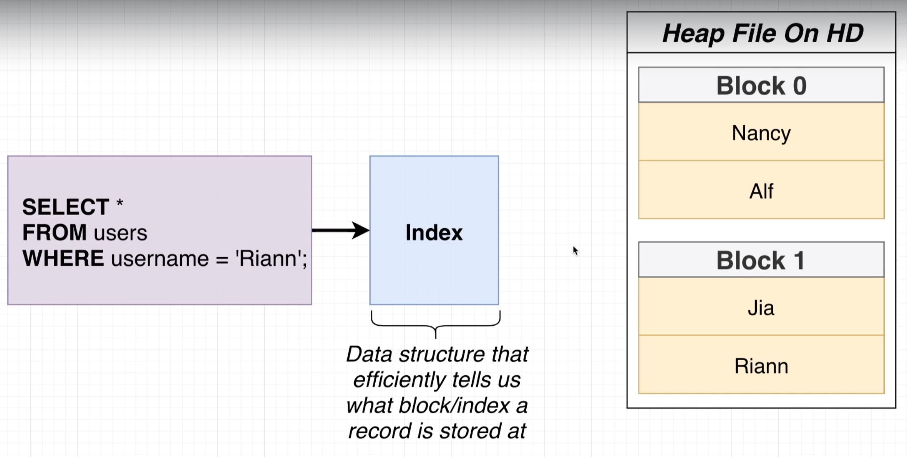
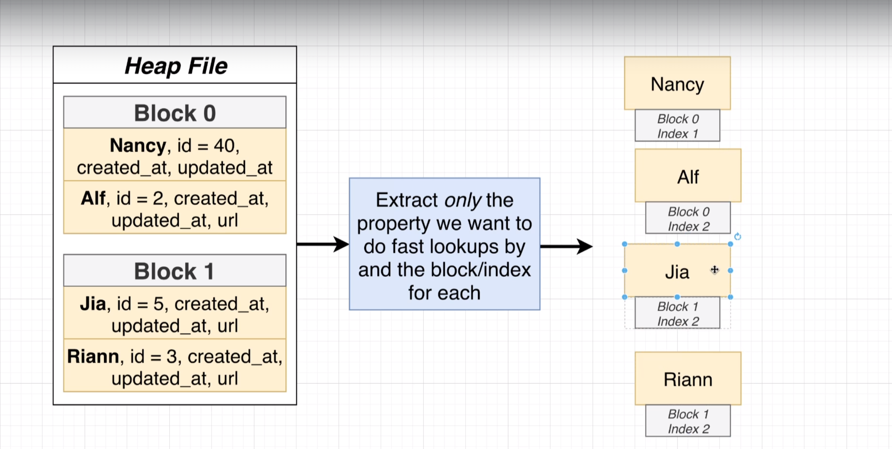
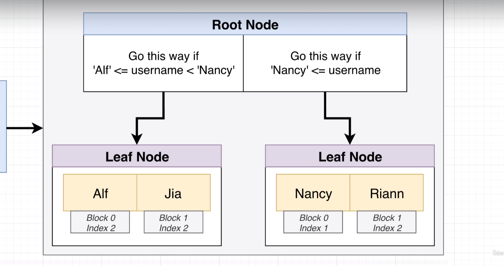

<!-- toc -->

- [Performance](#performance)
  * [Indexes](#indexes)
    + [Indexes basic concepts](#indexes-basic-concepts)
    + [Downsides of indexes](#downsides-of-indexes)
    + [Automatically generated indexes](#automatically-generated-indexes)
  * [Query processing pipeline](#query-processing-pipeline)
    + [`EXPLAIN` and `EXPLAIN ANALYZE` commands](#explain-and-explain-analyze-commands)
  * [Common Table Expressions (CTE)](#common-table-expressions-cte)
  * [Views](#views)
    + [`VIEW` vs Common Table Expressions (CTE)](#view-vs-common-table-expressions-cte)
  * [Materialized Views](#materialized-views)

<!-- tocstop -->

## Performance
### Indexes

Performance in PostgreSQL is a broad topic, but one of the key aspects that significantly impacts performance is the use of indexes. 

Indexes in PostgreSQL are data structures that provide a quick way for the database system to look up specific data. They work similarly to an index in a book, allowing the database to find data without having to scan every row in a table. Indexes can greatly increase the performance of your application by reducing the amount of data that your queries need to process.



PostgreSQL supports several types of indexes:

1. B-tree: This is the default index type. It's best for fields that will be used in equality or range queries.

2. Hash: This index type is best for fields that will be used in equality queries.

3. GiST (Generalized Search Tree): This index type is useful for fields containing geometric data.

4. SP-GiST (Space-Partitioned GiST): This index type is useful for partitioned data.

5. GIN (Generalized Inverted Index): This index type is useful for fields that contain multiple values, like arrays or full-text search vectors.

6. BRIN (Block Range INdex): This index type is useful for very large tables where the data is naturally sorted.

Creating an index involves the CREATE INDEX command followed by the name you wish to give the new index. You then specify the table to which the index belongs and the column or columns you want to index.

For example, to create a B-tree index on the column "email" in the table "users", you would use the following SQL command:

```sql
CREATE INDEX users_email_index ON users (email);
```

You can evaluate the velocity of the index with the command `EXPLAIN ANALYZE`:

```sql
EXPLAIN ANALYZE SELECT * FROM users WHERE email = 'some_email';
```

Remember, while indexes can speed up read queries, they can slow down write operations (INSERT, UPDATE, DELETE) because the index also needs to be updated. Therefore, it's important to find a balance and only create indexes that will benefit your application.

Indexes are a powerful tool in PostgreSQL for optimizing database performance. By understanding how they work and how to use them, you can make your database queries much more efficient.

#### Indexes basic concepts
We need to choose the column do we want to fast lookups on, we extract that information with the block
where the data is tored



Then we sort the data in some ways, for instance alphabetically, and we create a tree with the data sorted.



#### Downsides of indexes

There are 3 main downsides of indexes:
1. **Indexes take up space**: Indexes take up space in the database, so you need to be careful about how many you create. If you create too many indexes, you can end up using a lot of disk space and slowing down your database.
2. **Indexes slow down write operations**: Indexes can slow down write operations because they need to be updated whenever data is inserted, updated, or deleted. This means that if you have a lot of write operations, you may want to avoid creating too many indexes.


#### Automatically generated indexes

In PostgreSQL, indexes are automatically created for primary key constraints and unique constraints.

1. **Primary Key Indexes**: When you define a primary key in PostgreSQL, the system automatically creates a unique B-tree index on the column or group of columns listed in the primary key. This index enforces the uniqueness of the key and speeds up queries that select by the key.

2. **Unique Constraints Indexes**: Similar to primary keys, when you define a unique constraint in PostgreSQL, the system automatically creates a unique B-tree index on the column or group of columns listed in the unique constraint.

These automatically generated indexes are a significant part of PostgreSQL's functionality. They ensure data integrity and improve query performance by reducing the amount of data that needs to be processed.

It's important to note that while these automatic indexes significantly improve read operations, they can slow down write operations (INSERT, UPDATE, DELETE) because the database needs to update the index each time data is changed. Therefore, it's crucial to find a balance between the number of indexes and the frequency of write operations in your database.

### Query processing pipeline

The query processing pipeline in PostgreSQL involves several stages, each contributing to the overall functionality of the tool. Here's a breakdown of the core components:

1. Parsing: The first step in the query processing pipeline is parsing. In this stage, the SQL query is checked for syntactic correctness. The parser checks the query against the grammar of the SQL language. If there are any syntax errors, the parser will return an error message. If the query is syntactically correct, the parser will create a parse tree.

2. Rewriting: The next step is rewriting. The query rewriter takes the parse tree and applies any rewrite rules that may exist. These rules can be used to optimize the query, for example, by eliminating unnecessary joins or by replacing subqueries with joins.

3. Planning: The query planner takes the rewritten query and generates a query plan. The planner estimates the cost of different execution strategies and chooses the most efficient one. This is a crucial step because the efficiency of the query execution can greatly affect the performance of the database.

4. Execution: The final step is execution. The executor takes the query plan and executes it, accessing the database to retrieve or modify the data as requested by the query. The executor also handles any errors that may occur during the execution of the query.

After the execution, the results are returned to the client. This entire process is done in a matter of milliseconds, which is a testament to the efficiency of PostgreSQL's query processing pipeline.

#### `EXPLAIN` and `EXPLAIN ANALYZE` commands

`EXPLAIN` and `EXPLAIN ANALYZE` are two very useful commands that help developers understand the query planner's decision-making process.

1. `EXPLAIN`: This command shows the execution plan that the PostgreSQL planner generates for the supplied statement. The execution plan shows how the table(s) referenced by the statement will be scanned — by plain sequential scan, index scan, etc. — and if multiple tables are referenced, what join algorithms will be used to bring together the required rows from each input table.

```sql
EXPLAIN SELECT * FROM employees;
```

2. `EXPLAIN ANALYZE`: This command is more detailed. It executes the statement, then provides the same information as the `EXPLAIN` command, but with additional execution statistics, such as the total runtime, how many rows were returned, and more. This is useful for understanding the performance of your queries.

```sql
EXPLAIN ANALYZE SELECT * FROM employees;
```

These commands are essential for optimizing your queries and overall database performance. By understanding how your queries are executed, you can make necessary adjustments to improve efficiency and speed.

### Common Table Expressions (CTE)

Common Table Expressions (CTEs)

A Common Table Expression (CTE) is a temporary result set that you can reference within another SELECT, INSERT, UPDATE, or DELETE statement. They are a way of creating complex queries more simply by breaking them down into simpler, smaller parts.

CTEs are defined within the execution scope of a single statement. This means that you can only use the CTE within the SQL statement that it is defined, and you cannot reference it in subsequent statements.

Here's a basic example of how to use a CTE:

```sql
WITH Sales_CTE (SalesPersonID, NumberOfOrders)
AS
(
  SELECT SalesPersonID, COUNT(OrderID)
  FROM SalesOrderHeader
  GROUP BY SalesPersonID
)
SELECT E.EmployeeID, OS.NumberOfOrders
FROM HumanResources.Employee AS E
JOIN Sales_CTE AS OS
ON E.EmployeeID = OS.SalesPersonID
ORDER BY OS.NumberOfOrders DESC;
```

In this example, the CTE groups the sales by each salesperson and counts the number of orders. The main query then joins this CTE with the Employee table to return the list of employees and the number of sales they made, ordered by the number of sales in descending order.

Remember, CTEs are a powerful tool in SQL and PostgreSQL that can simplify your SQL queries and make them easier to understand and maintain.

Sure, let's consider a scenario where we have a database of a library. We have a table named `Books` and another table named `Borrowers`. The `Books` table contains information about the books, and the `Borrowers` table contains information about who has borrowed which book.

Here's how the tables look:

`Books` table:

| BookID | Title  | Author  |
|--------|--------|---------|
| 1      | Book A | Author1 |
| 2      | Book B | Author2 |
| 3      | Book C | Author3 |

`Borrowers` table:

| BorrowerID | Name  | BookID |
|------------|-------|--------|
| 1          | Alice | 1      |
| 2          | Bob   | 2      |
| 3          | Alice | 3      |

Now, let's say we want to find out how many books each person has borrowed. We can use a CTE to make this query easier to understand:

```sql
WITH Borrower_CTE (Name, NumberOfBooks)
AS
(
  SELECT Name, COUNT(BookID)
  FROM Borrowers
  GROUP BY Name
)
SELECT B.Name, B.NumberOfBooks
FROM Borrower_CTE AS B
ORDER BY B.NumberOfBooks DESC;
```

In this example, the CTE groups the borrowers by their names and counts the number of books they have borrowed. The main query then selects from this CTE to return the list of borrowers and the number of books they have borrowed, ordered by the number of books in descending order.

### Views
A `VIEW` is a virtual table, based on the result-set of an SQL statement. A view contains rows and columns, just like a real table. The fields in a view are fields from one or more real tables in the database. 

Views are used for security purposes because they provide encapsulation of the name of the table. Data is in the virtual table, not stored permanently. Also, Views can be used to reduce the complexity of the database schema, to hide the complexity of data, or to present the data in a different perspective.

Creating a View:

You can create a view in SQL using the `CREATE VIEW` statement. Here's an example:

```sql
CREATE VIEW view_name AS
SELECT column1, column2, ...
FROM table_name
WHERE condition;
```

In this example, `view_name` is the name of the view, `table_name` is the name of the table that has the data you want to include in the view, and `column1`, `column2`, ... are the names of the columns that you want to include in the view.

Updating a View:

You can update a view using the `CREATE OR REPLACE VIEW` statement. Here's an example:

```sql
CREATE OR REPLACE VIEW view_name AS
SELECT column1, column2, ...
FROM table_name
WHERE condition;
```

In this example, if the view `view_name` already exists, it will be updated with the new definition. If it does not exist, a new view will be created.

Deleting a View:

You can delete a view using the `DROP VIEW` statement. Here's an example:

```sql
DROP VIEW view_name;
```

In this example, the view `view_name` will be deleted.

#### `VIEW` vs Common Table Expressions (CTE)

Common Table Expressions (CTEs) and Views are both used to simplify complex queries, but they have some key differences.

* A `VIEW` is a virtual table based on the result-set of an SQL statement. It is stored in the database and can be reused multiple times in queries. Views are particularly useful when you have complex queries that are used frequently; instead of writing the query each time, you can create a view and reference that.
* A Common Table Expression (CTE) is a temporary result set that is defined within the execution scope of a single SELECT, INSERT, UPDATE, DELETE, or CREATE VIEW statement. A CTE is similar to a derived table in that it is not stored as an object and lasts only for the duration of the query.

Key Differences:

1. Scope: A `VIEW` is a database object and has a wider scope. It can be used across multiple queries and sessions. A CTE, on the other hand, is only available in the query it is defined and cannot be used in other sessions or queries.

2. Storage: A `VIEW` is stored in the database while a CTE is not. This means that a `VIEW` can be used to reduce the amount of disk storage required if the same query is run many times.

3. Recursion: CTEs can be recursive, meaning they can reference themselves. This is useful for dealing with hierarchical or tree-structured data. Views cannot be recursive.

4. Update: You can update the data in a `VIEW` using `INSTEAD OF` triggers, but you cannot update the data in a CTE.

In summary, while both `VIEW` and CTE can simplify SQL queries, they serve different purposes and are used in different scenarios.

### Materialized Views

Materialized Views

A Materialized View in SQL is a database object that contains the results of a query. It is a physical copy, snapshot or a picture of the base table. The result of the query can be stored and managed as a physical table. Materialized views are used as a performance-enhancing technique. 

In PostgreSQL, Materialized Views are a way to cache your query results for a long time. Unlike a simple VIEW, which is just a saved SQL query, a Materialized View saves the query result and provides a way to refresh this result periodically.

Here's an example of how to create a Materialized View in PostgreSQL:

```sql
CREATE MATERIALIZED VIEW my_materialized_view AS
SELECT column1, column2
FROM my_table
WHERE my_conditions;
```

In this example, `my_materialized_view` is the name of the new Materialized View, and `my_table` is the name of the existing table from which we're pulling data. `column1` and `column2` are the names of the columns we're interested in, and `my_conditions` are any conditions that must be met for a row to be included in the Materialized View.

To refresh a Materialized View, you can use the `REFRESH MATERIALIZED VIEW` command:

```sql
REFRESH MATERIALIZED VIEW my_materialized_view;
```

This command will repopulate the Materialized View with the current data from `my_table`, according to the conditions specified when the Materialized View was created.

Remember, Materialized Views can significantly speed up query execution time, as the results are pre-computed and stored. However, they can take up a considerable amount of storage space, and there is a delay in data being updated, as the Materialized View needs to be refreshed manually or at a set interval.
