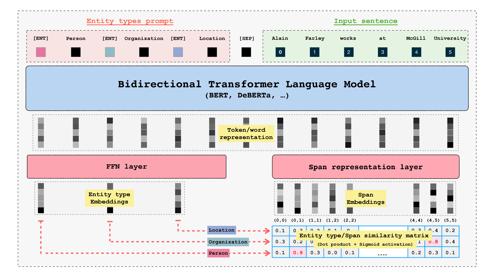

<!-- toc -->

- [GLiNER: Generalist Model for Named Entity Recognition using Bidirectional Transformer](#gliner-generalist-model-for-named-entity-recognition-using-bidirectional-transformer)
  * [Architecture](#architecture)
<!-- tocstop -->

# GLiNER: Generalist Model for Named Entity Recognition using Bidirectional Transformer
- https://arxiv.org/pdf/2311.08526.pdf

In their paper, the authors introduce GLiNER, a sleek NER model that's designed to recognize all kinds of entities. What sets it apart is its use of a bidirectional transformer encoder, which allows it to extract entities in parallel (differently from GPT models). 

The main idea behind the model is pretty interesting. It approaches Open NER by essentially matching entity type embeddings with representations of text spans in a latent space.

The paper introduces a model with three key components:
- A pre-trained textual encoder (e.g., BERT) for initial text processing.
- A span representation module that transforms token embeddings into span embeddings.
- An entity representation module designed to create entity embeddings, which the model aims to extract.

**The primary objective is to align entity and span embeddings in the same latent space**, facilitating an assessment of their compatibility or degree of matching. This alignment is essential for the model's effectiveness in accurately extracting and representing entities.



## Architecture

### Input Representation
The model takes in a combined sequence that includes both the types of entities and the text from which these entities need to be identified. The format for this input looks like this:

`[ENT] t0 [ENT] t1 … [ENT] tM-1 [SEP] x0 x2 … xN-1`

which correspond to the following representation:
`[ENT] person [ENT] location [SEP] John Doe went to Paris`

Here, the [ENT] token is a special marker used before each type of entity, and the [SEP] token acts as a boundary, separating the list of entity types from the actual text. These tokens are given random values at the beginning of the training process.

## Token representation
The token encoder processes the unified input to compute interactions between all tokens (both entity types and input text), producing contextualized representations.

As a result of this processing, the encoder generates what we call "contextualized representations" for each token. 
This means that for every entity type and every word in the text, the encoder produces a vector that captures not just the meaning of that entity or word by itself, 
but also how it relates to the other entities and words in the input. This is important because the meaning of a word can change depending on its context.

- **For Entity Types ([ENT] tokens):** The encoder outputs a set of vectors, one for each entity type in the input. This set is represented as $p = \{p_i\}_{i=0}^{M-1}$, where $M$ is the number of entity types, and $D$ is the dimensionality of the vectors. So, if you have 5 entity types and your vectors are 100-dimensional, $p$ would be a 5x100 matrix.

- **For Words in the Input Text:** Similarly, the encoder outputs a set of vectors for the words in the input text, represented as $h = \{h_i\}_{i=0}^{N-1}$, where $N$ is the number of words in the text, and $D$ is again the dimensionality of the vectors. If your text has 10 words and the vectors are 100-dimensional, $h$ would be a 10x100 matrix.

For words tokenized into multiple subwords, we use the representation of the first subword, which is a standard choice in the NER literature.

## Entity and Span Representation

the model is designed to process and understand both the types of entities and the specific segments (spans) of text where these entities are located, by mapping them into a unified latent space.

### Entity Representation
The entity representation is computed by refining the initial representation $p$ using a two-layer feedforward network,
resulting in $q = \{q_i\}_{i=0}^{M-1} ∈ R^{M \times D}.$ 

### Span Representation
A span is a specific piece of the input text, defined by its starting position (i) and ending position (j).

The span Representation $S_{ij}$ is calculated using both the start and end positions in the input text. This is done by first taking the representations of the start and end (denoted as $h_i$ and $h_j$, concatenating them $\otimes$, and then processing this concatenated vector through another two-layer feedforward network (FFN). Mathematically, this is represented as:

$$S_{ij} = FFN(h_i \otimes h_j)$$

Here, $S_{ij}$ is the final representation of the span, and $D$ is the dimensionality of this representation.

The computation of all span representations can be easily parallelized.

### Entity Type and Span Matching

The equation given for calculating the matching score is:

$$\phi(i, j, t) = \sigma(S^T_{ij}q_t) \in \mathbb{R}$$

Here's what each component represents:

- $\phi(i, j, t)$: This is the matching score for a span starting at position $i$ and ending at position $j$ in the text, with respect to the entity type $t$.
- $\sigma$: This symbol represents the sigmoid activation function. The sigmoid function is used to map any real-valued number into a value between 0 and 1, making it useful for models where we need to predict probabilities.
- $S^T_{ij}$: This represents a vector that encodes information about the span from position $i$ to $j$. It's derived from the model's internal representations.
- $q_t$: This is a vector that represents the entity type $t$. It encodes information specific to the type of entity we're trying to match the span against.
- $\in \mathbb{R}$: This indicates that the output of the equation, the matching score, is a real number.

#### High Dot Product Attention
In the context of this model, a high dot product between the span representation $S^T_{ij}$ and the entity representation $q_t$ indicates a high degree of similarity or "closeness" in the latent space. This would suggest that the span of text from position $i$ to $j$ likely corresponds to the entity type $t$. Conversely, a low dot product would suggest a low degree of similarity, indicating that the span likely does not correspond to the entity type $t$.

## Implementation

```python
  def compute_score_eval(self, x, device):
      assert isinstance(x['classes_to_id'], dict), "classes_to_id must be a dict"
      span_idx = (x['span_idx'] * x['span_mask'].unsqueeze(-1)).to(device)
      all_types = list(x['classes_to_id'].keys())

      entity_prompt = []
      for entity_type in all_types:
          entity_prompt.append(self.entity_token)
          entity_prompt.append(entity_type)
    
      # ['<<ENT>>', 'persona', '<<ENT>>', 'sport', '<<ENT>>', 'organizzazione', '<<SEP>>']
      entity_prompt.append(self.sep_token)
      prompt_entity_length = len(entity_prompt) # 7

      # ['<<ENT>>', 'persona', '<<ENT>>', 'sport', '<<ENT>>', 'organizzazione', '<<SEP>>', 'Gabriele', 'Ghisleni', 
      # 'è', 'un', 'giocatore', 'nazionale', 'di', 'tennis', 'tavolo', 'nella', 'squadra', 'di', 'Villazzano', 'USD']
      tokens_p = [entity_prompt + tokens for tokens in x['tokens']]
      seq_length_p = x['seq_length'] + prompt_entity_length # 21
        
      # https://flairnlp.github.io/docs/tutorial-embeddings/embeddings
      # from flair.embeddings import TransformerWordEmbeddings().embed
      # AutoModel.from_pretrained('bert-base-cased', config=config)()
      out = self.token_rep_layer(tokens_p, seq_length_p)
      # all together token/word representation with prompt

      word_rep_w_prompt = out["embeddings"]
      mask_w_prompt = out["mask"]

      # remove prompt ['Gabriele', 'Ghisleni', 'è', 'un', 'giocatore', 'nazionale', 'di', 
      # 'tennis', 'tavolo', 'nella', 'squadra', 'di', 'Villazzano', 'USD']
      word_rep = word_rep_w_prompt[:, prompt_entity_length:, :]
      mask = mask_w_prompt[:, prompt_entity_length:]

      # get_entity_type_rep ['<<ENT>>', 'persona', '<<ENT>>', 'sport', '<<ENT>>', 'organizzazione', '<<SEP>>']
      entity_type_rep = word_rep_w_prompt[:, :prompt_entity_length - 1, :]
      # extract [ENT] tokens (which are at even positions in entity_type_rep)
      # we remove the non entity tokens ['persona', 'sport', 'organizzazione'] ? 
      entity_type_rep = entity_type_rep[:, 0::2, :]

      # prompt representation (FFN)
      entity_type_rep = self.prompt_rep_layer(entity_type_rep)  # (batch_size, len_types, hidden_size)
    
      ## ?????????????
      word_rep = self.rnn(word_rep, mask)
    
      #  torch.Size([1, 14, 12, 768])
      span_rep = self.span_rep_layer(word_rep, span_idx)

      local_scores = torch.einsum('BLKD,BCD->BLKC', span_rep, entity_type_rep)

      return local_scores
```
